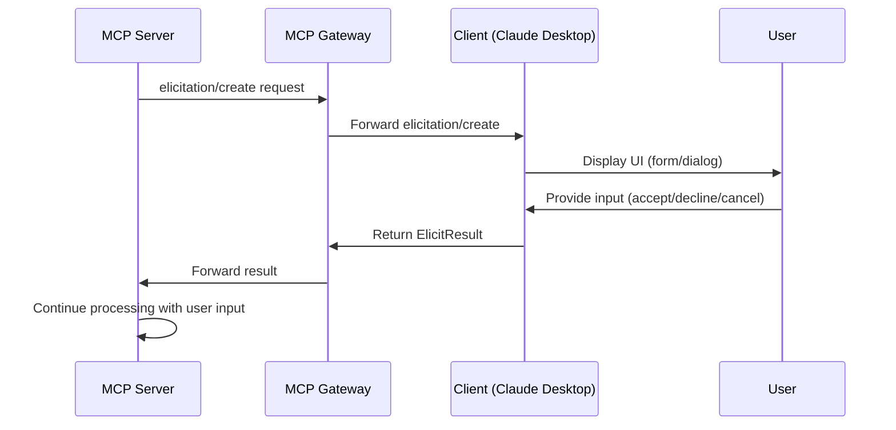

# ADR-017: Elicitation Passthrough Implementation

- **Status:** Accepted
- **Date:** 2025-10-26
- **Deciders:** Mihai Criveti
- **Technical Story:** spec/status.md item #27

## Context

The Model Context Protocol (MCP) specification version 2025-06-18 introduced **elicitation** as a new feature for interactive user input workflows. Elicitation allows MCP servers to request structured information from users through the client during tool execution or other operations.

### MCP Elicitation Overview

**Flow Pattern:** Server → Client (reverse request pattern)



**Key Characteristics:**
- **Newly introduced:** First appeared in MCP 2025-06-18, design may evolve
- **Optional capability:** Clients must advertise `{"elicitation": {}}` during initialization
- **Nested execution:** Elicitation can occur inside tool/resource/prompt operations
- **Three-action model:** Users can `accept` (with data), `decline`, or `cancel`
- **Structured schemas:** Requests include JSON Schema (restricted to primitive types)

### Gateway Architectural Challenge

The MCP Gateway operates as both:
1. **Server to downstream clients** (Claude Desktop, API consumers)
2. **Client to upstream servers** (MCP servers, federated gateways)

This dual role creates complexity for elicitation:
- Upstream servers initiate elicitation requests
- Gateway must forward to appropriate downstream clients
- Responses must be routed back to the original requester
- Session state must track pending elicitations

### Current State

**File:** `mcpgateway/main.py:3622-3623`

```python
elif method.startswith("elicitation/"):
    result = {}  # Stub implementation
```

**Problem:** Returns empty dict instead of proper handling, breaking MCP spec compliance.

## Decision

**Implement full passthrough elicitation support** with the following architecture:

### 1. **Bidirectional Proxy Pattern**

```python
# Server-to-Client flow (elicitation/create)
Upstream Server → Gateway → Downstream Client → User
User → Client → Gateway → Server

# Request tracking
ElicitationService tracks:
  - request_id → (upstream_session, downstream_session, timeout)
  - Maps responses back to original requestor
```

### 2. **Component Architecture**

**New Service:** `mcpgateway/services/elicitation_service.py`
- Track active elicitation requests
- Map request IDs between upstream/downstream sessions
- Handle timeouts and cleanup
- Validate schemas per MCP spec

**Updated Components:**
- `mcpgateway/cache/session_registry.py` - Track client elicitation capability
- `mcpgateway/models.py` - Add Pydantic models for elicitation types
- `mcpgateway/main.py` - Implement `elicitation/create` handler

### 3. **Configuration Strategy**

```yaml
# .env.example / config.py
MCPGATEWAY_ELICITATION_ENABLED=true           # Master switch
MCPGATEWAY_ELICITATION_TIMEOUT=60             # Default timeout (seconds)
MCPGATEWAY_ELICITATION_MAX_CONCURRENT=100     # Max concurrent requests
```

### 4. **Error Handling**

```python
# Scenarios handled:
1. Client doesn't support elicitation → Error -32601 (Capability not available)
2. No active downstream clients → Error -32000 (No capable clients connected)
3. Timeout waiting for response → Error -32000 (Elicitation timeout)
4. Invalid schema → Error -32602 (Invalid params)
5. Gateway elicitation disabled → Error -32601 (Feature disabled)
```

### 5. **Security Considerations**

Per MCP spec security requirements:
- **No sensitive data:** Validate schemas don't request passwords, API keys, etc.
- **Rate limiting:** Enforce max concurrent elicitations per session
- **Timeout enforcement:** Prevent indefinite blocking
- **Audit logging:** Log all elicitation requests and responses (sanitized)

## Implementation Plan

### Phase 1: Foundation (Priority: High)
1. **Add Pydantic Models** (`mcpgateway/models.py`)
   ```python
   class ElicitationCapability(BaseModelWithConfigDict)
   class ElicitRequestParams(BaseModelWithConfigDict)
   class ElicitResult(BaseModelWithConfigDict)
   ```

2. **Create ElicitationService** (`mcpgateway/services/elicitation_service.py`)
   - Request tracking data structure
   - Timeout management
   - Response routing logic
   - Schema validation (primitive types only)

3. **Update SessionRegistry** (`mcpgateway/cache/session_registry.py`)
   - Track client `elicitation` capability from initialization
   - Store capability per session
   - Provide lookup for capable clients

### Phase 2: Request Handling (Priority: High)
4. **Implement Handler** (`mcpgateway/main.py`)
   ```python
   elif method == "elicitation/create":
       # Validate elicitation enabled
       # Validate params (message, requestedSchema)
       # Find capable downstream client
       # Forward request via ElicitationService
       # Await response with timeout
       # Return ElicitResult
   ```

5. **Add Configuration** (`.env.example`, `config.py`)
   - Feature flags
   - Timeout settings
   - Concurrency limits

### Phase 3: Testing & Documentation (Priority: Medium)
6. **Unit Tests**
   - ElicitationService request tracking
   - Schema validation (primitive types only)
   - Timeout handling
   - Error scenarios

7. **Integration Tests**
   - End-to-end elicitation flow
   - Multiple concurrent requests
   - Client capability negotiation
   - Response routing

8. **Update Documentation**
   - `spec/status.md` - Mark item #27 as completed
   - `README.md` - Document elicitation configuration
   - API docs - Document elicitation endpoints

### Estimated Implementation
- **Lines of Code:** ~300-400 (service + models + tests)
- **Files Modified:** 6-8 files
- **Time Estimate:** 4-6 hours implementation + 2-3 hours testing

## Alternatives Considered

### Alternative 1: Stub Implementation (Return Error)
**Decision:** ❌ Rejected

```python
elif method == "elicitation/create":
    raise JSONRPCError(-32601, "Elicitation not implemented")
```

**Rationale:**
- ✅ **Pro:** Simplest implementation (5 lines of code)
- ✅ **Pro:** Honest about lack of support
- ❌ **Con:** Breaks MCP spec compliance (feature is in 2025-06-18 spec)
- ❌ **Con:** Limits gateway usability with elicitation-enabled servers
- ❌ **Con:** Future implementation requires complete rewrite

### Alternative 2: Gateway-Initiated Elicitation Only
**Decision:** ❌ Rejected

Implement elicitation for gateway's own use (e.g., configuration wizards) but not passthrough.

**Rationale:**
- ✅ **Pro:** Simpler than passthrough (no session tracking)
- ✅ **Pro:** Useful for gateway admin UI workflows
- ❌ **Con:** Doesn't solve spec compliance for upstream servers
- ❌ **Con:** Limited real-world use cases for gateway-initiated elicitation
- ❌ **Con:** Still requires full implementation later for spec compliance

### Alternative 3: Async Queue-Based Architecture
**Decision:** ❌ Rejected

Use message queue (Redis, RabbitMQ) for elicitation request routing.

**Rationale:**
- ✅ **Pro:** Better scalability for high-volume scenarios
- ✅ **Pro:** Natural timeout/retry handling
- ❌ **Con:** Adds external dependency complexity
- ❌ **Con:** Overkill for typical elicitation volumes (low frequency, human-in-loop)
- ❌ **Con:** More difficult to debug and troubleshoot
- ❌ **Con:** Increases deployment complexity

## Consequences

### Positive ✅

1. **MCP 2025-06-18 Compliance:** Gateway fully supports latest spec
2. **Interactive Workflows:** Enables rich user interaction patterns from upstream servers
3. **Future-Proof:** Ready for elicitation adoption as feature matures
4. **Federated Support:** Multi-tier gateway deployments can pass elicitations through
5. **Configuration Flexibility:** Can disable if not needed, minimal overhead when disabled
6. **Security First:** Validates schemas, enforces timeouts, prevents abuse

### Negative ❌

1. **Session Complexity:** Adds request/response tracking across sessions
2. **Memory Overhead:** Must track pending elicitations (mitigated by timeout/limits)
3. **Testing Complexity:** Requires end-to-end test infrastructure
4. **Error Handling:** Multiple failure modes require careful handling
5. **Feature Maturity:** MCP spec notes "design may evolve" - risk of breaking changes

### Neutral 🔄

1. **Adoption Uncertainty:** Unknown how many servers will use elicitation
2. **Performance Impact:** Minimal (elicitations are human-speed, not hot path)
3. **Maintenance:** New service requires ongoing maintenance as spec evolves

## Risks and Mitigations

### Risk 1: Spec Evolution
**Risk:** MCP spec notes elicitation design "may evolve in future versions"

**Mitigation:**
- ✅ Implement behind feature flag for easy disabling
- ✅ Comprehensive unit tests allow rapid updates
- ✅ Schema validation centralizes spec-dependent logic
- ✅ Monitor MCP spec changes and update promptly

### Risk 2: Session Tracking Bugs
**Risk:** Request/response routing errors could cause hangs or wrong responses

**Mitigation:**
- ✅ Aggressive timeouts (60s default, configurable)
- ✅ Comprehensive error handling and logging
- ✅ Request ID validation prevents mis-routing
- ✅ Automatic cleanup of expired requests

### Risk 3: Client Capability Detection
**Risk:** Incorrectly routing to non-capable clients

**Mitigation:**
- ✅ Validate client capabilities during initialization
- ✅ Store capability per session
- ✅ Return clear error if no capable clients available
- ✅ Log capability negotiation for debugging

## Success Metrics

1. **Functional:**
   - ✅ All elicitation spec requirements implemented
   - ✅ 100% test coverage for ElicitationService
   - ✅ Integration tests pass for all scenarios

2. **Performance:**
   - ✅ Elicitation overhead <10ms (excluding human response time)
   - ✅ No memory leaks from pending requests
   - ✅ Graceful handling of 100+ concurrent elicitations

3. **Operations:**
   - ✅ Clear error messages for all failure modes
   - ✅ Comprehensive logging for debugging
   - ✅ Configuration validation on startup
   - ✅ Metrics exposed for monitoring

## References

- **MCP Specification:** `spec/modelcontextprotocol/docs/specification/2025-06-18/client/elicitation.mdx`
- **FastMCP Implementation:** `.venv/lib/python3.12/site-packages/mcp/server/elicitation.py`
- **Status Tracking:** `spec/status.md` item #27
- **MCP Types Reference:** `.venv/lib/python3.12/site-packages/mcp/types.py` lines 1277-1311

---

**Decision Approved By:** Mihai Criveti
**Implementation Tracked In:** This ADR becomes the implementation specification for elicitation support.
