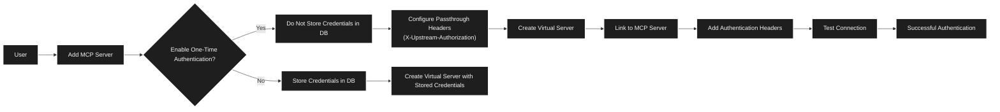
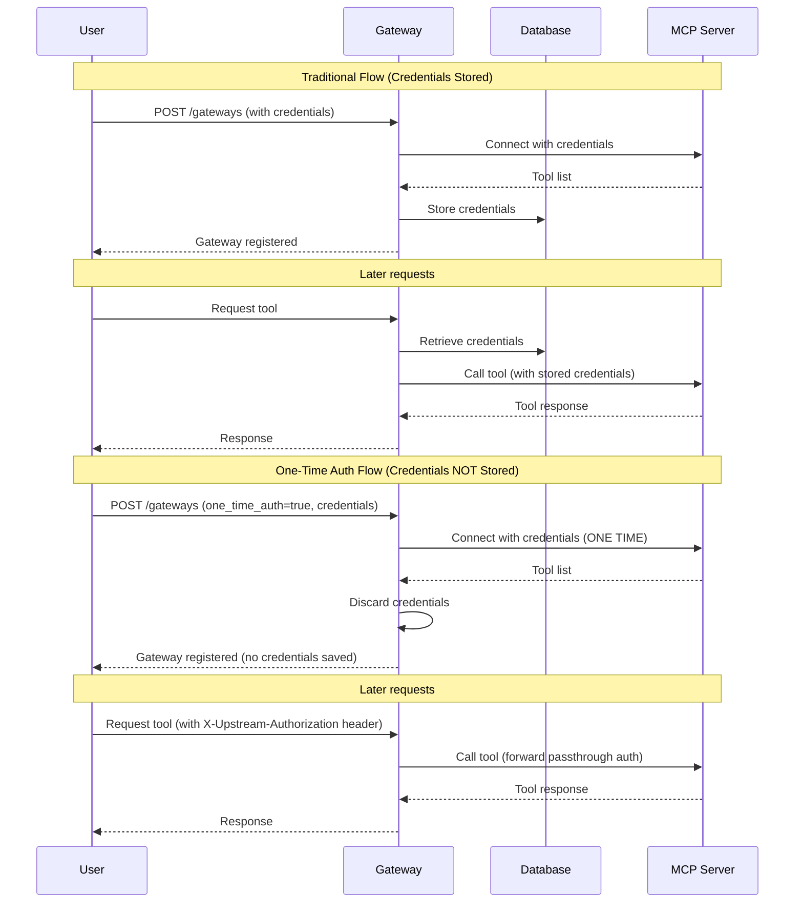

# ADR-023: One-Time Authentication for Gateway Registration

**Status:** Accepted  
**Date:** 2025-11-10  
**Deciders:** Keval Mahajan  
**Technical Story:** [#1387](https://github.com/IBM/mcp-context-forge/issues/1387)

## Context and Problem Statement

Context Forge Gateway allows users to register MCP servers with authentication credentials to proxy and expose their tools through virtual servers. Prior to this implementation, the gateway required storing authentication credentials (bearer tokens, basic auth) in the database to maintain persistent connections and perform health checks on registered MCP servers.

However, a significant use case emerged: organizations and users who want to leverage the gateway's tool proxying capabilities but cannot or will not store authentication credentials in the gateway database due to security policies, compliance requirements, or organizational constraints. These users still needed a mechanism to register MCP servers with authentication, discover available tools, and access them through the gateway using runtime-provided credentials via passthrough headers.

The existing authentication flow required credentials to be persisted, making it incompatible with scenarios where:
- Security policies prohibit credential storage in third-party systems
- Organizations prefer to use runtime authentication with short-lived tokens
- Users want to leverage passthrough header mechanisms for authentication
- Vault plugins or external secret management solutions are not available or suitable

**How can users register authenticated MCP servers and use their tools through the gateway without persisting credentials in the database?**

## Decision Drivers

- Security requirement: Avoid storing authentication credentials in the gateway database
- Compliance requirement: Meet organizational policies that prohibit credential persistence
- Usability requirement: Maintain automatic tool discovery and registration benefits
- Flexibility requirement: Support runtime authentication with passthrough headers
- Compatibility requirement: Work with existing transport protocols (SSE, STREAMABLEHTTP)

## Considered Options

1. **One-Time Authentication with Passthrough Headers** (Chosen)
2. Two-Step Registration API (Add gateway, then connect separately)
3. Mandatory Vault Plugin Integration
4. Credential-Free Registration with Manual Tool Configuration

## Decision Outcome

Chosen option: **"One-Time Authentication with Passthrough Headers"**, because it provides the optimal balance between security, usability, and flexibility. It enables automatic tool discovery while ensuring credentials are never persisted, and it works seamlessly with the existing passthrough header infrastructure.

### Implementation Details

The solution introduces a `one_time_auth` boolean flag in the gateway registration API (`POST /gateways`). When enabled, the authentication flow works as follows:

1. **Initial Registration**: User provides authentication credentials (`auth_type` and `auth_token`) along with `one_time_auth: true` in the registration request
2. **One-Time Connection**: Gateway uses the provided credentials exactly once to establish a connection with the MCP server
3. **Tool Discovery**: During this single authenticated connection, the gateway performs complete tool discovery, retrieving all available tools, their schemas, and metadata
4. **Credential Discard**: After tool discovery completes successfully, the authentication credentials are immediately discarded and not persisted to the database
5. **Passthrough Configuration**: Users must configure `passthrough_headers` (specifically `X-Upstream-Authorization` for authorization headers) to enable runtime authentication
6. **Runtime Authentication**: Subsequent requests to the MCP server tools must include authentication credentials via passthrough headers provided by the client

### Technical Changes

Key technical changes include:

- Added `one_time_auth` boolean field to the gateway registration schema
- Modified the gateway registration flow to conditionally store or discard credentials based on the flag
- Implemented automatic disabling of health checks for one-time auth gateways (since no stored credentials are available for health check execution)
- Updated the frontend UI to include a one-time authentication checkbox in the gateway configuration forms
- Modified the authentication handling logic to support both stored credentials and passthrough header workflows
- Ensured compatibility with both SSE and STREAMABLEHTTP transport protocols

Authentication Flow:

### Positive Consequences

- **Enhanced Security Posture**: Credentials are never persisted in the gateway database, reducing the attack surface and exposure risk
- **Compliance Enablement**: Organizations with strict security policies can now use the gateway without violating credential storage restrictions
- **Runtime Authentication Flexibility**: Users can rotate credentials, use short-lived tokens, or implement dynamic authentication strategies without updating gateway configuration
- **Preserved Tool Discovery**: Users still benefit from automatic tool discovery and schema registration without manual configuration
- **Backward Compatibility**: The feature is opt-in and does not affect existing gateway registration workflows

### Negative Consequences

- **Health Check Limitation**: Health checks are automatically disabled for one-time auth gateways since no stored credentials are available to authenticate health check requests
- **Client Configuration Complexity**: MCP clients must be configured to provide passthrough headers with authentication credentials for every request, increasing configuration complexity
- **Credential Management Burden**: Users are responsible for managing and distributing authentication credentials to all clients, rather than centralizing them in the gateway
- **Reconnection Requirements**: If tools need to be re-discovered or the gateway needs to reconnect, users must re-register the gateway with credentials since none are stored

## Pros and Cons of the Options

### Option 1: One-Time Authentication with Passthrough Headers (Chosen)

**Description**: Introduce a `one_time_auth` flag that uses credentials once for tool discovery, then discards them. Runtime authentication is handled via passthrough headers.

- **Good**, because it eliminates credential persistence security risks
- **Good**, because it preserves automatic tool discovery benefits
- **Good**, because it provides flexibility for runtime authentication strategies
- **Good**, because it is backward compatible and opt-in
- **Bad**, because health checks cannot be performed without stored credentials
- **Bad**, because it increases client configuration complexity

### Option 2: Two-Step Registration API

**Description**: Split the `POST /gateways` API into two separate operations: (1) Add gateway metadata, (2) Establish connection and perform tool discovery.

- **Good**, because it separates concerns between registration and authentication
- **Bad**, because it requires two API calls instead of one atomic operation
- **Bad**, because it increases implementation complexity
- **Bad**, because it creates potential for incomplete registrations
- **Neutral**, because it could enable other use cases in the future

### Option 3: Mandatory Vault Plugin Integration

**Description**: Require all users concerned about credential storage to use the Vault plugin for external secret management.

- **Good**, because it provides centralized secret management
- **Good**, because it enables health checks with externally stored credentials
- **Bad**, because not all users have vault infrastructure available
- **Bad**, because it imposes infrastructure requirements on users
- **Bad**, because it doesn't support scenarios where runtime passthrough authentication is preferred

### Option 4: Credential-Free Registration with Manual Tool Configuration

**Description**: Allow users to register gateways without any initial authentication and manually configure tool schemas.

- **Good**, because no credentials are ever provided to the gateway
- **Bad**, because it eliminates automatic tool discovery benefits
- **Bad**, because it requires extensive manual configuration of tool schemas
- **Bad**, because it creates maintenance burden when tools change

## Validation

The feature was tested and validated in the following scenarios:

- MCP servers with SSE transport using Bearer authentication
- MCP servers with SSE transport using Basic authentication
- MCP servers with STREAMABLEHTTP transport using Bearer authentication
- MCP servers with STREAMABLEHTTP transport using Basic authentication
- Tool invocation from Admin UI
- Tool invocation from MCP Inspector via virtual server

All test scenarios successfully validated that:
- Credentials were not stored in the database
- Tool discovery completed successfully during one-time authentication
- Tool calls functioned correctly when authentication was provided via passthrough headers
- Both transport protocols worked as expected

## Links

- GitHub Pull Request: [#1407](https://github.com/IBM/mcp-context-forge/pull/1407)
- GitHub Issue: [#1387](https://github.com/IBM/mcp-context-forge/issues/1387)
- Usage Documentation: `https://ibm.github.io/mcp-context-forge/overview/passthrough/#usage-with-one-time-auth`
- MCP Authorization Specification: OAuth 2.1 with Protected Resource Metadata (RFC 9728)

## Notes

- Documentation for this feature has been added to `docs/docs` including usage examples with Claude Desktop configuration
- The feature supports both bearer and basic authentication schemes
- The `X-Upstream-Authorization` passthrough header is mapped to the `Authorization` header when forwarding requests to upstream MCP servers
- Implementation maintains compatibility with existing gateway features including virtual servers, tool proxying, and RBAC
- Lint checks (`make lint`) and test suite (`make test`) pass successfully
- CHANGELOG has been updated with user-facing changes
