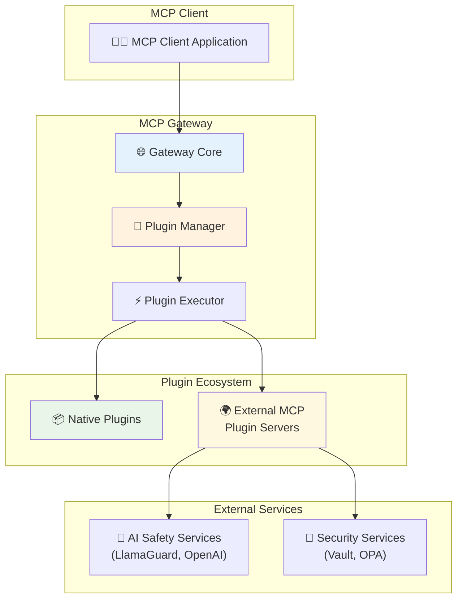

## 2. Architecture Overview

### 2.1 High-Level Architecture



### 2.2 Framework Structure

```
mcpgateway/plugins/framework/
├── base.py              # Plugin base classes
├── models.py            # Pydantic models for all plugin types
├── manager.py           # PluginManager singleton with lifecycle management
├── registry.py          # Plugin instance registry and discovery
├── constants.py         # Framework constants and enums
├── errors.py            # Plugin-specific exception types
├── utils.py             # Utility functions for plugin operations
├── loader/
│   ├── config.py        # Configuration loading and validation
│   └── plugin.py        # Dynamic plugin loading and instantiation
└── external/
    └── mcp/             # MCP external service integration
        ├── client.py    # MCP client for external plugin communication
        └── server/      # MCP server runtime for plugin hosting
```

### 2.3 Plugin Deployment Patterns

#### 2.3.1 Native Plugins (In-Process)

- Execute within the main gateway process
- Extends the base `Plugin` class
- Sub-millisecond latency (<1ms)
- Direct memory access to gateway state
- Examples: PII filtering, regex transforms, validation

#### 2.3.2 External Plugins (Remote MCP Servers)

- Standalone MCP servers implementing plugin logic
- Language-agnostic (Python, TypeScript, Go, Rust, etc.)
- Communicate via MCP protocol over various transports
- 10-100ms latency depending on service and network
- Examples: LlamaGuard, OpenAI Moderation, custom AI services

