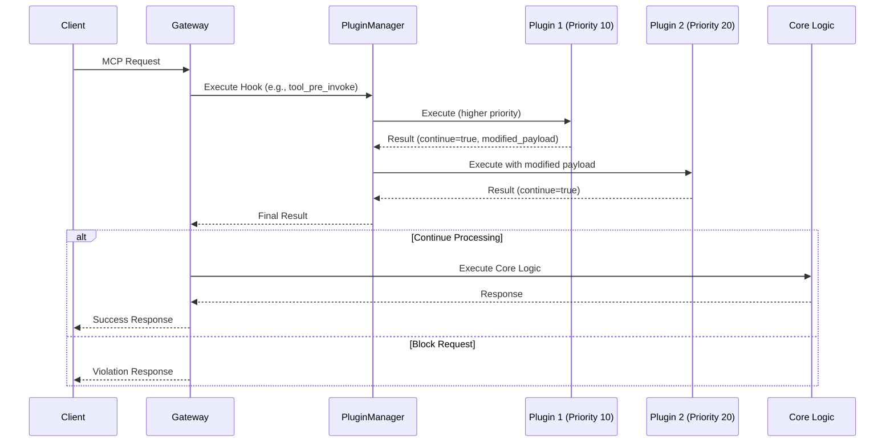

## 6. Hook System

### 6.1 Hook Execution Flow

The hook execution flow implements a **priority-based pipeline** that processes MCP requests through multiple plugin layers before reaching core gateway logic. This architecture ensures predictable plugin execution order while enabling comprehensive request/response transformation and policy enforcement.



#### 6.1.1 Execution Flow Breakdown

**Phase 1: Request Reception & Hook Identification**

1. **Client Request**: MCP client sends request (tool invocation, prompt fetch, resource access) to the gateway
2. **Hook Selection**: Gateway identifies the appropriate hook type based on the request (e.g., `tool_pre_invoke` for tool calls)
3. **Plugin Manager Invocation**: Gateway delegates hook execution to the Plugin Manager with request payload

**Phase 2: Priority-Based Plugin Execution**

4. **Plugin Discovery**: Plugin Manager retrieves all plugins registered for the specific hook type
5. **Priority Sorting**: Plugins are sorted in **ascending priority order** (lower numbers execute first)
6. **Conditional Filtering**: Plugins with conditions are filtered based on current request context (user, tenant, server, etc.)

**Phase 3: Sequential Plugin Processing**

7. **First Plugin Execution**: Highest priority plugin (P1, priority 10) executes with original payload
8. **Result Evaluation**: Plugin returns `PluginResult` indicating whether to continue processing
9. **Payload Chain**: If P1 modifies the payload, the modified version is passed to the next plugin
10. **Second Plugin Execution**: Next priority plugin (P2, priority 20) executes with potentially modified payload
11. **Continue Chain**: Process repeats for all remaining plugins in priority order

**Phase 4: Flow Control Decision**

12. **Aggregated Result**: Plugin Manager combines all plugin results and determines final action
13. **Continue vs Block**: Based on plugin results, request either continues to core logic or is blocked

**Phase 5: Request Resolution**

- **Continue Path**: If all plugins allow processing, request continues to core gateway logic
  - Core logic executes the actual MCP operation (tool invocation, prompt rendering, resource fetching)
  - Success response is returned to client
- **Block Path**: If any plugin blocks the request with a violation
  - Request processing stops immediately
  - Violation details are returned to client as an error response

#### 6.1.2 Plugin Interaction Patterns

**Payload Transformation Chain:**
```
Original Payload → Plugin 1 → Modified Payload → Plugin 2 → Final Payload → Core Logic
```

**Example Flow for Tool Pre-Invoke:**

1. Client calls `file_reader` tool with path argument
2. Gateway triggers `tool_pre_invoke` hook
3. **Security Plugin (Priority 10)**: Validates file path, blocks access to `/etc/passwd`
4. **Sanitization Plugin (Priority 20)**: Never executes (request blocked)
5. **Result**: Client receives "Access Denied" error

**Alternative Success Flow:**

1. Client calls `file_reader` tool with path `./documents/report.txt`
2. **Security Plugin (Priority 10)**: Validates path, allows access, normalizes path
3. **Sanitization Plugin (Priority 20)**: Adds read timeout, limits file size
4. **Core Logic**: Executes file reading with sanitized parameters
5. **Result**: Client receives file contents

#### 6.1.3 Error Handling and Resilience

**Plugin Error Isolation:**

- Plugin execution errors don't crash other plugins or the gateway
- Failed plugins are logged and handled based on their execution mode:
  - **Enforce Mode**: Plugin errors block the request
  - **Permissive Mode**: Plugin errors are logged but request continues
  - **Enforce Ignore Error Mode**: Plugin violations block, but technical errors are ignored

**Timeout Protection:**

- Each plugin execution is wrapped with configurable timeouts (default 30 seconds)
- Timed-out plugins are treated as errors according to their execution mode
- External plugins may have longer timeout allowances due to network latency

**Context Preservation:**

- Plugin contexts are preserved across the execution chain
- State set by early plugins is available to later plugins
- Global context maintains request-level information throughout the flow

This execution model ensures **predictable behavior**, **comprehensive security coverage**, and **operational resilience** while maintaining the flexibility to implement complex policy enforcement and content transformation workflows.

### 6.2 Plugin Execution Priority

- Plugins execute in **ascending priority order** (lower number = higher priority)
- **Priority Ranges** (recommended):
  - `1-50`: Critical security plugins (authentication, PII filtering)
  - `51-100`: Content filtering and validation
  - `101-200`: Transformations and enhancements
  - `201+`: Logging and monitoring

### 6.3 Hook Registration

```python
# Plugin registers for specific hooks via configuration
hooks: list[HookType] = [
    HookType.PROMPT_PRE_FETCH,
    HookType.TOOL_PRE_INVOKE,
    HookType.TOOL_POST_INVOKE
]

# Plugin Manager routes hooks to registered plugins
plugins = registry.get_plugins_for_hook(HookType.TOOL_PRE_INVOKE)
```

### 6.4 Conditional Execution

Plugins can specify conditions for when they should execute:

```python
class PluginCondition(BaseModel):
    """Conditions for plugin execution"""
    server_ids: Optional[set[str]] = None      # Execute only for specific servers
    tenant_ids: Optional[set[str]] = None      # Execute only for specific tenants
    tools: Optional[set[str]] = None           # Execute only for specific tools
    prompts: Optional[set[str]] = None         # Execute only for specific prompts
    resources: Optional[set[str]] = None       # Execute only for specific resources
    user_patterns: Optional[list[str]] = None  # Execute for users matching patterns
    content_types: Optional[list[str]] = None  # Execute for specific content types
```
## 6.5 Hook Reference Documentation

The plugin framework provides two main categories of hooks, each documented in detail in separate files:

### MCP Security Hooks

For detailed information about MCP protocol security hooks including payload structures, examples, and use cases, see:

**[📖 MCP Security Hooks Reference](./07-security-hooks.md)**

This document covers the eight core MCP protocol hooks:

- HTTP Pre/Post-Forwarding Hooks - Header processing and authentication
- Prompt Pre/Post-Fetch Hooks - Input validation and content filtering
- Tool Pre/Post-Invoke Hooks - Parameter validation and result processing
- Resource Pre/Post-Fetch Hooks - URI validation and content transformation

### Gateway Administrative Hooks

For detailed information about gateway management and administrative hooks, see:

**[📖 Gateway Administrative Hooks Reference](./06-gateway-hooks.md)**

This document covers administrative operation hooks:

- Server Management Hooks - Registration, updates, deletion, activation
- Gateway Federation Hooks - Peer gateway management *(Future)*
- A2A Agent Hooks - Agent-to-Agent integration management *(Future)*
- Entity Lifecycle Hooks - Tool, resource, and prompt registration *(Future)*

