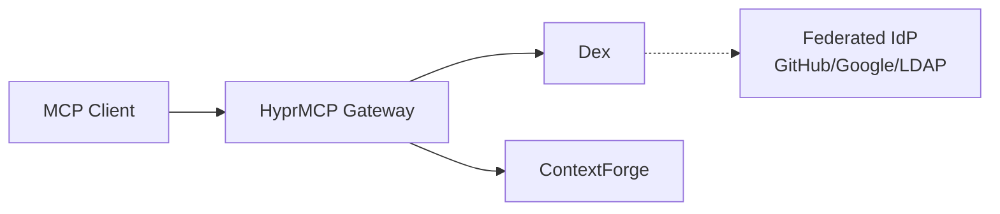

# Dynamic Client Registration (DCR)

Dynamic Client Registration (DCR) is an OAuth 2.0 extension that enables automatic client registration without manual configuration. This guide explains how to configure and use DCR with MCP Gateway for streamable HTTP servers.

## Overview

DCR solves a common authentication challenge in distributed MCP deployments:
- **Traditional OAuth2** requires pre-configured client credentials for each MCP server
- **With DCR**, MCP clients can automatically register themselves as OAuth2 clients

**Key Benefits:**
- ✅ Zero-touch OAuth configuration - no manual credential management
- ✅ Automatic discovery via RFC 8414 (Authorization Server Metadata)
- ✅ Support for public clients (PKCE-only, no client secret)
- ✅ Credential encryption and secure storage
- ✅ Issuer allowlist for security

---

## What is Dynamic Client Registration?

Dynamic Client Registration is defined in [RFC 7591](https://tools.ietf.org/html/rfc7591) as a protocol that allows OAuth 2.0 clients to register with authorization servers dynamically. In the context of MCP Gateway:

1. **Discovery Phase**: Gateway discovers Authorization Server (AS) metadata via [RFC 8414](https://tools.ietf.org/html/rfc8414)
2. **Registration Phase**: Gateway registers itself as an OAuth client with the AS
3. **Token Phase**: Gateway uses registered credentials for standard OAuth flows

---

## Environment Variables

```bash
# DCR Feature Control
MCPGATEWAY_DCR_ENABLED=true                              # Enable/disable DCR (default: true)
MCPGATEWAY_DCR_AUTO_REGISTER_ON_MISSING_CREDENTIALS=true # Auto-register when gateway has issuer but no client_id (default: true)

# DCR Configuration
MCPGATEWAY_DCR_DEFAULT_SCOPES="mcp:read"                 # Default scopes to request (comma-separated, default: mcp:read)
MCPGATEWAY_DCR_ALLOWED_ISSUERS=""                        # Optional allowlist of issuer URLs (empty = allow any)
MCPGATEWAY_DCR_TOKEN_ENDPOINT_AUTH_METHOD="client_secret_basic" # Auth method: client_secret_basic or client_secret_post
MCPGATEWAY_DCR_METADATA_CACHE_TTL=3600                   # AS metadata cache TTL in seconds (default: 1 hour)
MCPGATEWAY_DCR_CLIENT_NAME_TEMPLATE="MCP Gateway ({gateway_name})" # Client name template for registration

# OAuth Settings (used by DCR)
OAUTH_REQUEST_TIMEOUT=30                                 # HTTP request timeout in seconds
AUTH_ENCRYPTION_SECRET=<strong-random-key>               # Required for encrypting client secrets
```

!!! important "Security Note"
    Always set `AUTH_ENCRYPTION_SECRET` to a strong random value. DCR-registered client secrets and refresh tokens are encrypted using this key.

---

## How It Works

### 1. AS Metadata Discovery (RFC 8414)

When you configure a gateway with an `issuer` URL, the gateway automatically discovers the AS configuration:

```
GET https://auth.example.com/.well-known/oauth-authorization-server
```

If that fails, tries OIDC discovery:

```
GET https://auth.example.com/.well-known/openid-configuration
```

The metadata response includes:
- `registration_endpoint` - Where to register clients
- `authorization_endpoint` - OAuth authorization URL
- `token_endpoint` - Token exchange URL
- Supported grant types, scopes, and auth methods

**Caching:** Metadata is cached for `MCPGATEWAY_DCR_METADATA_CACHE_TTL` seconds (default: 1 hour).

### 2. Client Registration (RFC 7591)

If no `client_id` is configured and `MCPGATEWAY_DCR_AUTO_REGISTER_ON_MISSING_CREDENTIALS=true`, the gateway automatically registers:

```json
POST https://auth.example.com/register
Content-Type: application/json

{
  "client_name": "MCP Gateway (GitHub MCP)",
  "redirect_uris": ["https://gateway.example.com/oauth/callback"],
  "grant_types": ["authorization_code"],
  "response_types": ["code"],
  "token_endpoint_auth_method": "client_secret_basic",
  "scope": "mcp:read mcp:write"
}
```

The AS responds with registered credentials:

```json
{
  "client_id": "auto-generated-id",
  "client_secret": "auto-generated-secret",
  "registration_access_token": "...",
  "registration_client_uri": "https://auth.example.com/register/auto-generated-id"
}
```

Gateway stores these in the `registered_oauth_clients` table (encrypted).

### 3. OAuth Flow with Registered Credentials

Once registered, the gateway uses the client credentials for standard OAuth flows with automatic PKCE.

---

## Architecture

A simplified architecture. Please view the following guide for an in-depth swimlane chart:

📖 **[Dynamic Client Registration with HyperMCP Tutorial](../tutorials/dcr-hyprmcp.md)**



---

## Configuration Examples

### Automatic Registration (Recommended)

Configure a gateway with just the issuer URL - credentials auto-register:

**Admin UI:**
1. Create/Edit Gateway → Authentication Type: OAuth
2. Set Grant Type: `authorization_code`
3. Set Issuer: `https://auth.example.com`
4. Set Redirect URI: `https://gateway.example.com/oauth/callback`
5. Leave Client ID and Client Secret empty
6. Save → Gateway auto-registers and stores credentials

**JSON/API:**

```json
{
  "name": "Auto-DCR Gateway",
  "url": "https://mcp.example.com/sse",
  "auth_type": "oauth",
  "oauth_config": {
    "grant_type": "authorization_code",
    "issuer": "https://auth.example.com",
    "redirect_uri": "https://gateway.example.com/oauth/callback",
    "scopes": ["mcp:read", "mcp:write"]
  }
}
```

### Manual Client Credentials (Fallback)

If DCR is disabled or you have pre-registered credentials:

```json
{
  "name": "Manual OAuth Gateway",
  "url": "https://mcp.example.com/sse",
  "auth_type": "oauth",
  "oauth_config": {
    "grant_type": "authorization_code",
    "client_id": "pre-registered-id",
    "client_secret": "pre-registered-secret",
    "authorization_url": "https://auth.example.com/authorize",
    "token_url": "https://auth.example.com/token",
    "redirect_uri": "https://gateway.example.com/oauth/callback",
    "scopes": ["mcp:read"]
  }
}
```

### Public Client with PKCE Only

For public clients that don't support client secrets:

```json
{
  "name": "Public Client Gateway",
  "url": "https://mcp.example.com/sse",
  "auth_type": "oauth",
  "oauth_config": {
    "grant_type": "authorization_code",
    "issuer": "https://auth.example.com",
    "client_id": "public-client-id",
    "redirect_uri": "https://gateway.example.com/oauth/callback",
    "scopes": ["mcp:read"]
  }
}
```

Note: No `client_secret` - PKCE provides security.

---

## Database Schema

DCR uses two new tables:

### `registered_oauth_clients`

Stores auto-registered OAuth clients:

```sql
CREATE TABLE registered_oauth_clients (
    id VARCHAR(36) PRIMARY KEY,
    gateway_id VARCHAR(255) NOT NULL,
    issuer VARCHAR(500) NOT NULL,
    client_id VARCHAR(255) NOT NULL,
    client_secret_encrypted TEXT,
    redirect_uris TEXT NOT NULL,
    grant_types TEXT NOT NULL,
    scope VARCHAR(1000),
    registration_client_uri VARCHAR(500),
    registration_access_token_encrypted TEXT,
    created_at TIMESTAMP,
    expires_at TIMESTAMP,
    is_active BOOLEAN,
    UNIQUE (gateway_id, issuer)
);
```

### `oauth_states`

Stores OAuth authorization state with PKCE verifiers:

```sql
CREATE TABLE oauth_states (
    id VARCHAR(36) PRIMARY KEY,
    gateway_id VARCHAR(255) NOT NULL,
    state VARCHAR(255) NOT NULL UNIQUE,
    code_verifier VARCHAR(255),  -- PKCE code verifier
    app_user_email VARCHAR(255),
    created_at TIMESTAMP,
    expires_at TIMESTAMP
);
```

---

## Security Features

### 1. Issuer Allowlist

Restrict which Authorization Servers can be used:

```bash
MCPGATEWAY_DCR_ALLOWED_ISSUERS='["https://trusted-as1.com", "https://trusted-as2.com"]'
```

If set, gateway will reject DCR for any issuer not in the list.

### 2. Encrypted Credentials

All sensitive data is encrypted at rest using `AUTH_ENCRYPTION_SECRET`:
- Client secrets
- Registration access tokens
- Refresh tokens

### 3. PKCE Integration

All Authorization Code flows automatically use PKCE (RFC 7636) for enhanced security:
- Prevents authorization code interception attacks
- Supports public clients without client secrets
- No configuration needed - always enabled

### 4. Metadata Validation

Gateway validates AS metadata responses:
- Issuer URL must match discovery URL
- Registration endpoint must be present
- Proper HTTP status codes (200/201 for registration)

---

## Troubleshooting

### DCR Registration Fails

**Error: "AS does not support Dynamic Client Registration"**
- The Authorization Server doesn't expose a `registration_endpoint` in its metadata
- Solution: Use manual client credentials instead

**Error: "Issuer not in allowed issuers list"**
- The issuer URL is not in `MCPGATEWAY_DCR_ALLOWED_ISSUERS`
- Solution: Add the issuer to the allowlist or clear the allowlist to allow any

**Error: "Failed to discover AS metadata"**
- The issuer URL is incorrect or unreachable
- Solution: Verify the issuer URL and network connectivity

### Client Registration Rejected

**HTTP 400/401 from AS**
- Check AS logs for specific error messages
- Verify redirect URI matches AS requirements
- Ensure scopes are supported by the AS

**HTTP 200 instead of 201**
- Some ASs return 200 instead of RFC 7591's 201 - this is accepted
- If registration still fails, check response body for errors

### Token Exchange Issues

**Invalid client_id after DCR**
- Verify registration was successful in `registered_oauth_clients` table
- Check that `client_secret_encrypted` was properly stored
- Try re-registering by deleting the record and recreating the gateway

---

## Monitoring

Check DCR activity in logs:

```bash
# Search for DCR operations
grep "Discovered AS metadata" logs/mcpgateway.log
grep "Successfully registered client" logs/mcpgateway.log
grep "Found existing registered client" logs/mcpgateway.log

# Check for errors
grep "DcrError" logs/mcpgateway.log
```

Query registered clients:

```sql
SELECT
    gateway_id,
    issuer,
    client_id,
    created_at,
    is_active
FROM registered_oauth_clients
WHERE is_active = 1;
```

---

## Related Documentation

- [OAuth 2.0 Integration](oauth.md) - General OAuth2 configuration and PKCE details
- [Proxy Authentication](../deployment/proxy-auth.md) - Using authentication proxies
- [SSO Configuration](sso.md) - Single Sign-On setup
- [Security Best Practices](securing.md) - Security guidelines
