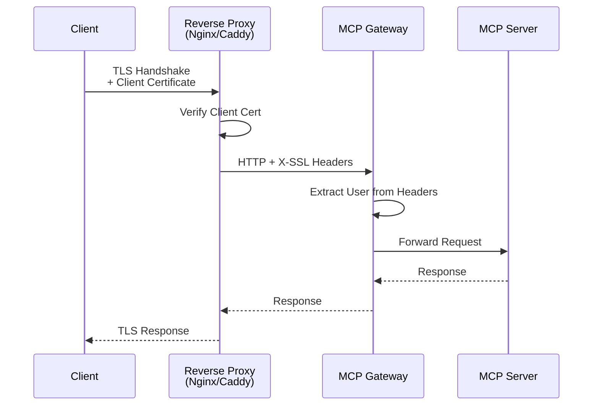

# mTLS (Mutual TLS) Configuration

Configure mutual TLS authentication for MCP Gateway to enable certificate-based client authentication and enhanced security.

## Overview

Mutual TLS (mTLS) provides bidirectional authentication between clients and servers using X.509 certificates. While native mTLS support is in development ([#568](https://github.com/IBM/mcp-context-forge/issues/568)), MCP Gateway can leverage reverse proxies for production-ready mTLS today.

## Current Status

- **Native mTLS**: 🚧 In Progress - tracked in [#568](https://github.com/IBM/mcp-context-forge/issues/568)
- **Proxy-based mTLS**: ✅ Available - using Nginx, Caddy, or other reverse proxies
- **Container Support**: ✅ Ready - lightweight containers support proxy deployment

## Architecture



## Quick Start

### Option 1: Docker Compose with Nginx mTLS

1. **Generate certificates** (for testing):

```bash
# Create certificates directory
mkdir -p certs/mtls

# Generate CA certificate
openssl req -x509 -newkey rsa:4096 -days 365 -nodes \
  -keyout certs/mtls/ca.key -out certs/mtls/ca.crt \
  -subj "/C=US/ST=State/L=City/O=MCP-CA/CN=MCP Root CA"

# Generate server certificate
openssl req -newkey rsa:4096 -nodes \
  -keyout certs/mtls/server.key -out certs/mtls/server.csr \
  -subj "/CN=gateway.local"

openssl x509 -req -in certs/mtls/server.csr \
  -CA certs/mtls/ca.crt -CAkey certs/mtls/ca.key \
  -CAcreateserial -out certs/mtls/server.crt -days 365

# Generate client certificate
openssl req -newkey rsa:4096 -nodes \
  -keyout certs/mtls/client.key -out certs/mtls/client.csr \
  -subj "/CN=admin@example.com"

openssl x509 -req -in certs/mtls/client.csr \
  -CA certs/mtls/ca.crt -CAkey certs/mtls/ca.key \
  -CAcreateserial -out certs/mtls/client.crt -days 365

# Create client bundle for testing
cat certs/mtls/client.crt certs/mtls/client.key > certs/mtls/client.pem
```

2. **Create Nginx configuration** (`nginx-mtls.conf`):

```nginx
events {
    worker_connections 1024;
}

http {
    upstream mcp_gateway {
        server gateway:4444;
    }

    server {
        listen 443 ssl;
        server_name gateway.local;

        # Server certificates
        ssl_certificate /etc/nginx/certs/server.crt;
        ssl_certificate_key /etc/nginx/certs/server.key;

        # mTLS client verification
        ssl_client_certificate /etc/nginx/certs/ca.crt;
        ssl_verify_client on;
        ssl_verify_depth 2;

        # Strong TLS settings
        ssl_protocols TLSv1.2 TLSv1.3;
        ssl_ciphers HIGH:!aNULL:!MD5;
        ssl_prefer_server_ciphers on;

        location / {
            proxy_pass http://mcp_gateway;
            proxy_http_version 1.1;

            # Pass client certificate info to MCP Gateway
            proxy_set_header X-SSL-Client-Cert $ssl_client_escaped_cert;
            proxy_set_header X-SSL-Client-S-DN $ssl_client_s_dn;
            proxy_set_header X-SSL-Client-S-DN-CN $ssl_client_s_dn_cn;
            proxy_set_header X-SSL-Client-Verify $ssl_client_verify;
            proxy_set_header X-Authenticated-User $ssl_client_s_dn_cn;

            # Standard proxy headers
            proxy_set_header Host $host;
            proxy_set_header X-Real-IP $remote_addr;
            proxy_set_header X-Forwarded-For $proxy_add_x_forwarded_for;
            proxy_set_header X-Forwarded-Proto $scheme;
        }

        # WebSocket support
        location /ws {
            proxy_pass http://mcp_gateway;
            proxy_http_version 1.1;
            proxy_set_header Upgrade $http_upgrade;
            proxy_set_header Connection "upgrade";
            proxy_set_header X-SSL-Client-S-DN-CN $ssl_client_s_dn_cn;
            proxy_set_header X-Authenticated-User $ssl_client_s_dn_cn;
        }

        # SSE support
        location ~ ^/servers/.*/sse$ {
            proxy_pass http://mcp_gateway;
            proxy_http_version 1.1;
            proxy_set_header X-SSL-Client-S-DN-CN $ssl_client_s_dn_cn;
            proxy_set_header X-Authenticated-User $ssl_client_s_dn_cn;
            proxy_set_header Connection "";
            proxy_buffering off;
            proxy_cache off;
        }
    }
}
```

3. **Create Docker Compose file** (`docker-compose-mtls.yml`):

```yaml
version: '3.8'

services:
  nginx-mtls:
    image: nginx:alpine
    ports:
      - "443:443"
    volumes:
      - ./nginx-mtls.conf:/etc/nginx/nginx.conf:ro
      - ./certs/mtls:/etc/nginx/certs:ro
    networks:
      - mcpnet
    depends_on:
      - gateway

  gateway:
    image: ghcr.io/ibm/mcp-context-forge:latest
    environment:
      - HOST=0.0.0.0
      - PORT=4444
      - DATABASE_URL=sqlite:////app/data/mcp.db

      # Disable JWT auth and trust proxy headers
      - MCP_CLIENT_AUTH_ENABLED=false
      - TRUST_PROXY_AUTH=true
      - PROXY_USER_HEADER=X-SSL-Client-S-DN-CN

      # Keep admin UI protected
      - AUTH_REQUIRED=true
      - BASIC_AUTH_USER=admin
      - BASIC_AUTH_PASSWORD=changeme

      # Enable admin features
      - MCPGATEWAY_UI_ENABLED=true
      - MCPGATEWAY_ADMIN_API_ENABLED=true
    networks:
      - mcpnet
    volumes:
      - ./data:/app/data  # persists SQLite database at /app/data/mcp.db

networks:
  mcpnet:
    driver: bridge
```
> 💾 Run `mkdir -p data` before `docker-compose up` so the SQLite database survives restarts.


4. **Test the connection**:

```bash
# Start the services
docker-compose -f docker-compose-mtls.yml up -d

# Test with client certificate
curl --cert certs/mtls/client.pem \
     --cacert certs/mtls/ca.crt \
     https://localhost/health

# Test without certificate (should fail)
curl https://localhost/health
# Error: SSL certificate problem
```

### Option 2: Caddy with mTLS

1. **Create Caddyfile** (`Caddyfile.mtls`):

```caddyfile
{
    # Global options
    debug
}

gateway.local {
    # Enable mTLS
    tls {
        client_auth {
            mode require_and_verify
            trusted_ca_cert_file /etc/caddy/certs/ca.crt
        }
    }

    # Reverse proxy to MCP Gateway
    reverse_proxy gateway:4444 {
        # Pass certificate info as headers
        header_up X-SSL-Client-Cert {http.request.tls.client.certificate_pem_escaped}
        header_up X-SSL-Client-S-DN {http.request.tls.client.subject}
        header_up X-SSL-Client-S-DN-CN {http.request.tls.client.subject_cn}
        header_up X-Authenticated-User {http.request.tls.client.subject_cn}

        # WebSocket support
        @websocket {
            header Connection *Upgrade*
            header Upgrade websocket
        }
        transport http {
            versions 1.1
        }
    }
}
```

2. **Docker Compose with Caddy**:

```yaml
version: '3.8'

services:
  caddy-mtls:
    image: caddy:alpine
    ports:
      - "443:443"
    volumes:
      - ./Caddyfile.mtls:/etc/caddy/Caddyfile:ro
      - ./certs/mtls:/etc/caddy/certs:ro
      - caddy_data:/data
      - caddy_config:/config
    networks:
      - mcpnet
    depends_on:
      - gateway

  gateway:
    # Same configuration as Nginx example
    image: ghcr.io/ibm/mcp-context-forge:latest
    environment:
      - MCP_CLIENT_AUTH_ENABLED=false
      - TRUST_PROXY_AUTH=true
      - PROXY_USER_HEADER=X-SSL-Client-S-DN-CN
      # ... rest of config ...
    networks:
      - mcpnet

volumes:
  caddy_data:
  caddy_config:

networks:
  mcpnet:
    driver: bridge
```

## Production Configuration

### Enterprise PKI Integration

For production deployments, integrate with your enterprise PKI:

```nginx
# nginx.conf - Enterprise PKI
server {
    listen 443 ssl;

    # Server certificates from enterprise CA
    ssl_certificate /etc/pki/tls/certs/gateway.crt;
    ssl_certificate_key /etc/pki/tls/private/gateway.key;

    # Client CA chain
    ssl_client_certificate /etc/pki/tls/certs/enterprise-ca-chain.crt;
    ssl_verify_client on;
    ssl_verify_depth 3;

    # CRL verification
    ssl_crl /etc/pki/tls/crl/enterprise.crl;

    # OCSP stapling
    ssl_stapling on;
    ssl_stapling_verify on;
    ssl_trusted_certificate /etc/pki/tls/certs/enterprise-ca-chain.crt;

    location / {
        proxy_pass http://mcp-gateway:4444;

        # Extract user from certificate DN
        if ($ssl_client_s_dn ~ /CN=([^\/]+)/) {
            set $cert_cn $1;
        }
        proxy_set_header X-Authenticated-User $cert_cn;

        # Extract organization
        if ($ssl_client_s_dn ~ /O=([^\/]+)/) {
            set $cert_org $1;
        }
        proxy_set_header X-User-Organization $cert_org;
    }
}
```

### Kubernetes Deployment Options

### Option 1: Helm Chart with TLS Ingress

The MCP Gateway Helm chart (`charts/mcp-stack`) includes built-in TLS support via Ingress:

```bash
# Install with TLS enabled
helm install mcp-gateway ./charts/mcp-stack \
  --set mcpContextForge.ingress.enabled=true \
  --set mcpContextForge.ingress.host=gateway.example.com \
  --set mcpContextForge.ingress.tls.enabled=true \
  --set mcpContextForge.ingress.tls.secretName=gateway-tls \
  --set mcpContextForge.ingress.annotations."cert-manager\.io/cluster-issuer"=letsencrypt-prod \
  --set mcpContextForge.ingress.annotations."nginx.ingress.kubernetes.io/auth-tls-secret"=mcp-system/gateway-client-ca \
  --set mcpContextForge.ingress.annotations."nginx.ingress.kubernetes.io/auth-tls-verify-client"=on \
  --set mcpContextForge.ingress.annotations."nginx.ingress.kubernetes.io/auth-tls-verify-depth"="2" \
  --set mcpContextForge.ingress.annotations."nginx.ingress.kubernetes.io/auth-tls-pass-certificate-to-upstream"="true"
```


> ℹ️ The configuration snippet that forwards the client CN is easier to maintain in `values.yaml`; the one-liner above focuses on core flags.

Or configure via `values.yaml`:

```yaml
# charts/mcp-stack/values.yaml excerpt
mcpContextForge:
  ingress:
    enabled: true
    className: nginx
    host: gateway.example.com
    annotations:
      cert-manager.io/cluster-issuer: letsencrypt-prod
      nginx.ingress.kubernetes.io/auth-tls-secret: mcp-system/gateway-client-ca
      nginx.ingress.kubernetes.io/auth-tls-verify-client: "on"
      nginx.ingress.kubernetes.io/auth-tls-verify-depth: "2"
      nginx.ingress.kubernetes.io/auth-tls-pass-certificate-to-upstream: "true"
      nginx.ingress.kubernetes.io/configuration-snippet: |
        proxy_set_header X-SSL-Client-S-DN $ssl_client_s_dn;
        proxy_set_header X-SSL-Client-S-DN-CN $ssl_client_s_dn_cn;
        proxy_set_header X-Authenticated-User $ssl_client_s_dn_cn;
    tls:
      enabled: true
      secretName: gateway-tls  # cert-manager will generate this

  secret:
    MCP_CLIENT_AUTH_ENABLED: "false"
    TRUST_PROXY_AUTH: "true"
    PROXY_USER_HEADER: X-SSL-Client-S-DN-CN
```

Create the `gateway-client-ca` secret in the same namespace as the release so the Ingress controller can validate client certificates. For example:

```bash
kubectl create secret generic gateway-client-ca \
  --from-file=ca.crt=certs/mtls/ca.crt \
  --namespace mcp-system
```

### Option 2: Kubernetes with Istio mTLS

Deploy MCP Gateway with automatic mTLS in Istio service mesh:

```yaml
# gateway-deployment.yaml
apiVersion: apps/v1
kind: Deployment
metadata:
  name: mcp-gateway
  namespace: mcp-system
spec:
  template:
    metadata:
      labels:
        app: mcp-gateway
      annotations:
        sidecar.istio.io/inject: "true"
    spec:
      containers:
      - name: mcp-gateway
        image: ghcr.io/ibm/mcp-context-forge:latest
        env:
        - name: MCP_CLIENT_AUTH_ENABLED
          value: "false"
        - name: TRUST_PROXY_AUTH
          value: "true"
        - name: PROXY_USER_HEADER
          value: "X-SSL-Client-S-DN-CN"
---
# peer-authentication.yaml
apiVersion: security.istio.io/v1beta1
kind: PeerAuthentication
metadata:
  name: mcp-gateway-mtls
  namespace: mcp-system
spec:
  selector:
    matchLabels:
      app: mcp-gateway
  mtls:
    mode: STRICT
```

Istio does not add `X-SSL-Client-S-DN-CN` automatically. Use an `EnvoyFilter` to extract the client certificate common name and forward it as the header referenced by `PROXY_USER_HEADER`:

```yaml
# envoy-filter-client-cn.yaml
apiVersion: networking.istio.io/v1alpha3
kind: EnvoyFilter
metadata:
  name: append-client-cn-header
  namespace: mcp-system
spec:
  workloadSelector:
    labels:
      app: mcp-gateway
  configPatches:
  - applyTo: HTTP_FILTER
    match:
      context: SIDECAR_INBOUND
      listener:
        portNumber: 4444
      filterChain:
        filter:
          name: envoy.filters.network.http_connection_manager
    patch:
      operation: INSERT_BEFORE
      value:
        name: envoy.filters.http.lua
        typed_config:
          "@type": type.googleapis.com/envoy.extensions.filters.http.lua.v3.Lua
          inlineCode: |
            function envoy_on_request(handle)
              local ssl = handle:streamInfo():downstreamSslConnection()
              if ssl ~= nil and ssl:peerCertificatePresented() then
                local subject = ssl:subjectPeerCertificate()
                if subject ~= nil then
                  local cn = subject:match("CN=([^,/]+)")
                  if cn ~= nil then
                    handle:headers():replace("X-SSL-Client-S-DN-CN", cn)
                  end
                end
              end
            end
            function envoy_on_response(handle)
            end
```

The filter runs in the sidecar and ensures the gateway receives the client's common name rather than the full certificate payload.

### HAProxy with mTLS

```haproxy
# haproxy.cfg
global
    ssl-default-bind-options ssl-min-ver TLSv1.2
    tune.ssl.default-dh-param 2048

frontend mcp_gateway_mtls
    bind *:443 ssl crt /etc/haproxy/certs/server.pem ca-file /etc/haproxy/certs/ca.crt verify required

    # Extract certificate information
    http-request set-header X-SSL-Client-Cert %[ssl_c_der,base64]
    http-request set-header X-SSL-Client-S-DN %[ssl_c_s_dn]
    http-request set-header X-SSL-Client-S-DN-CN %[ssl_c_s_dn(CN)]
    http-request set-header X-Authenticated-User %[ssl_c_s_dn(CN)]

    default_backend mcp_gateway_backend

backend mcp_gateway_backend
    server gateway gateway:4444 check
```

## Certificate Management

### Certificate Generation Scripts

Create a script for certificate management (`generate-certs.sh`):

```bash
#!/bin/bash
set -e

CERT_DIR="${CERT_DIR:-./certs/mtls}"
CA_DAYS="${CA_DAYS:-3650}"
CERT_DAYS="${CERT_DAYS:-365}"
KEY_SIZE="${KEY_SIZE:-4096}"

mkdir -p "$CERT_DIR"

# Generate CA if it doesn't exist
if [ ! -f "$CERT_DIR/ca.crt" ]; then
    echo "Generating CA certificate..."
    openssl req -x509 -newkey rsa:$KEY_SIZE -days $CA_DAYS -nodes \
        -keyout "$CERT_DIR/ca.key" -out "$CERT_DIR/ca.crt" \
        -subj "/C=US/ST=State/L=City/O=Organization/CN=MCP CA"
    echo "CA certificate generated."
fi

# Function to generate certificates
generate_cert() {
    local name=$1
    local cn=$2

    if [ -f "$CERT_DIR/${name}.crt" ]; then
        echo "Certificate for $name already exists, skipping..."
        return
    fi

    echo "Generating certificate for $name (CN=$cn)..."

    # Generate private key and CSR
    openssl req -newkey rsa:$KEY_SIZE -nodes \
        -keyout "$CERT_DIR/${name}.key" -out "$CERT_DIR/${name}.csr" \
        -subj "/CN=$cn"

    # Sign with CA
    openssl x509 -req -in "$CERT_DIR/${name}.csr" \
        -CA "$CERT_DIR/ca.crt" -CAkey "$CERT_DIR/ca.key" \
        -CAcreateserial -out "$CERT_DIR/${name}.crt" -days $CERT_DAYS \
        -extfile <(echo "subjectAltName=DNS:$cn")

    # Create bundle
    cat "$CERT_DIR/${name}.crt" "$CERT_DIR/${name}.key" > "$CERT_DIR/${name}.pem"

    # Clean up CSR
    rm "$CERT_DIR/${name}.csr"

    echo "Certificate for $name generated."
}

# Generate server certificate
generate_cert "server" "gateway.local"

# Generate client certificates
generate_cert "admin" "admin@example.com"
generate_cert "user1" "user1@example.com"
generate_cert "service-account" "mcp-service@example.com"

echo "All certificates generated in $CERT_DIR"
```

### Certificate Rotation

Implement automatic certificate rotation:

```yaml
# kubernetes CronJob for cert rotation
apiVersion: batch/v1
kind: CronJob
metadata:
  name: cert-rotation
  namespace: mcp-system
spec:
  schedule: "0 2 * * *"  # Daily at 2 AM
  jobTemplate:
    spec:
      template:
        spec:
          serviceAccountName: cert-rotation
          containers:
          - name: cert-rotator
            image: bitnami/kubectl:1.30
            command:
            - /bin/sh
            - -c
            - |
              set -euo pipefail
              SECRET_NAME=${CERT_SECRET:-gateway-tls}
              CERT_NAME=${CERT_NAME:-gateway-tls-cert}
              NAMESPACE=${TARGET_NAMESPACE:-mcp-system}
              TLS_CERT=$(kubectl get secret "$SECRET_NAME" -n "$NAMESPACE" -o jsonpath='{.data.tls\.crt}')
              if [ -z "$TLS_CERT" ]; then
                echo "TLS secret $SECRET_NAME missing or empty"
                exit 1
              fi
              echo "$TLS_CERT" | base64 -d > /tmp/current.crt
              if openssl x509 -checkend 604800 -noout -in /tmp/current.crt; then
                echo "Certificate valid for more than 7 days"
              else
                echo "Certificate expiring soon, requesting renewal"
                kubectl cert-manager renew "$CERT_NAME" -n "$NAMESPACE" || echo "Install the kubectl-cert_manager plugin inside the job image to enable automatic renewal"
              fi
            env:
            - name: CERT_SECRET
              value: gateway-tls
            - name: CERT_NAME
              value: gateway-tls-cert
            - name: TARGET_NAMESPACE
              value: mcp-system
            volumeMounts:
            - name: tmp
              mountPath: /tmp
          restartPolicy: OnFailure
          volumes:
          - name: tmp
            emptyDir: {}
```

Create a `ServiceAccount`, `Role`, and `RoleBinding` that grant `get` access to the TLS secret and `update` access to the related `Certificate` resource so the job can request renewals.


> 🔧 Install the [`kubectl-cert_manager` plugin](https://cert-manager.io/docs/reference/kubectl-plugin/) or swap the command for `cmctl renew` if you prefer Jetstack's CLI image, and ensure your job image bundles both `kubectl` and `openssl`.

## mTLS for External MCP Plugins

External plugins that use the `STREAMABLEHTTP` transport now support mutual TLS directly from the gateway. This is optional—if you skip the configuration below, the gateway continues to call plugins exactly as before. Enabling mTLS lets you restrict remote plugin servers so they only accept connections from gateways presenting a trusted client certificate.

### 1. Issue Certificates for the Remote Plugin

Reuse the same CA you generated earlier or provision a dedicated one. Create a **server** certificate for the remote plugin endpoint and a **client** certificate for the MCP Gateway:

```bash
# Server cert for the remote plugin (served by your reverse proxy/mcp server)
openssl req -newkey rsa:4096 -nodes \
  -keyout certs/plugins/remote.key -out certs/plugins/remote.csr \
  -subj "/CN=plugins.internal.example.com"

openssl x509 -req -in certs/plugins/remote.csr \
  -CA certs/mtls/ca.crt -CAkey certs/mtls/ca.key \
  -CAcreateserial -out certs/plugins/remote.crt -days 365 \
  -extfile <(echo "subjectAltName=DNS:plugins.internal.example.com")

# Client cert for the gateway
openssl req -newkey rsa:4096 -nodes \
  -keyout certs/plugins/gateway-client.key -out certs/plugins/gateway-client.csr \
  -subj "/CN=mcpgateway"

openssl x509 -req -in certs/plugins/gateway-client.csr \
  -CA certs/mtls/ca.crt -CAkey certs/mtls/ca.key \
  -CAcreateserial -out certs/plugins/gateway-client.crt -days 365

cat certs/plugins/gateway-client.crt certs/plugins/gateway-client.key > certs/plugins/gateway-client.pem
```

### 2. Protect the Remote Plugin with mTLS

Front the remote MCP plugin with a reverse proxy (Nginx, Caddy, Envoy, etc.) that enforces client certificate verification using the CA above. Example Nginx snippet:

```nginx
server {
    listen 9443 ssl;
    server_name plugins.internal.example.com;

    ssl_certificate     /etc/ssl/private/remote.crt;
    ssl_certificate_key /etc/ssl/private/remote.key;
    ssl_client_certificate /etc/ssl/private/ca.crt;
    ssl_verify_client   on;

    location /mcp {
        proxy_pass http://plugin-runtime:8000/mcp;
        proxy_set_header Host $host;
        proxy_set_header X-Forwarded-Proto https;
    }
}
```

### 3. Mount Certificates into the Gateway

Expose the CA bundle and gateway client certificate to the gateway container:

```yaml
# docker-compose override
  gateway:
    volumes:
      - ./certs/plugins:/app/certs/plugins:ro

# Kubernetes deployment (snippet)
volumeMounts:
  - name: plugin-mtls
    mountPath: /app/certs/plugins
    readOnly: true
volumes:
  - name: plugin-mtls
    secret:
      secretName: gateway-plugin-mtls
```

### 4. Configure the Plugin Entry

Use the new `mcp.tls` block in `plugins/config.yaml` (or the Admin UI) to point the gateway at the certificates. Example external plugin definition:

```yaml
plugins:
  - name: "LlamaGuardSafety"
    kind: "external"
    hooks: ["prompt_pre_fetch", "tool_pre_invoke"]
    mode: "enforce"
    priority: 20
    mcp:
      proto: STREAMABLEHTTP
      url: https://plugins.internal.example.com:9443/mcp
      tls:
        ca_bundle: /app/certs/plugins/ca.crt
        client_cert: /app/certs/plugins/gateway-client.pem
        client_key: /app/certs/plugins/gateway-client.key  # optional if PEM already bundles key
        verify: true
        check_hostname: true

    config:
      policy: strict
```

**Key behavior**
- `verify` controls whether the gateway validates the remote server certificate. Leave `true` in production; set `false` only for local debugging.
- `ca_bundle` may point to a custom CA chain; omit it if the remote certificate chains to a system-trusted CA.
- `client_cert` must reference the gateway certificate. Provide `client_key` only when the key is stored separately.
- `check_hostname` defaults to `true`. Set it to `false` for scenarios where the certificate CN does not match the URL (not recommended outside testing).

Restart the gateway after updating the config so the external plugin client reloads with the TLS settings. Watch the logs for `Connected to plugin MCP (http) server` to confirm a successful handshake; TLS errors will surface as plugin initialization failures.

> 💡 **Tip:** You can set gateway-wide defaults via `PLUGINS_MTLS_CA_BUNDLE`,
> `PLUGINS_MTLS_CLIENT_CERT`, `PLUGINS_MTLS_CLIENT_KEY`, and the other
> `PLUGINS_MTLS_*` environment variables. Any plugin without an explicit
> `tls` block will inherit these values automatically.


## Security Best Practices

### 1. Certificate Validation

```nginx
# Strict certificate validation
ssl_verify_client on;
ssl_verify_depth 2;

# Check certificate validity
ssl_session_cache shared:SSL:10m;
ssl_session_timeout 10m;

# Enable OCSP stapling
ssl_stapling on;
ssl_stapling_verify on;
resolver 8.8.8.8 8.8.4.4 valid=300s;
resolver_timeout 5s;
```

### 2. Certificate Pinning

```python
# MCP Gateway plugin for cert pinning
class CertificatePinningPlugin:
    def __init__(self):
        self.pinned_certs = {
            "admin@example.com": "sha256:HASH...",
            "service@example.com": "sha256:HASH..."
        }

    async def on_request(self, request):
        cert_header = request.headers.get("X-SSL-Client-Cert")
        if cert_header:
            cert_hash = self.calculate_hash(cert_header)
            user = request.headers.get("X-Authenticated-User")

            if user in self.pinned_certs:
                if self.pinned_certs[user] != cert_hash:
                    raise SecurityException("Certificate pin mismatch")
```

### 3. Audit Logging

Configure comprehensive audit logging for mTLS connections:

```nginx
# nginx.conf - Audit logging
log_format mtls_audit '$remote_addr - $ssl_client_s_dn [$time_local] '
                      '"$request" $status $body_bytes_sent '
                      '"$http_user_agent" cert_verify:$ssl_client_verify';

access_log /var/log/nginx/mtls-audit.log mtls_audit;
```

### 4. Rate Limiting by Certificate

```nginx
# Rate limit by certificate CN
limit_req_zone $ssl_client_s_dn_cn zone=cert_limit:10m rate=10r/s;

location / {
    limit_req zone=cert_limit burst=20 nodelay;
    proxy_pass http://mcp-gateway;
}
```

## Monitoring & Troubleshooting

### Health Checks

```bash
# Check mTLS connectivity
openssl s_client -connect gateway.local:443 \
    -cert certs/mtls/client.crt \
    -key certs/mtls/client.key \
    -CAfile certs/mtls/ca.crt \
    -showcerts

# Verify certificate
openssl x509 -in certs/mtls/client.crt -text -noout

# Test with curl
curl -v --cert certs/mtls/client.pem \
     --cacert certs/mtls/ca.crt \
     https://gateway.local/health
```

### Common Issues

| Issue | Cause | Solution |
|-------|-------|----------|
| `SSL certificate verify error` | Missing/invalid client cert | Ensure client cert is valid and signed by CA |
| `400 No required SSL certificate` | mTLS not configured | Check `ssl_verify_client on` in proxy |
| `X-Authenticated-User missing` | Header not passed | Verify proxy_set_header configuration |
| `Connection refused` | Service not running | Check docker-compose logs |
| `Certificate expired` | Cert past validity | Regenerate certificates |

### Debug Logging

Enable debug logging in your reverse proxy:

```nginx
# nginx.conf
error_log /var/log/nginx/error.log debug;

# Log SSL handshake details
ssl_session_cache shared:SSL:10m;
ssl_session_timeout 10m;
```

## Migration Path

### From JWT to mTLS

1. **Phase 1**: Deploy proxy with mTLS alongside existing JWT auth
2. **Phase 2**: Run dual-mode (both JWT and mTLS accepted)
3. **Phase 3**: Migrate all clients to certificates
4. **Phase 4**: Disable JWT, enforce mTLS only

```yaml
# Dual-mode configuration
environment:
  # Accept both methods during migration
  - MCP_CLIENT_AUTH_ENABLED=true  # Keep JWT active
  - TRUST_PROXY_AUTH=true         # Also trust proxy
  - PROXY_USER_HEADER=X-SSL-Client-S-DN-CN
```

## Helm Chart Configuration

The MCP Gateway Helm chart in `charts/mcp-stack/` provides extensive configuration options for TLS and security:

### Key Security Settings in values.yaml

```yaml
mcpContextForge:
  # JWT Configuration - supports both HMAC and RSA
  secret:
    JWT_ALGORITHM: HS256            # or RS256 for asymmetric
    JWT_SECRET_KEY: my-test-key     # for HMAC algorithms
    # For RSA/ECDSA, mount keys and set:
    # JWT_PUBLIC_KEY_PATH: /app/certs/jwt/public.pem
    # JWT_PRIVATE_KEY_PATH: /app/certs/jwt/private.pem

  # Security Headers (enabled by default)
  config:
    SECURITY_HEADERS_ENABLED: "true"
    X_FRAME_OPTIONS: DENY
    HSTS_ENABLED: "true"
    HSTS_MAX_AGE: "31536000"
    SECURE_COOKIES: "true"

  # Ingress with TLS
  ingress:
    enabled: true
    tls:
      enabled: true
      secretName: gateway-tls
```

### Deploying with Helm and mTLS

```bash
# Create namespace
kubectl create namespace mcp-gateway

# Install with custom TLS settings
helm install mcp-gateway ./charts/mcp-stack \
  --namespace mcp-gateway \
  --set mcpContextForge.ingress.tls.enabled=true \
  --set mcpContextForge.secret.JWT_ALGORITHM=RS256 \
  --values custom-values.yaml
```

## Future Native mTLS Support

When native mTLS support lands ([#568](https://github.com/IBM/mcp-context-forge/issues/568)), expect:

- Direct TLS termination in MCP Gateway
- Certificate-based authorization policies
- Integration with enterprise PKI systems
- Built-in certificate validation and revocation checking
- Automatic certificate rotation
- Per-service certificate management

## Related Documentation

- [Proxy Authentication](./proxy.md) - Configuring proxy-based authentication
- [Security Features](../architecture/security-features.md) - Overall security architecture
- [Deployment Guide](../deployment/index.md) - Production deployment options
- [Authentication Overview](./securing.md) - All authentication methods
