[Back to Plugin Specification Main Page](../plugin-framework-specification.md)

[Next: External Plugin Integration](./security.md)
## 7. External Plugin Integration

### 7.1 Plugin Lifecycle

The plugin framework provides comprehensive lifecycle management for both native and external plugins, encompassing the complete journey from development to production deployment. The lifecycle follows a structured workflow designed to ensure plugin quality, security, and operational reliability.

#### 7.1.1 Development Workflow

The plugin development process follows a streamlined four-phase approach that gets developers from concept to running plugin quickly:

```mermaid
graph LR
    A["📋 Template"]
    B(["🚀 Bootstrap"])
    C(["📦 Build"])
    D(["🌐 Serve"])

    subgraph dev["Development Phase"]
        A -.-> B
    end

    subgraph deploy["Deployment Phase"]
        C --> D
    end

    B --> C

    subgraph CF["Context Forge Gateway"]
        E["🌐 Gateway"]
        D o--"MCP<br>&nbsp;&nbsp;<small>tools/hooks</small>&nbsp;&nbsp;"--o E
    end

    style A stroke-dasharray: 3 3;
```



**Phase Breakdown:**

1. **Bootstrap Phase**: Initialize project structure from templates with metadata and configuration
2. **Build Phase**: Compile, package, and validate plugin code with dependencies
3. **Serve Phase**: Launch development server for testing and integration validation
4. **Integration Phase**: Connect to Context Forge gateway via MCP protocol for end-to-end testing

#### 7.1.2 Plugin Types and Templates

The framework supports two primary plugin architectures with dedicated development templates:

##### Native Plugins
- **Architecture**: Run in-process within the gateway
- **Language**: Python only
- **Performance**: <1ms latency, direct memory access
- **Use Cases**: High-frequency operations, simple transformations, core security checks

**Template Structure:**
```
plugin_templates/native/
├── plugin.py.jinja              # Plugin class skeleton extending Plugin base
├── plugin-manifest.yaml.jinja   # Metadata (description, author, version, hooks)
├── config.yaml.jinja            # Configuration entry for plugins/config.yaml
├── __init__.py.jinja            # Package initialization
└── README.md.jinja              # Documentation template
```

##### External Plugins
- **Architecture**: Standalone MCP servers communicating via protocol
- **Language**: Any language (Python, TypeScript, Go, Rust, etc.)
- **Performance**: 10-100ms latency depending on network and service
- **Use Cases**: AI service integration, complex processing, external tool orchestration

#### 7.1.3 Plugin Development Commands

The `mcpplugins` CLI tool provides comprehensive lifecycle management:

```bash
# Create new plugin from template
mcpplugins bootstrap --destination ./my-security-plugin

# Plugin development workflow
cd ./my-security-plugin
cp .env.template .env
make install-dev                 # Install dependencies
make test                        # Run tests
make build                       # Build container (external plugins)
make start                       # Start development server

# Verify external plugin MCP endpoint
npx @modelcontextprotocol/inspector
```

#### 7.1.4 Gateway Integration Process

External plugins integrate with the gateway through standardized configuration:

**Plugin Server Configuration:**
```yaml
# resources/plugins/config.yaml (in plugin project)
plugins:
  - name: "MySecurityFilter"
    kind: "myfilter.plugin.MySecurityFilter"
    hooks: ["prompt_pre_fetch", "tool_pre_invoke"]
    mode: "enforce"
    priority: 10
```

**Gateway Configuration:**
```yaml
# plugins/config.yaml (in gateway)
plugins:
  - name: "MySecurityFilter"
    kind: "external"
    priority: 10
    mcp:
      proto: "STREAMABLEHTTP"
      url: "http://localhost:8000/mcp"
```

### 7.2 MCP Protocol Integration

External plugins communicate via the Model Context Protocol (MCP), enabling language-agnostic plugin development.


### 7.3 Required MCP Tools

External plugin servers must implement these standard MCP tools:

```python
REQUIRED_TOOLS = [
    "get_plugin_config",      # Return plugin configuration metadata
    "prompt_pre_fetch",       # Process prompt before template rendering
    "prompt_post_fetch",      # Process prompt after template rendering
    "tool_pre_invoke",        # Process tool call before execution
    "tool_post_invoke",       # Process tool result after execution
    "resource_pre_fetch",     # Process resource request before fetching
    "resource_post_fetch",    # Process resource content after fetching
]
```

### 7.4 External Plugin Configuration

```yaml
plugins:
  - name: "OpenAIModerationPlugin"
    kind: "external"                    # Indicates external MCP server
    description: "OpenAI Content Moderation"
    version: "1.0.0"
    hooks: ["tool_pre_invoke", "prompt_pre_fetch"]
    mode: "enforce"
    priority: 30
    mcp:
      proto: "STREAMABLEHTTP"          # Transport protocol
      url: "http://openai-plugin:3000/mcp"  # Server URL
      # Optional authentication
      auth:
        type: "bearer"
        token: "${OPENAI_API_KEY}"
```

### 7.5 MCP Transport Types

```python
class TransportType(str, Enum):
    """Supported MCP transport protocols"""
    STDIO = "stdio"                    # Standard input/output
    SSE = "sse"                       # Server-Sent Events
    STREAMABLEHTTP = "streamablehttp"  # HTTP with streaming support
    WEBSOCKET = "websocket"           # WebSocket bidirectional
```

---
[Back to Plugin Specification Main Page](../plugin-framework-specification.md)

[Next: External Plugin Integration](./security.md)