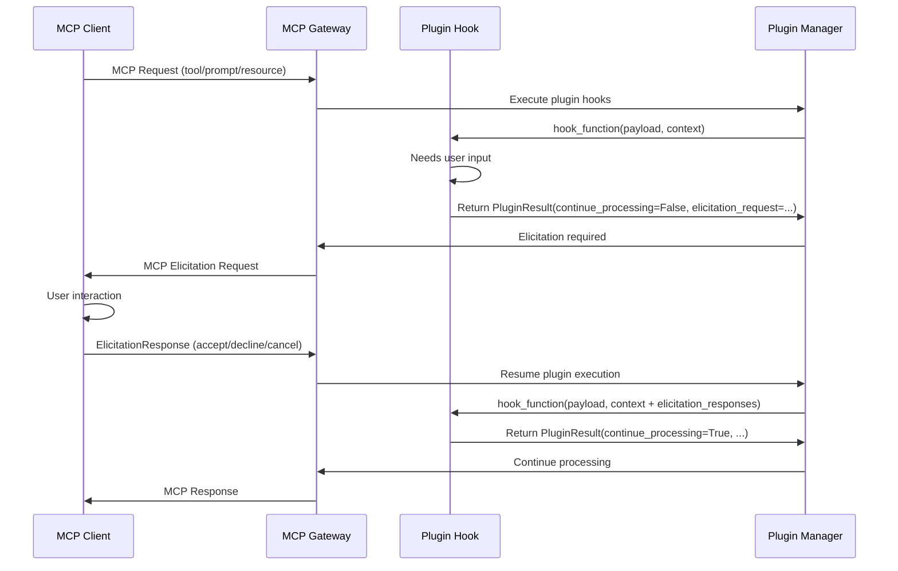

[Back to Plugin Specification Main Page](../plugin-framework-specification.md)

[Next: Hook System](./hooks-details.md)
## 5. Hook Function Architecture

### 5.1 Hook Function Overview

Every hook function in the plugin framework follows a consistent architectural pattern designed for type safety, extensibility, and clear data flow. A hook function is a standardized interface that allows plugins to intercept and process MCP protocol operations at specific points in the request/response lifecycle.

**Universal Hook Function Signature:**
```python
async def hook_function(
    self,
    payload: PayloadType,
    context: PluginContext
) -> PluginResult[PayloadType]
```

All hook functions share three fundamental components that provide a complete execution environment:

1. **Payload** - Contains the specific data being processed (request, response, or metadata)
2. **Context** - Provides request-scoped state and metadata shared across plugins
3. **Plugin Result** - Returns execution status, modifications, and control flow decisions

This architecture enables plugins to:

- **Inspect** incoming data through structured payloads
- **Transform** data by returning modified payloads
- **Control Flow** by blocking or allowing request continuation
- **Share State** through context objects across plugin executions
- **Report Violations** through structured violation objects

#### 5.1.1 Payload Component

The **Payload** is a strongly-typed data container that carries the specific information being processed at each hook point. Payloads are immutable input objects that plugins can inspect and optionally modify.

**Payload Characteristics:**

- **Type-Safe**: All payloads extend Pydantic `BaseModel` for validation
- **Hook-Specific**: Each hook type has its own payload structure
- **Immutable Input**: Original payload is never modified directly
- **Modification Pattern**: Plugins return new payload instances for modifications

**Common Payload Structure:**
```python
class BasePayload(BaseModel):
    """Base payload structure for all hook types"""
    # Core identification (varies by hook type)
    name: str                                  # Resource/tool/prompt identifier

    # Hook-specific data (varies by hook type)
    args: Optional[dict[str, Any]] = None      # Parameters or arguments
    result: Optional[Any] = None               # Results or content (post-hooks)
    metadata: Optional[dict[str, Any]] = None  # Additional metadata
```

**Payload Modification Pattern:**
```python
# Plugin modifies payload by creating new instance
modified_payload = ToolPreInvokePayload(
    name=payload.name,
    args=sanitized_args,  # Modified arguments
    headers=payload.headers
)

return ToolPreInvokeResult(modified_payload=modified_payload)
```

#### 5.1.2 Context Component

The **PluginContext** provides request-scoped state management and metadata sharing between plugins during a single request lifecycle. The **GlobalContext** is an object that is shared across multiple plugins at particular pre/post hook pairs.  It contains metadata about the hook point including information about tools, prompts and resources, and allows for state to be stored that can be passed to other plugins.

**Context Architecture:**
```python
class PluginContext(BaseModel):
    """Per-plugin context with state management"""
    state: dict[str, Any] = Field(default_factory=dict)    # Plugin-local state
    global_context: GlobalContext                           # Shared request context
    metadata: dict[str, Any] = Field(default_factory=dict) # Plugin execution metadata
    elicitation_responses: Optional[List[ElicitationResponse]] = None # Client elicitation responses

    def get_state(self, key: str, default: Any = None) -> Any: ...
    def set_state(self, key: str, value: Any) -> None: ...

class GlobalContext(BaseModel):
    """Shared context across all plugins in a request"""
    request_id: str                                         # Unique request identifier
    user: Optional[str] = None                              # User making request
    tenant_id: Optional[str] = None                         # Multi-tenant context
    server_id: Optional[str] = None                         # Virtual server context
    state: dict[str, Any] = Field(default_factory=dict)    # Cross-plugin shared state
    metadata: dict[str, Any] = Field(default_factory=dict) # Request metadata
```

**Context Usage Patterns:**
```python
# Access request information
user_id = context.global_context.user
request_id = context.global_context.request_id

# Store plugin-local state
context.set_state("processed_items", item_count)
previous_count = context.get_state("processed_items", 0)

# Share data between plugins
context.global_context.state["security_scan_passed"] = True

# Add execution metadata
context.metadata["processing_time_ms"] = 45
context.metadata["items_filtered"] = 3
```

#### 5.1.3 Plugin Result Component

The **PluginResult** is the standardized return object that controls request flow and communicates plugin execution outcomes.

**Plugin Result Architecture:**
```python
class PluginResult(BaseModel, Generic[T]):
    """Generic plugin execution result"""
    continue_processing: bool = True                        # Flow control
    modified_payload: Optional[T] = None                    # Payload modifications
    violation: Optional[PluginViolation] = None             # Policy violations
    elicitation_request: Optional[ElicitationRequest] = None # Client elicitation request
    metadata: Optional[dict[str, Any]] = Field(default_factory=dict) # Execution metadata

class PluginViolation(BaseModel):
    """Plugin policy violation details"""
    reason: str                                             # High-level violation reason
    description: str                                        # Detailed human-readable description
    code: str                                               # Machine-readable violation code
    details: dict[str, Any]                                 # Additional structured context
    _plugin_name: str = PrivateAttr(default="")             # Plugin that detected violation

class ElicitationRequest(BaseModel):
    """Request for client elicitation during plugin execution"""
    message: str                                            # Message to display to user
    schema: dict[str, Any]                                  # JSON schema for response validation
    timeout_seconds: Optional[int] = 30                     # Elicitation timeout

class ElicitationResponse(BaseModel):
    """Response from client elicitation"""
    action: Literal["accept", "decline", "cancel"]          # User action taken
    data: Optional[dict[str, Any]] = None                   # User-provided data (if accepted)
    message: Optional[str] = None                           # Optional user message
```

**Plugin Result Usage Patterns:**
```python
# Allow request to continue (default behavior)
return PluginResult()

# Allow with payload modification
return PluginResult(
    modified_payload=modified_payload,
    metadata={"items_sanitized": 5}
)

# Block request with violation
violation = PluginViolation(
    reason="Unauthorized access",
    description="User lacks permission for this resource",
    code="ACCESS_DENIED",
    details={"user_id": user_id, "resource": resource_name}
)
return PluginResult(
    continue_processing=False,
    violation=violation
)

# Allow but report metadata (monitoring/logging)
return PluginResult(
    metadata={
        "scan_duration_ms": 150,
        "threats_detected": 0,
        "confidence_score": 0.95
    }
)
```

**Flow Control Logic:**

- `continue_processing=True`: Request continues to next plugin/core logic
- `continue_processing=False`: Request is blocked, violation returned to client
- `modified_payload`: Used for next plugin execution if provided
- `violation`: Structured error information for blocked requests
- `metadata`: Observability and debugging information

**Processing Model**:

Plugin processing uses short circuiting to abort evaluation in the case of a violation and `continue_processing=False`. If the plugin needs to record side effects, such as the bookkeeping, these plugins should be executed first with the highest priority. 

### 5.2 HTTP Header Hook Integration Example

The HTTP header hooks provide powerful capabilities for authentication, security, and compliance. Here's a comprehensive example showing how to implement both pre and post HTTP forwarding hooks for enterprise security:

```python
from mcpgateway.plugins.framework import Plugin, PluginConfig, HookType
from mcpgateway.plugins.framework.models import (
    HttpHeaderPayload, HttpHeaderPayloadResult,
    PluginContext, PluginViolation
)
import datetime

class SecurityHeaderPlugin(Plugin):
    """Enterprise security plugin for HTTP header management."""

    def __init__(self, config: PluginConfig):
        super().__init__(config)
        self.required_security_headers = [
            "Content-Security-Policy",
            "X-Frame-Options",
            "X-Content-Type-Options"
        ]

    async def http_pre_forwarding_call(
        self,
        payload: HttpHeaderPayload,
        context: PluginContext
    ) -> HttpHeaderPayloadResult:
        """Inject authentication and security headers before forwarding."""

        modified_headers = dict(payload.root)

        # 1. Authentication token injection based on user context
        if context.global_context.user:
            # Get user-specific token from secure storage
            token = await self._get_user_token(context.global_context.user)
            modified_headers["Authorization"] = f"Bearer {token}"

        # 2. Add data classification headers for compliance
        data_class = self._classify_request_data(context.global_context)
        modified_headers["X-Data-Classification"] = data_class

        # 3. Add session tracking for audit purposes
        modified_headers["X-Session-ID"] = context.global_context.request_id
        modified_headers["X-Tenant-ID"] = context.global_context.tenant_id or "default"

        # 4. Add security headers for OWASP compliance
        modified_headers.update({
            "X-Content-Type-Options": "nosniff",
            "X-Frame-Options": "DENY",
            "Referrer-Policy": "strict-origin-when-cross-origin"
        })

        return HttpHeaderPayloadResult(
            continue_processing=True,
            modified_payload=HttpHeaderPayload(modified_headers),
            metadata={
                "plugin": "security_header",
                "action": "auth_injected",
                "data_classification": data_class,
                "headers_added": 6
            }
        )

    async def http_post_forwarding_call(
        self,
        payload: HttpHeaderPayload,
        context: PluginContext
    ) -> HttpHeaderPayloadResult:
        """Validate response headers and add compliance metadata."""

        modified_headers = dict(payload.root)

        # 1. Validate required security headers are present
        missing_headers = [
            h for h in self.required_security_headers
            if h not in payload.root
        ]

        if missing_headers:
            return HttpHeaderPayloadResult(
                continue_processing=False,
                violation=PluginViolation(
                    code="SECURITY_HEADERS_MISSING",
                    reason="Required security headers not found in response",
                    description=f"Missing headers: {', '.join(missing_headers)}",
                    plugin_name=self.name
                ),
                metadata={
                    "plugin": "security_header",
                    "action": "validation_failed",
                    "missing_headers": missing_headers
                }
            )

        # 2. Add audit trail for compliance
        modified_headers["X-Audit-Trail"] = (
            f"processed-{context.global_context.request_id}-"
            f"{datetime.datetime.utcnow().isoformat()}"
        )

        # 3. Extract and log performance metrics
        response_time = payload.root.get("X-Response-Time")
        if response_time:
            context.global_context.metadata["response_time"] = response_time

        # 4. Add data governance labels
        modified_headers["X-Data-Retention"] = "30d"
        modified_headers["X-Processing-Complete"] = "true"

        return HttpHeaderPayloadResult(
            continue_processing=True,
            modified_payload=HttpHeaderPayload(modified_headers),
            metadata={
                "plugin": "security_header",
                "action": "compliance_validated",
                "audit_trail_added": True,
                "response_time": response_time
            }
        )

    async def _get_user_token(self, user: str) -> str:
        """Retrieve user-specific authentication token."""
        # Implementation would connect to token service
        return f"token_for_{user}"

    def _classify_request_data(self, context) -> str:
        """Classify request data for compliance purposes."""
        # Basic classification logic - could be more sophisticated
        if context.tenant_id and "enterprise" in context.tenant_id:
            return "confidential"
        elif context.user and "@internal.com" in context.user:
            return "internal"
        return "public"

# Plugin configuration
config = PluginConfig(
    name="security_header_plugin",
    description="Enterprise security and compliance header management",
    author="Security Team",
    version="2.1.0",
    kind="plugins.security.SecurityHeaderPlugin",
    hooks=[HookType.HTTP_PRE_FORWARDING_CALL, HookType.HTTP_POST_FORWARDING_CALL],
    mode=PluginMode.ENFORCE,  # Critical security - block on violations
    priority=10,  # High priority for security
    tags=["security", "compliance", "authentication", "headers"]
)

plugin = SecurityHeaderPlugin(config)
```

**Key Benefits of This Implementation:**

| Feature | Business Value | Security Impact |
|---------|----------------|-----------------|
| **Token Injection** | Seamless user authentication across services | Prevents unauthorized API access |
| **Data Classification** | Automated compliance labeling | Enables data governance tracking |
| **Security Header Validation** | OWASP compliance enforcement | Prevents XSS, clickjacking attacks |
| **Audit Trail Creation** | Complete request/response logging | Regulatory compliance, forensics |
| **Performance Monitoring** | Response time tracking | Operational visibility |

This example demonstrates how HTTP header hooks enable **defense-in-depth** security strategies while maintaining **operational transparency** and **regulatory compliance**.

### 5.3 Client Elicitation Support

The plugin framework supports **MCP Client Elicitation**, enabling plugins to dynamically request structured user input during hook execution. This capability follows the MCP specification for bidirectional communication between servers and clients.

#### 5.3.1 Elicitation Flow Architecture



#### 5.3.2 Plugin Elicitation Pattern

Plugins request user elicitation by returning `continue_processing=False` with an `ElicitationRequest`:

```python
async def tool_pre_invoke(self, payload: ToolPreInvokePayload,
                         context: PluginContext) -> ToolPreInvokeResult:
    # Check if sensitive operation requires user confirmation
    if payload.name == "delete_file" and not context.elicitation_responses:
        # Request user confirmation with structured schema
        confirmation_schema = {
            "type": "object",
            "properties": {
                "confirm_deletion": {
                    "type": "boolean",
                    "description": "Confirm file deletion"
                },
                "backup_first": {
                    "type": "boolean",
                    "description": "Create backup before deletion",
                    "default": True
                }
            },
            "required": ["confirm_deletion"]
        }

        elicitation_request = ElicitationRequest(
            message=f"Confirm deletion of file: {payload.args.get('path')}",
            schema=confirmation_schema,
            timeout_seconds=60
        )

        return ToolPreInvokeResult(
            continue_processing=False,
            elicitation_request=elicitation_request
        )

    # Process elicitation response
    if context.elicitation_responses:
        response = context.elicitation_responses[0]
        if response.action == "decline" or response.action == "cancel":
            return ToolPreInvokeResult(
                continue_processing=False,
                violation=PluginViolation(
                    reason="User declined operation",
                    description="File deletion was cancelled by user",
                    code="USER_DECLINED",
                    details={"action": response.action}
                )
            )

        if response.action == "accept" and response.data:
            # User confirmed - optionally create backup first
            if response.data.get("backup_first", True):
                context.set_state("create_backup", True)

    return ToolPreInvokeResult()
```

#### 5.3.3 Common Elicitation Use Cases

| Use Case | Schema Example | Security Benefit |
|----------|----------------|------------------|
| **Sensitive Operation Confirmation** | `{"confirm": {"type": "boolean"}}` | Prevents accidental destructive actions |
| **User Preference Collection** | `{"format": {"enum": ["json", "xml"]}}` | Personalizes responses dynamically |
| **Multi-Factor Authentication** | `{"otp_code": {"type": "string", "pattern": "^[0-9]{6}$"}}` | Additional security layer |
| **Data Processing Consent** | `{"consent": {"type": "boolean"}, "data_retention_days": {"type": "number"}}` | GDPR compliance |

#### 5.3.4 Elicitation Security Guidelines

1. **No Sensitive Data Requests**: Never request passwords, API keys, or other credentials
2. **Clear User Communication**: Provide descriptive messages explaining why input is needed
3. **Timeout Management**: Set appropriate timeouts to prevent hanging requests
4. **Graceful Degradation**: Handle decline/cancel responses appropriately
5. **Schema Validation**: Use strict JSON schemas to validate user input

```python
# Example: Input validation and sanitization
async def process_elicitation_response(self, response: ElicitationResponse) -> bool:
    if response.action != "accept" or not response.data:
        return False

    # Validate against original schema
    try:
        jsonschema.validate(response.data, self.elicitation_schema)
    except jsonschema.ValidationError:
        self.logger.warning("Invalid elicitation response format")
        return False

    # Additional sanitization
    for key, value in response.data.items():
        if isinstance(value, str):
            # Sanitize string inputs
            response.data[key] = html.escape(value.strip())

    return True
```
[Back to Plugin Specification Main Page](../plugin-framework-specification.md)

[Next: Hook System](./hooks-details.md)