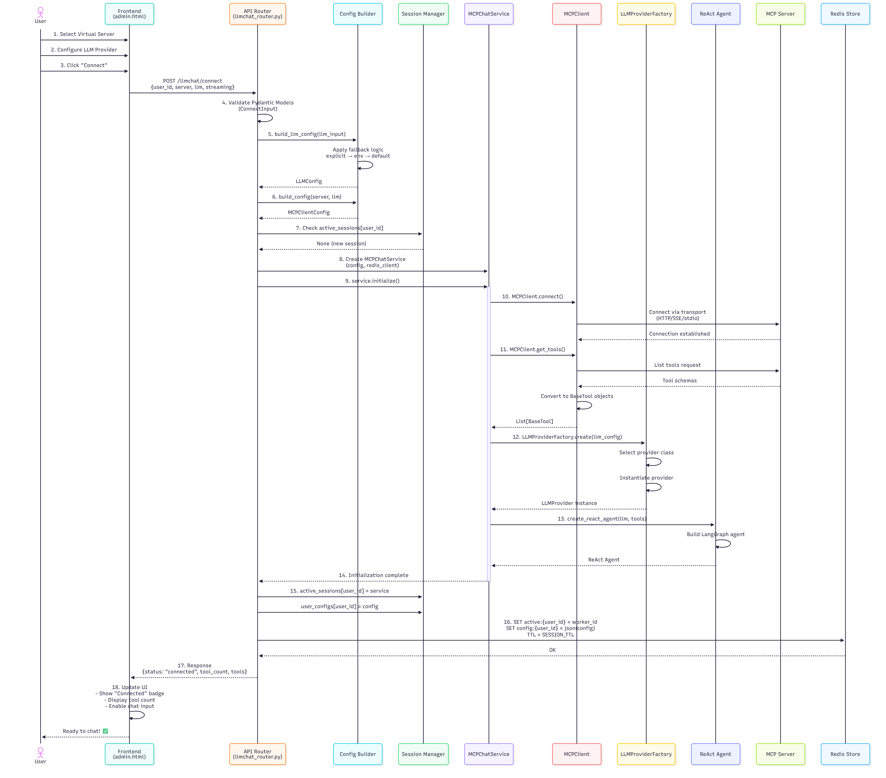
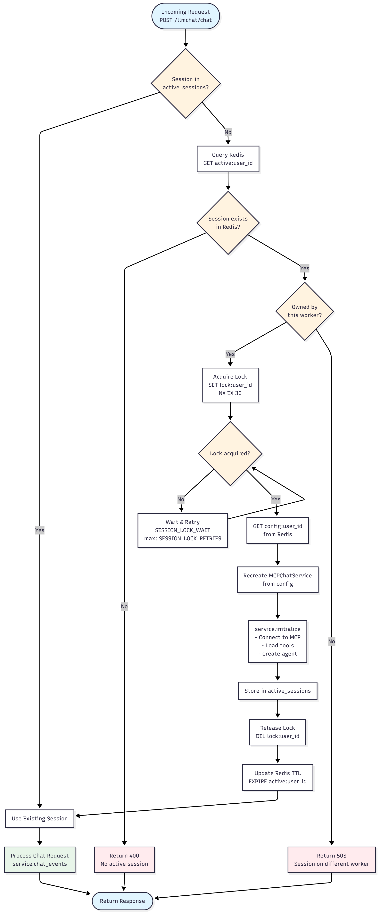

# 🚀 LLM Chat - Integrated MCP Client within Context Forge Gateway

The LLM Chat feature enables interactive conversations with AI language models while leveraging tools from Virtual MCP servers. Once a virtual server is created, the user can use the integrated mcp client with agentic capabilities to test the tools.

## 📖 Overview

LLM Chat connects virtual servers created in MCP Context Forge Gateway with AI models/LLMs, allowing them to use tools exposed by those servers. The system supports multiple LLM providers and provides both streaming and non-streaming response modes for flexible user experiences.

## 📋 Prerequisites :

### 🔐 Environment Variables for Configuration

1. To Enable the LLM Chat UI and backend:
```bash
LLMCHAT_ENABLED=true
```

2. You can pre-configure LLM providers using environment variables. Click the provider buttons in the **Environment Variables** info card to copy the required variables:

### ☁️ Azure OpenAI

```bash
LLM_PROVIDER=azure_openai
AZURE_OPENAI_API_KEY=your-api-key
AZURE_OPENAI_ENDPOINT=https://your-resource.openai.azure.com/
AZURE_OPENAI_DEPLOYMENT=gpt-4
AZURE_OPENAI_API_VERSION=2024-05-01-preview
AZURE_OPENAI_TEMPERATURE=0.7
```


### 🟢 OpenAI

```bash
LLM_PROVIDER=openai
OPENAI_API_KEY=sk-...
OPENAI_MODEL=gpt-4o-mini
OPENAI_TEMPERATURE=0.7
OPENAI_BASE_URL=https://api.openai.com/v1
```


### 🟣 Anthropic Claude

```bash
LLM_PROVIDER=anthropic
ANTHROPIC_API_KEY=sk-ant-...
ANTHROPIC_MODEL=claude-3-5-sonnet-20241022
ANTHROPIC_TEMPERATURE=0.7
ANTHROPIC_MAX_TOKENS=4096
```


### 🟠 AWS Bedrock

```bash
LLM_PROVIDER=aws_bedrock
AWS_BEDROCK_MODEL_ID=anthropic.claude-v2
AWS_BEDROCK_REGION=us-east-1
AWS_BEDROCK_TEMPERATURE=0.7
AWS_BEDROCK_MAX_TOKENS=4096
```


### 🔵 IBM watsonx.ai

```bash
LLM_PROVIDER=watsonx
WATSONX_APIKEY=your-api-key
WATSONX_URL=https://us-south.ml.cloud.ibm.com
WATSONX_PROJECT_ID=your-project-id
WATSONX_MODEL_ID=ibm/granite-13b-chat-v2
WATSONX_TEMPERATURE=0.7
```


### 🦙 Ollama

```bash
LLM_PROVIDER=ollama
OLLAMA_MODEL=llama3
OLLAMA_BASE_URL=http://localhost:11434
OLLAMA_TEMPERATURE=0.7
```

### 🗄️ Redis Configurations for Multi Worker Environment

```bash
# ===== Redis Connection =====
CACHE_TYPE=redis                          # Enable Redis
REDIS_URL=redis://localhost:6379/0       # Redis connection string

# ===== Session Management =====
LLMCHAT_SESSION_TTL=300                   # Active session ownership TTL (seconds)
# Default: 300 (5 minutes)
# Higher values: More stable sessions, slower failover
# Lower values: Faster failover, more frequent TTL refreshes

# ===== Lock Configuration =====
LLMCHAT_SESSION_LOCK_TTL=30               # Lock expiry time (seconds)
# Default: 30 seconds
# Should be > typical initialization time

LLMCHAT_SESSION_LOCK_RETRIES=10           # Lock acquisition retry attempts
# Default: 10 attempts
# Total wait time = RETRIES × WAIT

LLMCHAT_SESSION_LOCK_WAIT=0.2             # Wait between retry attempts (seconds)
# Default: 0.2 seconds (200ms)
# Total max wait: 10 × 0.2 = 2 seconds

# ===== Chat History =====
LLMCHAT_CHAT_HISTORY_TTL=3600             # History expiry time (seconds)
# Default: 3600 (1 hour)

LLMCHAT_CHAT_HISTORY_MAX_MESSAGES=50      # Maximum messages per user
# Default: 50
# Older messages automatically trimmed
```

## 🎯 Getting Started

### Accessing the LLM Chat Tab

Navigate to the **LLM Chat** tab in the admin interface. The interface features two main sections:

- **🔧 Left Panel**: Virtual server selection and configuration
- **💬 Right Panel**: Chat interface and LLM settings


### Step 1: 🌐 Select a Virtual Server

All the Virtual servers created in the Context Forge Gateway will be displayed in the left card.
Click the **Refresh Servers** button to reload available virtual servers, if needed. Each server card displays:

- 📛 Server name and description
- 🛠️ Number of available tools
- 🟢 Status indicators (Active/Inactive)
- 🔐 Token requirement badges (for team/private servers)

**Note**: Team-level and private servers require authentication tokens for access.

### Step 2: ⚙️ Configure Your LLM Provider

After selecting a server, expand the **LLM Configuration** section and choose your provider:

#### 🤖 Supported Providers

1. Azure OpenAI
2. OpenAI
3. Anthropic Claude
4. AWS Bedrock
5. IBM watsonx.ai
6. Ollama

Select your preferred provider. If you've already configured LLM details like API key, URL, etc., in the environment variables, you can leave the next fields blank.


### Step 3: 🔗 Connect to the Chat Session

Click the **Connect** button. Upon successful connection:

- ✅ Status badge displays "Connected"
- 🔢 Number of available tools is shown
- 📦 Configuration panel auto-collapses
- ⌨️ Chat input area becomes active


## 💬 Using the Chat Interface

### 📤 Sending Messages

Type your message in the text input area at the bottom of the chat panel. You can:

- ⏎ Press **Enter** to send your message
- ⇧⏎ Press **Shift+Enter** for new lines without sending
- 📏 Input area auto-resizes as you type (up to 120px height)


### 📨 Understanding Responses

Messages display in conversation format:

- **👤 Your messages**: Right side in indigo/purple gradient bubbles
- **🤖 AI responses**: Left side in gray bubbles
- **⚠️ System messages**: Centered in yellow boxes


### 🛠️ Tool Usage

When the AI uses MCP server tools during conversations, you'll see:

- **⚡ Tool execution indicators**: Visual feedback when tools are invoked
- **📊 Tool results**: Seamlessly integrated into conversation flow
- **🏷️ Tool badges**: Showing which tools are actively available


### 🎨 Advanced Features

**🧠 Thinking Steps** (if supported by the model):
Some models display their reasoning process using collapsible "thinking" sections. Click to expand/collapse these sections to see the AI's thought process.

**⚡ Streaming Responses**:
Responses stream in real-time by default, showing tokens as they're generated with a pulsing indicator during streaming.

## 🎛️ Managing Your Session

### 👀 Viewing Active Tools

Hover over the "X tools" badge in the configuration header to see a tooltip displaying all available tools from the connected server.

### 🔌 Disconnecting

Click the **Disconnect** button to:

- ❌ End your current chat session
- 🧹 Clear conversation history
- 💾 Release server resources
- 🔄 Return to the initial state

You can reconnect anytime by selecting a server and configuring the LLM again.


## 🌐 API Endpoints (Backend)

The LLM Chat functionality is powered by the following REST API endpoints:

### POST /llmchat/connect

🔗 Establish a new chat session with a virtual server and LLM provider.

**Request Body**:

```json
{
  "user_id": "some-string",
  "server": {
    "url": "http://localhost:8000/mcp",
    "transport": "streamable_http",
    "auth_token": "optional-jwt-token"
  },
  "llm": {
    "provider": "azure_openai|openai|anthropic|aws_bedrock|watsonx|ollama",
    "config": {
      // Provider-specific configuration
    }
  },
  "streaming": false
}
```

**Response**:

```json
{
  "status": "connected",
  "user_id": "string",
  "provider": "string",
  "tool_count": 5,
  "tools": ["tool1", "tool2", "tool3"]
}
```


### POST /llmchat/chat

💬 Send a message and receive a response.

**Request Body**:

```json
{
  "user_id": "some-string",
  "message": "Your message here",
  "streaming": false
}
```

**Response (Non-Streaming)**:

```json
{
  "user_id": "some-string",
  "response": "AI response text",
  "tool_used": true,
  "tools": ["tool_name"],
  "tool_invocations": 1,
  "elapsed_ms": 450
}
```

**Response (Streaming)**:
Server-Sent Events (SSE) stream with event types: `token`, `tool_start`, `tool_end`, `tool_error`, `final`

### POST /llmchat/disconnect

🔌 End the chat session and clean up resources.

**Request Body**:

```json
{
  "user_id": "some-string"
}
```

**Response**:

```json
{
  "status": "disconnected",
  "user_id": "some-string",
  "message": "Successfully disconnected"
}
```


### GET /llmchat/status/{user_id}

🔍 Check if an active session exists for a user.

**Response**:

```json
{
  "user_id": "some-string",
  "connected": true
}
```


## 💾 Chat History Management

The system automatically manages your conversation history:

- **🗄️ Redis Storage**: When Redis is configured, history is persisted across sessions
- **🧠 In-Memory Storage**: Falls back to memory-based storage when Redis is unavailable
- **⏱️ TTL**: Chat history expires after a configurable time (default: 1 hour)
- **📊 Max Messages**: History is limited to 50 messages by default (configurable)
- **🧹 Automatic Cleanup**: History is cleared when you disconnect


## 🔧 Troubleshooting

### ⚠️ Connection Issues

**"No active session found"**:

- Ensure you clicked "Connect" after selecting a server and configuring the LLM
- Check that the server is active (not marked as "Inactive")

**"Authentication required"**:

- For team/private servers, ensure you're logged in
- The JWT token is automatically retrieved from your session

**"Failed to connect to MCP server"**:

- Verify the server URL is correct and accessible
- Check that the server is running and responsive
- Ensure you have the correct authentication token for private servers


### ⚙️ Configuration Errors

**"API key is required"**:

- Provide the API key in the configuration or set the appropriate environment variable

**"Invalid configuration"**:

- Verify all required fields for your chosen provider are filled
- Check that URLs are properly formatted
- Ensure temperature values are within valid ranges


### 🐛 Runtime Issues

**Request timeout**:

- The LLM took too long to respond (default timeout: 2 minutes)
- Try reconnecting or using a simpler query

**Tool execution errors**:

- Some tools may fail if they're not accessible or have invalid parameters
- Error details are displayed in the chat interface


## 💡 Best Practices

1. **🎯 Server Selection**: Choose servers with tools relevant to your tasks
2. **🤖 Model Selection**: Use appropriate models for your use case (faster models for simple tasks, more capable models for complex reasoning)
3. **🌡️ Temperature Settings**: Lower values (0.3-0.5) for factual responses, higher values (0.7-0.9) for creative tasks
4. **🔌 Session Management**: Disconnect when done to free up resources
5. **🎟️ Token Limits**: Be mindful of token limits when having long conversations
6. **🛠️ Tool Usage**: Understand what tools are available and how they can help with your queries

## 🔒 Security Considerations

- **🔑 API Keys**: Never share or expose your API keys
- **📝 Environment Variables**: Store sensitive credentials as environment variables
- **🎫 Authentication Tokens**: JWT tokens are automatically managed for team/private servers
- **💬 Chat History**: History is isolated per user and automatically cleaned up

***

## 🏗️ Architecture & Technical Details

### System Architecture Overview

The LLM Chat system follows a **three-tier architecture** with clear separation of concerns:

```
┌─────────────────────────────────────────────────────┐
│              Frontend (UI Layer)                    │
│  ┌─────────────┐  ┌─────────────┐  ┌────────────┐   │
│  │  admin.html │──│  admin.js   │──│   HTMX     │   │
│  └─────────────┘  └─────────────┘  └────────────┘   │
└────────────────────────┬────────────────────────────┘
                         │ HTTP/SSE
┌────────────────────────┴────────────────────────────┐
│           Backend (API Layer)                       │
│  ┌──────────────────────────────────────────────┐   │
│  │        llmchat_router.py (FastAPI)           │   │
│  │  • Session Management                        │   │
│  │  • Configuration Validation                  │   │
│  │  • Request/Response Handling                 │   │
│  │  • SSE Streaming                             │   │
│  └────────────────┬─────────────────────────────┘   │
└───────────────────┴─────────────────────────────────┘
                    │
┌───────────────────┴─────────────────────────────────┐
│         Service Layer (Business Logic)              │
│  ┌──────────────────────────────────────────────┐   │
│  │     mcp_client_chat_service.py               │   │
│  │  ┌─────────────────┐  ┌──────────────────┐   │   │
│  │  │  MCPChatService │  │  ChatHistory     │   │   │
│  │  │                 │  │  Manager         │   │   │
│  │  └────────┬────────┘  └──────────────────┘   │   │
│  │           │                                  │   │
│  │  ┌────────┴────────┐  ┌──────────────────┐   │   │
│  │  │   MCPClient     │  │  LLMProvider     │   │   │
│  │  │                 │  │  Factory         │   │   │
│  │  └─────────────────┘  └──────────────────┘   │   │
│  └──────────────────────────────────────────────┘   │
└─────────────────────────────────────────────────────┘
           │                         │
           │                         │
    ┌──────┴──────┐          ┌───────┴────────┐
    │  MCP Server │          │  LLM Provider  │
    │   (Tools)   │          │   (AI Model)   │
    └─────────────┘          └────────────────┘
```

### 🔄 Entire Workflow




### 🏛️ Core Components

#### 1. **Frontend Layer** (admin.html + admin.js)

**Responsibilities**:

- 🎨 Render the LLM Chat tab UI
- 📡 Handle user interactions (connect, send messages, disconnect)
- 🔄 Manage WebSocket/SSE connections for streaming
- 🎭 Display chat messages, tool invocations, and status updates
- 🎯 Provide configuration forms for LLM providers


#### 2. **API Layer** (llmchat_router.py)

**Core Classes & Functions**:

**📝 Pydantic Models**:

- `ConnectInput`: Validates connection parameters (user_id, server, llm, streaming)
- `ChatInput`: Validates chat message parameters (user_id, message, streaming)
- `DisconnectInput`: Validates disconnection requests (user_id)
- `LLMInput`: Encapsulates LLM provider configuration
- `ServerInput`: Encapsulates MCP server connection details

**🔑 Key Functions**:

- `build_llm_config()`: Constructs LLMConfig with environment fallbacks and validation
- `build_config()`: Aggregates all configuration into MCPClientConfig
- `fallback()`: Implements cascading value resolution (explicit → env → default)

**🗃️ Session Management**:

- `active_sessions`: Dict storing active MCPChatService instances per user
- `user_configs`: Dict storing user configurations
- **Redis Integration** (optional): Distributed session storage with TTL and worker affinity
- **Sticky Sessions**: Workers use locks to prevent race conditions during session initialization



**🔐 Authentication**:

- JWT token extraction from cookies for team/private servers
- Automatic Bearer token injection into MCP server requests

**📡 Endpoints**:

- `POST /llmchat/connect`: Initialize session, validate config, connect to MCP server \& LLM
- `POST /llmchat/chat`: Process messages with streaming/non-streaming modes
- `POST /llmchat/disconnect`: Cleanup session and release resources
- `GET /llmchat/status/{user_id}`: Query session status


#### 3. **Service Layer** (mcp_client_chat_service.py)

**🎯 MCPChatService** (Main orchestrator):

**Responsibilities**:

- Coordinate between MCP client and LLM provider
- Manage conversation flow with tool execution
- Handle streaming and non-streaming responses
- Integrate with ChatHistoryManager for persistence

**Key Methods**:

- `initialize()`: Connects to MCP server, loads tools, creates ReAct agent[^2]
- `chat(message)`: Synchronous chat with complete response[^2]
- `chat_stream(message)`: Asynchronous generator for streaming responses[^2]
- `chat_events(message)`: Detailed event stream (tokens, tool_start, tool_end, final)[^2]

**🔧 MCPClient** (MCP Server interface):[^2]

**Responsibilities**:

- Connect to MCP servers via multiple transports (HTTP, SSE, stdio)
- Load and manage tools from MCP servers
- Handle MCP protocol communication

**Key Methods**:

- `connect()`: Establish connection to MCP server
- `get_tools()`: Retrieve available tools as LangChain BaseTool objects
- `is_connected`: Property to check connection status

**🏭 LLMProviderFactory** (LLM abstraction)

**Key Method**:

- `create(llm_config)`: Factory method returning configured provider instance

**Each Provider Implements**:

- `get_llm()`: Returns LangChain chat model instance (lazy initialization)
- `get_model_name()`: Returns model identifier

**💾 ChatHistoryManager** (History persistence):

**Storage Backends**:

- **Redis**: Distributed storage with TTL for multi-worker deployments
- **In-Memory**: Dict-based fallback for single-worker scenarios

**Key Methods**:

- `get_history(user_id)`: Retrieve user's message history
- `save_history(user_id, messages)`: Persist entire history
- `append_message(user_id, role, content)`: Add single message
- `clear_history(user_id)`: Delete user's history

**Features**:

- Automatic message trimming (max 50 messages by default)
- TTL-based expiration (1 hour default)
- Conversion between dict format and LangChain BaseMessage objects


### 🗂️ Configuration Management

**Hierarchical Configuration Resolution**:

```
Explicit Input → Environment Variables → Hardcoded Defaults
```

**Example** (Azure OpenAI API Key):

1. Check `llm.config.api_key` from request body
2. If None, check `AZURE_OPENAI_API_KEY` environment variable
3. If None, raise validation error (no default for secrets)

**Configuration Classes Hierarchy**:

```
MCPClientConfig
├── MCPServerConfig (transport, url, auth_token)
└── LLMConfig (provider, config)
    ├── AzureOpenAIConfig
    ├── OpenAIConfig
    ├── AnthropicConfig
    ├── AWSBedrockConfig
    ├── OllamaConfig
    └── WatsonxConfig
```


### 🔐 Security Architecture

**Authentication**:

- JWT tokens stored in HTTP-only cookies
- Automatic extraction and validation by router
- Bearer token injection for MCP server authentication

**Secrets Management**:

- API keys never logged or returned in responses
- Sanitization in `GET /llmchat/config` endpoint
- Environment variable storage recommended

**Session Isolation**:

- Per-user session storage with unique user_id
- Redis-based distributed sessions with TTL
- Automatic cleanup on disconnect

**Input Validation**:

- Pydantic models enforce type safety
- Field validators check ranges (temperature, tokens)
- URL and command validation for transport types


### ⚡ Performance Optimizations

**Lazy Initialization**:

- LLM instances created only when `get_llm()` is first called
- Reduces startup time and memory usage

**Connection Pooling**:

- MCP client maintains persistent connections
- Reuses connections across multiple chat messages

**Streaming**:

- SSE reduces latency for first token
- Improves perceived performance
- Supports real-time tool execution feedback

**Chat History Management**:

- Automatic trimming to max messages limit
- TTL-based expiration reduces memory footprint
- Redis caching for distributed deployments

**Sticky Sessions** (Multi-worker):

- Worker affinity via Redis ownership keys
- Reduces session recreation overhead
- Lock-based coordination prevents race conditions


### 🧪 Error Handling

**Router Level**:

- HTTP exceptions with appropriate status codes
- Validation errors return 400 Bad Request
- Authentication errors return 401 Unauthorized
- Service errors return 503 Service Unavailable
- Timeouts return 504 Gateway Timeout

**Service Level**:

- Connection errors propagated to router
- Tool execution errors captured in events
- LLM errors logged and re-raised
- Graceful degradation when Redis unavailable

**Frontend Level**:

- Error messages displayed in chat interface
- Retry mechanisms for transient failures
- Graceful fallback when streaming fails


### 📊 Observability

**Logging**:

- Structured logging via `LoggingService`
- Debug, info, warning, and error levels
- Contextual information (user_id, provider, tools)

**Metrics** (potential extensions):

- Session duration
- Tool invocation counts
- Token usage per provider
- Error rates by endpoint


### 🔮 Extensibility Points

**Adding New LLM Providers**:

1. Create new config class inheriting from `BaseModel`
2. Implement provider class with `get_llm()` and `get_model_name()`
3. Add to `LLMProviderFactory.create()` providermap
4. Update UI configuration forms

**Adding New MCP Transports**:

- Extend `MCPServerConfig` with new transport type
- Update `MCPClient.connect()` logic
- Add validation in `MCPServerConfig` validators

**Custom History Backends**:

- Implement methods: `get_history`, `save_history`, `append_message`, `clear_history`
- Replace `ChatHistoryManager` instance in `MCPChatService`

This architecture ensures **scalability**, **maintainability**, and **flexibility** while providing a seamless user experience for AI-powered conversations with tool augmentation. 🚀
