# MCP Context Forge Plugin Framework Specification

**Version**: 1.0
**Status**: Draft
**Last Updated**: January 2025
**Authors**: Plugin Framework Team

---

## Table of Contents

1. [Introduction](#introduction)
2. [Architecture Overview](#architecture-overview)
3. [Core Components](#core-components)
4. [Plugin Types and Models](#plugin-types-and-models)
5. [Hook Function Architecture](#hook-function-architecture)
6. [Hook System](#hook-system)
7. [External Plugin Integration](#external-plugin-integration)
8. [Security and Protection](#security-and-protection)
9. [Error Handling](#error-handling)
10. [Performance Requirements](#performance-requirements)
11. [Development Guidelines](#development-guidelines)
12. [Testing Framework](#testing-framework)
13. [Conclusion](#conclusion)

---

## 1. Introduction

### 1.1 Purpose

The MCP Context Forge Plugin Framework provides a comprehensive, production-ready system for extending MCP Gateway functionality through pluggable middleware components.  These plugins interpose calls to MCP and agentic components to apply security, AI, business logic, and monitoring capabilities to existing flows. This specification defines the architecture, interfaces, and protocols for developing, deploying, and managing plugins within the MCP ecosystem.

### 1.2 Scope

This specification covers:
- Plugin architecture and component design
- Plugin types and deployment patterns
- Hook system and execution model
- Configuration and context management
- Security and performance requirements
- External plugin integration via MCP protocol
- Development and testing guidelines
- Operational considerations

### 1.3 Design Principles

1. **Platform Agnostic**: Framework can be embedded in any Python application. The framework can also be ported to other languages.
2. **Protocol Neutral**: Supports multiple transport mechanisms (HTTP, WebSocket, STDIO, SSE, Custom)
3. **MCP Native**: Remote plugins are fully compliant MCP servers
4. **Security First**: Comprehensive protection, validation, and isolation
5. **Production Ready**: Built for high-throughput, low-latency environments
6. **Developer Friendly**: Simple APIs with comprehensive tooling

### 1.4 Terminology

- **Plugin**: A middleware component that processes MCP requests/responses
- **Hook**: A specific point in the MCP lifecycle where plugins execute
- **Native Plugin**: Plugin running in-process with the gateway
- **External Plugin**: Plugin running as a remote MCP server
- **Plugin Manager**: Core service managing plugin lifecycle and execution
- **Plugin Context**: Request-scoped state shared between plugins
- **Plugin Configuration**: YAML-based plugin setup and parameters

---

## 2. Architecture Overview

### 2.1 High-Level Architecture


### 2.2 Framework Structure

```
mcpgateway/plugins/framework/
├── base.py              # Plugin base classes
├── models.py            # Pydantic models for all plugin types
├── manager.py           # PluginManager singleton with lifecycle management
├── registry.py          # Plugin instance registry and discovery
├── constants.py         # Framework constants and enums
├── errors.py            # Plugin-specific exception types
├── utils.py             # Utility functions for plugin operations
├── loader/
│   ├── config.py        # Configuration loading and validation
│   └── plugin.py        # Dynamic plugin loading and instantiation
└── external/
    └── mcp/             # MCP external service integration
        ├── client.py    # MCP client for external plugin communication
        └── server/      # MCP server runtime for plugin hosting
```

### 2.3 Plugin Deployment Patterns

#### 2.3.1 Native Plugins (In-Process)
- Execute within the main gateway process
- Extends the base `Plugin` class
- Sub-millisecond latency (<1ms)
- Direct memory access to gateway state
- Examples: PII filtering, regex transforms, validation

#### 2.3.2 External Plugins (Remote MCP Servers)
- Standalone MCP servers implementing plugin logic
- Language-agnostic (Python, TypeScript, Go, Rust, etc.)
- Communicate via MCP protocol over various transports
- 10-100ms latency depending on service and network
- Examples: LlamaGuard, OpenAI Moderation, custom AI services

---

## 3. Core Components

### 3.1 Plugin Base Class

The base plugin class, of which developers subclass and implement the hooks that are important for their plugins. Hook points are functions that appear interpose on existing MCP and agent-based functionality. 

```python
class Plugin:
    """Base plugin class for self-contained, in-process plugins"""

    def __init__(self, config: PluginConfig) -> None:
        """Initialize plugin with configuration"""

    @property
    def name(self) -> str:
        """Plugin name"""

    @property
    def priority(self) -> int:
        """Plugin execution priority (lower = higher priority)"""

    @property
    def mode(self) -> PluginMode:
        """Plugin execution mode (enforce/permissive/disabled)"""

    @property
    def hooks(self) -> list[HookType]:
        """Hook points where plugin executes"""

    @property
    def conditions(self) -> list[PluginCondition] | None:
        """Conditions for plugin execution"""

    async def initialize(self) -> None:
        """Initialize plugin resources"""

    async def shutdown(self) -> None:
        """Cleanup plugin resources"""

    # Hook methods (implemented by subclasses)
    async def prompt_pre_fetch(self, payload: PromptPrehookPayload,
                              context: PluginContext) -> PromptPrehookResult: ...
    async def prompt_post_fetch(self, payload: PromptPosthookPayload,
                               context: PluginContext) -> PromptPosthookResult: ...
    async def tool_pre_invoke(self, payload: ToolPreInvokePayload,
                             context: PluginContext) -> ToolPreInvokeResult: ...
    async def tool_post_invoke(self, payload: ToolPostInvokePayload,
                              context: PluginContext) -> ToolPostInvokeResult: ...
    async def resource_pre_fetch(self, payload: ResourcePreFetchPayload,
                                context: PluginContext) -> ResourcePreFetchResult: ...
    async def resource_post_fetch(self, payload: ResourcePostFetchPayload,
                                 context: PluginContext) -> ResourcePostFetchResult: ...
```

### 3.2 Plugin Manager

The Plugin Manager loads configured plugins and executes them at their designated hook points based on a plugin's priority.

```python
class PluginManager:
    """Singleton plugin manager for lifecycle management"""

    def __init__(self, config: str = "", timeout: int = 30): ...

    @property
    def config(self) -> Config | None:
        """Plugin manager configuration"""

    @property
    def plugin_count(self) -> int:
        """Number of loaded plugins"""

    @property
    def initialized(self) -> bool:
        """Manager initialization status"""

    async def initialize(self) -> None:
        """Initialize manager and load plugins"""

    async def shutdown(self) -> None:
        """Shutdown all plugins and cleanup"""

    def get_plugin(self, name: str) -> Optional[Plugin]:
        """Get plugin by name"""

    # Hook execution methods
    async def prompt_pre_fetch(self, payload: PromptPrehookPayload,
                              global_context: GlobalContext, ...) -> tuple[PromptPrehookResult, PluginContextTable]: ...
    async def prompt_post_fetch(self, payload: PromptPosthookPayload, ...) -> tuple[PromptPosthookResult, PluginContextTable]: ...
    async def tool_pre_invoke(self, payload: ToolPreInvokePayload, ...) -> tuple[ToolPreInvokeResult, PluginContextTable]: ...
    async def tool_post_invoke(self, payload: ToolPostInvokePayload, ...) -> tuple[ToolPostInvokeResult, PluginContextTable]: ...
    async def resource_pre_fetch(self, payload: ResourcePreFetchPayload, ...) -> tuple[ResourcePreFetchResult, PluginContextTable]: ...
    async def resource_post_fetch(self, payload: ResourcePostFetchPayload, ...) -> tuple[ResourcePostFetchResult, PluginContextTable]: ...
```

### 3.4 Plugin Registry

```python
class PluginInstanceRegistry:
    """Registry for plugin instance management and discovery"""

    def register(self, plugin: Plugin) -> None:
        """Register a plugin instance"""

    def unregister(self, name: str) -> None:
        """Unregister a plugin by name"""

    def get_plugin(self, name: str) -> Optional[PluginRef]:
        """Get plugin reference by name"""

    def get_plugins_for_hook(self, hook_type: HookType) -> list[PluginRef]:
        """Get all plugins registered for a specific hook"""

    def get_all_plugins(self) -> list[PluginRef]:
        """Get all registered plugins"""

    @property
    def plugin_count(self) -> int:
        """Number of registered plugins"""

    async def shutdown(self) -> None:
        """Shutdown all registered plugins"""
```

---

## 4. Plugin Types and Models

### 4.1 Overview

The plugin configuration system is the cornerstone of the MCP Context Forge plugin framework, providing a declarative, YAML-based approach to plugin management, deployment, and orchestration. This system enables administrators and developers to:

**🎯 Plugin Lifecycle Management**
- **Discovery & Loading**: Automatically discover and load plugins from configuration
- **Dependency Resolution**: Handle plugin dependencies and load order
- **Runtime Control**: Enable, disable, or modify plugin behavior without code changes
- **Version Management**: Track plugin versions and manage updates

**🔧 Operational Control**
- **Environment-Specific Deployment**: Different configurations for dev/staging/production
- **Conditional Execution**: Run plugins only under specific conditions (tenant, server, user)
- **Priority-Based Orchestration**: Control execution order through priority settings
- **Mode-Based Behavior**: Switch between enforce/enforce_ignore_error/permissive/disabled modes

**🔐 Security & Compliance**
- **Access Control**: Restrict plugin execution to specific users, tenants, or servers
- **Audit Trail**: Track plugin configuration changes and deployment history
- **Policy Enforcement**: Implement organizational security policies through configuration
- **External Service Integration**: Securely configure connections to external AI safety services

**⚡ Performance Optimization**
- **Resource Limits**: Configure timeouts, memory limits, and execution constraints
- **Selective Loading**: Load only necessary plugins to optimize performance
- **Monitoring Integration**: Configure metrics collection and health monitoring
- **Caching Strategies**: Control plugin result caching and optimization

The configuration system supports both **native plugins** (running in-process) and **external plugins** (remote MCP servers), providing a unified interface for managing diverse plugin architectures while maintaining type safety, validation, and operational excellence.

### 4.2 Plugin Configuration Schema

Below is an example of a plugin configuration file.  A plugin configuration file can configure one or more plugins in a prioritized list as below.  Each individual plugin is an instance of the of a plugin class that subclasses the base `Plugin` object and implements a set of hooks as listed in the configuration.   

```yaml
# plugins/config.yaml
plugins:
  - name: "PIIFilterPlugin"                    # Unique plugin identifier
    kind: "plugins.pii_filter.pii_filter.PIIFilterPlugin"  # Plugin class path
    description: "Detects and masks PII"       # Human-readable description
    version: "1.0.0"                          # Plugin version
    author: "Security Team"                   # Plugin author
    hooks:                                    # Hook registration
      - "prompt_pre_fetch"
      - "tool_pre_invoke"
      - "tool_post_invoke"
    tags:                                     # Searchable tags
      - "security"
      - "pii"
      - "compliance"
    mode: "enforce"                           # enforce|enforce_ignore_error|permissive|disabled
    priority: 50                              # Execution priority (lower = higher)
    conditions:                               # Conditional execution
      - server_ids: ["prod-server"]
        tenant_ids: ["enterprise"]
        tools: ["sensitive-tool"]
    config:                                   # Plugin-specific configuration
      detect_ssn: true
      detect_credit_card: true
      mask_strategy: "partial"
      redaction_text: "[REDACTED]"

# Global plugin settings
plugin_settings:
  parallel_execution_within_band: false      # Execute same-priority plugins in parallel
  plugin_timeout: 30                         # Per-plugin timeout (seconds)
  fail_on_plugin_error: false                # Continue on plugin failures
  plugin_health_check_interval: 60           # Health check interval (seconds)
```

Details of each field are below:

| Field | Type | Required | Default | Description | Example Values |
|-------|------|----------|---------|-------------|----------------|
| `name` | `string` | ✅ | - | Unique plugin identifier within the configuration | `"PIIFilterPlugin"`, `"OpenAIModeration"` |
| `kind` | `string` | ✅ | - | Plugin class path for self-contained plugins or `"external"` for MCP servers | `"plugins.pii_filter.pii_filter.PIIFilterPlugin"`, `"external"` |
| `description` | `string` | ❌ | `null` | Human-readable description of plugin functionality | `"Detects and masks PII in requests"` |
| `author` | `string` | ❌ | `null` | Plugin author or team responsible for maintenance | `"Security Team"`, `"AI Safety Group"` |
| `version` | `string` | ❌ | `null` | Plugin version for tracking and compatibility | `"1.0.0"`, `"2.3.1-beta"` |
| `hooks` | `string[]` | ❌ | `[]` | List of hook points where plugin executes | `["prompt_pre_fetch", "tool_pre_invoke"]` |
| `tags` | `string[]` | ❌ | `[]` | Searchable tags for plugin categorization | `["security", "pii", "compliance"]` |
| `mode` | `string` | ❌ | `"enforce"` | Plugin execution mode controlling behavior on violations | `"enforce"`, `"enforce_ignore_error"`, `"permissive"`, `"disabled"` |
| `priority` | `integer` | ❌ | `null` | Execution priority (lower number = higher priority) | `10`, `50`, `100` |
| `conditions` | `object[]` | ❌ | `[]` | Conditional execution rules for targeting specific contexts | See [Condition Fields](#condition-fields) below |
| `config` | `object` | ❌ | `{}` | Plugin-specific configuration parameters | `{"detect_ssn": true, "mask_strategy": "partial"}` |
| `mcp` | `object` | ❌ | `null` | External MCP server configuration (required for external plugins) | See [MCP Configuration](#mcp-configuration-fields) below |

#### Hook Types
Available hook values for the `hooks` field:

| Hook Value | Description | Timing |
|------------|-------------|--------|
| `"prompt_pre_fetch"` | Process prompt requests before template processing | Before prompt template retrieval |
| `"prompt_post_fetch"` | Process prompt responses after template rendering | After prompt template processing |
| `"tool_pre_invoke"` | Process tool calls before execution | Before tool invocation |
| `"tool_post_invoke"` | Process tool results after execution | After tool completion |
| `"resource_pre_fetch"` | Process resource requests before fetching | Before resource retrieval |
| `"resource_post_fetch"` | Process resource content after loading | After resource content loading |

#### Plugin Modes
Available values for the `mode` field:

| Mode | Behavior | Use Case |
|------|----------|----------|
| `"enforce"` | Block requests when plugin detects violations or errors | Production security plugins, critical compliance checks |
| `"enforce_ignore_error"` | Block on violations but continue on plugin errors | Security plugins that should block violations but not break on technical errors |
| `"permissive"` | Log violations and errors but allow requests to continue | Development environments, monitoring-only plugins |
| `"disabled"` | Plugin is loaded but never executed | Temporary plugin deactivation, maintenance mode |

#### Condition Fields
The `conditions` array contains objects that specify when plugins should execute:

| Field | Type | Description | Example |
|-------|------|-------------|---------|
| `server_ids` | `string[]` | Execute only for specific virtual server IDs | `["prod-server", "api-gateway"]` |
| `tenant_ids` | `string[]` | Execute only for specific tenant/organization IDs | `["enterprise", "premium-tier"]` |
| `tools` | `string[]` | Execute only for specific tool names | `["file_reader", "web_scraper"]` |
| `prompts` | `string[]` | Execute only for specific prompt names | `["user_prompt", "system_message"]` |
| `resources` | `string[]` | Execute only for specific resource URI patterns | `["https://api.example.com/*"]` |
| `user_patterns` | `string[]` | Execute for users matching regex patterns | `["admin_.*", ".*@company.com"]` |
| `content_types` | `string[]` | Execute for specific content types | `["application/json", "text/plain"]` |

#### MCP Configuration Fields
For external plugins (`kind: "external"`), the `mcp` object configures the MCP server connection:

| Field | Type | Required | Description | Example |
|-------|------|----------|-------------|---------|
| `proto` | `string` | ✅ | MCP transport protocol | `"stdio"`, `"sse"`, `"streamablehttp"`, `"websocket"` |
| `url` | `string` | ❌ | Service URL for HTTP-based transports | `"http://openai-plugin:3000/mcp"` |
| `script` | `string` | ❌ | Script path for STDIO transport | `"/opt/plugins/custom-filter.py"` |

#### Global Plugin Settings
The `plugin_settings` object controls framework-wide behavior:

| Setting | Type | Default | Description |
|---------|------|---------|-------------|
| `parallel_execution_within_band` | `boolean` | `false` | Execute plugins with same priority in parallel |
| `plugin_timeout` | `integer` | `30` | Per-plugin timeout in seconds |
| `fail_on_plugin_error` | `boolean` | `false` | Stop processing on plugin errors |
| `plugin_health_check_interval` | `integer` | `60` | Health check interval in seconds |

### 4.3 Plugin Configuration Model

```python
class PluginConfig(BaseModel):
    """Plugin configuration schema"""
    name: str                                    # Required: Unique plugin name
    kind: str                                    # Required: Plugin class path or "external"
    description: Optional[str] = None            # Plugin description
    author: Optional[str] = None                 # Plugin author
    version: Optional[str] = None                # Plugin version
    hooks: Optional[list[HookType]] = None       # Hook points to register
    tags: Optional[list[str]] = None             # Searchable tags
    mode: PluginMode = PluginMode.ENFORCE        # Execution mode
    priority: Optional[int] = None               # Execution priority
    conditions: Optional[list[PluginCondition]] = None # Execution conditions
    config: Optional[dict[str, Any]] = None      # Plugin-specific settings
    mcp: Optional[MCPConfig] = None              # External MCP server configuration
```


### 4.4 External Plugin Configuration

```python
class MCPConfig(BaseModel):
    """MCP configuration for external plugins"""
    proto: TransportType                      # STDIO, SSE, or STREAMABLEHTTP
    url: Optional[str] = None                # Service URL (for HTTP transports)
    script: Optional[str] = None             # Script path (for STDIO transport)
```

### 4.5 Configuration Loading

```python
class ConfigLoader:
    """Configuration loading and validation"""

    @staticmethod
    def load_config(config_path: str) -> Config:
        """Load plugin configuration from YAML file"""

    @staticmethod
    def validate_config(config: Config) -> None:
        """Validate plugin configuration"""

    @staticmethod
    def merge_configs(base: Config, override: Config) -> Config:
        """Merge configuration files"""
```

### 4.6 Plugin Modes

```python
class PluginMode(str, Enum):
    """Plugin execution modes"""
    ENFORCE = "enforce"              # Block requests that violate plugin rules
    ENFORCE_IGNORE_ERROR = "enforce_ignore_error"  # Enforce rules, ignore errors
    PERMISSIVE = "permissive"        # Log violations but allow continuation
    DISABLED = "disabled"            # Plugin loaded but not executed
```

### 4.7 Hook Types

```python
class HookType(str, Enum):
    """Available hook points in MCP request lifecycle"""
    HTTP_PRE_FORWARDING_CALL = "http_pre_forwarding_call"   # Before HTTP forwarding
    HTTP_POST_FORWARDING_CALL = "http_post_forwarding_call" # After HTTP forwarding
    PROMPT_PRE_FETCH = "prompt_pre_fetch"     # Before prompt retrieval
    PROMPT_POST_FETCH = "prompt_post_fetch"   # After prompt rendering
    TOOL_PRE_INVOKE = "tool_pre_invoke"       # Before tool execution
    TOOL_POST_INVOKE = "tool_post_invoke"     # After tool execution
    RESOURCE_PRE_FETCH = "resource_pre_fetch" # Before resource fetching
    RESOURCE_POST_FETCH = "resource_post_fetch" # After resource retrieval
```

### 4.8 Plugin Manifest

The plugin manifest is a metadata file that provides structured information about a plugin's capabilities, dependencies, and characteristics. This manifest serves multiple purposes in the plugin ecosystem: development guidance, runtime validation, discoverability, and documentation.

#### 4.8.1 Manifest Purpose and Usage

The plugin manifest (`plugin-manifest.yaml`) is primarily used by:

- **Plugin Templates**: Bootstrap process uses manifest to generate plugin scaffolding
- **Development Tools**: IDEs and editors can provide enhanced support based on manifest information
- **Plugin Discovery**: Registry systems can index plugins based on manifest metadata
- **Documentation Generation**: Automated documentation can be generated from manifest content
- **Dependency Management**: Future versions may use manifest for dependency resolution

#### 4.8.2 Manifest Structure

The plugin manifest follows a structured YAML format that captures comprehensive plugin metadata:

```yaml
# plugin-manifest.yaml
name: "Advanced PII Filter"
description: "Comprehensive PII detection and masking with configurable sensitivity levels"
author: "Security Engineering Team"
version: "2.1.0"
license: "MIT"
homepage: "https://github.com/company/advanced-pii-filter"
repository: "https://github.com/company/advanced-pii-filter.git"

# Plugin capabilities and hook registration
available_hooks:
  - "prompt_pre_fetch"
  - "prompt_post_fetch"
  - "tool_pre_invoke"
  - "tool_post_invoke"
  - "resource_post_fetch"

# Categorization and discovery
tags:
  - "security"
  - "pii"
  - "compliance"
  - "data-protection"
  - "gdpr"

# Plugin characteristics
plugin_type: "native"                     # native | external
language: "python"                       # python | typescript | go | rust | java
performance_tier: "high"                 # high | medium | low (expected latency)

# Default configuration template
default_config:
  detection_sensitivity: 0.8
  masking_strategy: "partial"             # partial | full | token
  pii_types:
    - "ssn"
    - "credit_card"
    - "email"
    - "phone"
  compliance_mode: "gdpr"                 # gdpr | hipaa | pci | custom
  log_violations: true
  max_content_length: 1048576

# Runtime requirements
requirements:
  python_version: ">=3.11"
  memory_mb: 64
  cpu_cores: 0.5
  timeout_seconds: 5

# Dependencies (for external plugins)
dependencies:
  - "spacy>=3.4.0"
  - "presidio-analyzer>=2.2.0"
  - "pydantic>=2.0.0"

# Plugin metadata for advanced features
features:
  configurable: true                      # Plugin accepts runtime configuration
  stateful: false                         # Plugin maintains state between requests
  async_capable: true                     # Plugin supports async execution
  external_dependencies: true             # Plugin requires external services
  multi_tenant: true                      # Plugin supports tenant isolation

# Documentation and examples
documentation:
  readme: "README.md"
  examples: "examples/"
  api_docs: "docs/api.md"

# Testing and quality assurance
testing:
  unit_tests: "tests/unit/"
  integration_tests: "tests/integration/"
  coverage_threshold: 90

# Compatibility and versioning
compatibility:
  min_framework_version: "1.0.0"
  max_framework_version: "2.x.x"
  python_versions: ["3.11", "3.12"]

# Optional deployment metadata
deployment:
  container_image: "company/pii-filter:2.1.0"
  k8s_manifest: "k8s/deployment.yaml"
  health_check_endpoint: "/health"
```

#### 4.8.3 Manifest Fields Reference

| Field | Type | Required | Description | Example |
|-------|------|----------|-------------|---------|
| `name` | `string` | ✅ | Human-readable plugin name | `"Advanced PII Filter"` |
| `description` | `string` | ✅ | Detailed plugin description | `"Comprehensive PII detection with GDPR compliance"` |
| `author` | `string` | ✅ | Plugin author or team | `"Security Engineering Team"` |
| `version` | `string` | ✅ | Semantic version | `"2.1.0"` |
| `license` | `string` | ❌ | License identifier | `"MIT"`, `"Apache-2.0"` |
| `homepage` | `string` | ❌ | Plugin homepage URL | `"https://github.com/company/plugin"` |
| `repository` | `string` | ❌ | Source code repository | `"https://github.com/company/plugin.git"` |

#### 4.8.4 Plugin Capability Fields

| Field | Type | Description | Values |
|-------|------|-------------|--------|
| `available_hooks` | `string[]` | Hook points the plugin can implement | `["prompt_pre_fetch", "tool_pre_invoke"]` |
| `plugin_type` | `string` | Plugin architecture type | `"native"`, `"external"` |
| `language` | `string` | Implementation language | `"python"`, `"typescript"`, `"go"`, `"rust"` |
| `performance_tier` | `string` | Expected latency characteristics | `"high"` (<1ms), `"medium"` (<10ms), `"low"` (<100ms) |

#### 4.8.5 Configuration and Dependencies

| Field | Type | Description |
|-------|------|-------------|
| `default_config` | `object` | Default plugin configuration template |
| `requirements` | `object` | Runtime resource requirements |
| `dependencies` | `string[]` | External package dependencies |
| `features` | `object` | Plugin capability flags |

#### 4.8.6 Manifest Usage in Development

**Plugin Template Generation**:
```bash
# Bootstrap uses manifest to generate plugin structure
mcpplugins bootstrap --destination ./my-plugin --template advanced-filter

# Generated files include manifest-based configuration
├── plugin-manifest.yaml        # Copied from template
├── my_plugin.py               # Generated with hooks from manifest
├── config.yaml               # Default config from manifest
└── README.md                 # Generated with manifest metadata
```

**IDE Integration**:
The manifest enables development tools to provide:
- **Hook Autocomplete**: Available hooks based on `available_hooks`
- **Configuration Validation**: Schema validation using `default_config`
- **Dependency Management**: Package requirements from `dependencies`
- **Documentation Links**: Direct access to `documentation` resources

#### 4.8.7 Best Practices for Plugin Manifests

**Versioning**:
- Use semantic versioning (MAJOR.MINOR.PATCH)
- Update version for any changes that affect plugin behavior
- Include pre-release identifiers for development versions (e.g., `2.1.0-beta.1`)

**Documentation**:
- Provide clear, comprehensive descriptions
- Include usage examples in the repository
- Document all configuration options in `default_config`
- Maintain up-to-date README files

**Dependencies**:
- Pin dependency versions for reproducible builds
- Use minimum version constraints where appropriate
- Document external service dependencies in description

**Tags and Categories**:
- Use consistent, descriptive tags for discoverability
- Include functional tags (`security`, `validation`) and domain tags (`gdpr`, `healthcare`)
- Follow established tag conventions within your organization

The plugin manifest system provides a foundation for plugin ecosystem management, enabling better development workflows, automated tooling, and enhanced discoverability while maintaining consistency across plugin implementations.

## 5. Hook Function Architecture

### 5.1 Hook Function Overview

Every hook function in the plugin framework follows a consistent architectural pattern designed for type safety, extensibility, and clear data flow. A hook function is a standardized interface that allows plugins to intercept and process MCP protocol operations at specific points in the request/response lifecycle.

**Universal Hook Function Signature:**
```python
async def hook_function(
    self,
    payload: PayloadType,
    context: PluginContext
) -> PluginResult[PayloadType]
```

All hook functions share three fundamental components that provide a complete execution environment:

1. **Payload** - Contains the specific data being processed (request, response, or metadata)
2. **Context** - Provides request-scoped state and metadata shared across plugins
3. **Plugin Result** - Returns execution status, modifications, and control flow decisions

This architecture enables plugins to:
- **Inspect** incoming data through structured payloads
- **Transform** data by returning modified payloads
- **Control Flow** by blocking or allowing request continuation
- **Share State** through context objects across plugin executions
- **Report Violations** through structured violation objects

#### 5.1.1 Payload Component

The **Payload** is a strongly-typed data container that carries the specific information being processed at each hook point. Payloads are immutable input objects that plugins can inspect and optionally modify.

**Payload Characteristics:**
- **Type-Safe**: All payloads extend Pydantic `BaseModel` for validation
- **Hook-Specific**: Each hook type has its own payload structure
- **Immutable Input**: Original payload is never modified directly
- **Modification Pattern**: Plugins return new payload instances for modifications

**Common Payload Structure:**
```python
class BasePayload(BaseModel):
    """Base payload structure for all hook types"""
    # Core identification (varies by hook type)
    name: str                                  # Resource/tool/prompt identifier

    # Hook-specific data (varies by hook type)
    args: Optional[dict[str, Any]] = None      # Parameters or arguments
    result: Optional[Any] = None               # Results or content (post-hooks)
    metadata: Optional[dict[str, Any]] = None  # Additional metadata
```

**Payload Modification Pattern:**
```python
# Plugin modifies payload by creating new instance
modified_payload = ToolPreInvokePayload(
    name=payload.name,
    args=sanitized_args,  # Modified arguments
    headers=payload.headers
)

return ToolPreInvokeResult(modified_payload=modified_payload)
```

#### 5.1.2 Context Component

The **PluginContext** provides request-scoped state management and metadata sharing between plugins during a single request lifecycle. The **GlobalContext** is an object that is shared across multiple plugins at particular pre/post hook pairs.  It contains metadata about the hook point including information about tools, prompts and resources, and allows for state to be stored that can be passed to other plugins.

**Context Architecture:**
```python
class PluginContext(BaseModel):
    """Per-plugin context with state management"""
    state: dict[str, Any] = Field(default_factory=dict)    # Plugin-local state
    global_context: GlobalContext                           # Shared request context
    metadata: dict[str, Any] = Field(default_factory=dict) # Plugin execution metadata
    elicitation_responses: Optional[List[ElicitationResponse]] = None # Client elicitation responses

    def get_state(self, key: str, default: Any = None) -> Any: ...
    def set_state(self, key: str, value: Any) -> None: ...

class GlobalContext(BaseModel):
    """Shared context across all plugins in a request"""
    request_id: str                                         # Unique request identifier
    user: Optional[str] = None                              # User making request
    tenant_id: Optional[str] = None                         # Multi-tenant context
    server_id: Optional[str] = None                         # Virtual server context
    state: dict[str, Any] = Field(default_factory=dict)    # Cross-plugin shared state
    metadata: dict[str, Any] = Field(default_factory=dict) # Request metadata
```

**Context Usage Patterns:**
```python
# Access request information
user_id = context.global_context.user
request_id = context.global_context.request_id

# Store plugin-local state
context.set_state("processed_items", item_count)
previous_count = context.get_state("processed_items", 0)

# Share data between plugins
context.global_context.state["security_scan_passed"] = True

# Add execution metadata
context.metadata["processing_time_ms"] = 45
context.metadata["items_filtered"] = 3
```

#### 5.1.3 Plugin Result Component

The **PluginResult** is the standardized return object that controls request flow and communicates plugin execution outcomes.

**Plugin Result Architecture:**
```python
class PluginResult(BaseModel, Generic[T]):
    """Generic plugin execution result"""
    continue_processing: bool = True                        # Flow control
    modified_payload: Optional[T] = None                    # Payload modifications
    violation: Optional[PluginViolation] = None             # Policy violations
    elicitation_request: Optional[ElicitationRequest] = None # Client elicitation request
    metadata: Optional[dict[str, Any]] = Field(default_factory=dict) # Execution metadata

class PluginViolation(BaseModel):
    """Plugin policy violation details"""
    reason: str                                             # High-level violation reason
    description: str                                        # Detailed human-readable description
    code: str                                               # Machine-readable violation code
    details: dict[str, Any]                                 # Additional structured context
    _plugin_name: str = PrivateAttr(default="")             # Plugin that detected violation

class ElicitationRequest(BaseModel):
    """Request for client elicitation during plugin execution"""
    message: str                                            # Message to display to user
    schema: dict[str, Any]                                  # JSON schema for response validation
    timeout_seconds: Optional[int] = 30                     # Elicitation timeout

class ElicitationResponse(BaseModel):
    """Response from client elicitation"""
    action: Literal["accept", "decline", "cancel"]          # User action taken
    data: Optional[dict[str, Any]] = None                   # User-provided data (if accepted)
    message: Optional[str] = None                           # Optional user message
```

**Plugin Result Usage Patterns:**
```python
# Allow request to continue (default behavior)
return PluginResult()

# Allow with payload modification
return PluginResult(
    modified_payload=modified_payload,
    metadata={"items_sanitized": 5}
)

# Block request with violation
violation = PluginViolation(
    reason="Unauthorized access",
    description="User lacks permission for this resource",
    code="ACCESS_DENIED",
    details={"user_id": user_id, "resource": resource_name}
)
return PluginResult(
    continue_processing=False,
    violation=violation
)

# Allow but report metadata (monitoring/logging)
return PluginResult(
    metadata={
        "scan_duration_ms": 150,
        "threats_detected": 0,
        "confidence_score": 0.95
    }
)
```

**Flow Control Logic:**
- `continue_processing=True`: Request continues to next plugin/core logic
- `continue_processing=False`: Request is blocked, violation returned to client
- `modified_payload`: Used for next plugin execution if provided
- `violation`: Structured error information for blocked requests
- `metadata`: Observability and debugging information

### 5.2 HTTP Header Hook Integration Example

The HTTP header hooks provide powerful capabilities for authentication, security, and compliance. Here's a comprehensive example showing how to implement both pre and post HTTP forwarding hooks for enterprise security:

```python
from mcpgateway.plugins.framework import Plugin, PluginConfig, HookType
from mcpgateway.plugins.framework.models import (
    HttpHeaderPayload, HttpHeaderPayloadResult,
    PluginContext, PluginViolation
)
import datetime

class SecurityHeaderPlugin(Plugin):
    """Enterprise security plugin for HTTP header management."""

    def __init__(self, config: PluginConfig):
        super().__init__(config)
        self.required_security_headers = [
            "Content-Security-Policy",
            "X-Frame-Options",
            "X-Content-Type-Options"
        ]

    async def http_pre_forwarding_call(
        self,
        payload: HttpHeaderPayload,
        context: PluginContext
    ) -> HttpHeaderPayloadResult:
        """Inject authentication and security headers before forwarding."""

        modified_headers = dict(payload.root)

        # 1. Authentication token injection based on user context
        if context.global_context.user:
            # Get user-specific token from secure storage
            token = await self._get_user_token(context.global_context.user)
            modified_headers["Authorization"] = f"Bearer {token}"

        # 2. Add data classification headers for compliance
        data_class = self._classify_request_data(context.global_context)
        modified_headers["X-Data-Classification"] = data_class

        # 3. Add session tracking for audit purposes
        modified_headers["X-Session-ID"] = context.global_context.request_id
        modified_headers["X-Tenant-ID"] = context.global_context.tenant_id or "default"

        # 4. Add security headers for OWASP compliance
        modified_headers.update({
            "X-Content-Type-Options": "nosniff",
            "X-Frame-Options": "DENY",
            "Referrer-Policy": "strict-origin-when-cross-origin"
        })

        return HttpHeaderPayloadResult(
            continue_processing=True,
            modified_payload=HttpHeaderPayload(modified_headers),
            metadata={
                "plugin": "security_header",
                "action": "auth_injected",
                "data_classification": data_class,
                "headers_added": 6
            }
        )

    async def http_post_forwarding_call(
        self,
        payload: HttpHeaderPayload,
        context: PluginContext
    ) -> HttpHeaderPayloadResult:
        """Validate response headers and add compliance metadata."""

        modified_headers = dict(payload.root)

        # 1. Validate required security headers are present
        missing_headers = [
            h for h in self.required_security_headers
            if h not in payload.root
        ]

        if missing_headers:
            return HttpHeaderPayloadResult(
                continue_processing=False,
                violation=PluginViolation(
                    code="SECURITY_HEADERS_MISSING",
                    reason="Required security headers not found in response",
                    description=f"Missing headers: {', '.join(missing_headers)}",
                    plugin_name=self.name
                ),
                metadata={
                    "plugin": "security_header",
                    "action": "validation_failed",
                    "missing_headers": missing_headers
                }
            )

        # 2. Add audit trail for compliance
        modified_headers["X-Audit-Trail"] = (
            f"processed-{context.global_context.request_id}-"
            f"{datetime.datetime.utcnow().isoformat()}"
        )

        # 3. Extract and log performance metrics
        response_time = payload.root.get("X-Response-Time")
        if response_time:
            context.global_context.metadata["response_time"] = response_time

        # 4. Add data governance labels
        modified_headers["X-Data-Retention"] = "30d"
        modified_headers["X-Processing-Complete"] = "true"

        return HttpHeaderPayloadResult(
            continue_processing=True,
            modified_payload=HttpHeaderPayload(modified_headers),
            metadata={
                "plugin": "security_header",
                "action": "compliance_validated",
                "audit_trail_added": True,
                "response_time": response_time
            }
        )

    async def _get_user_token(self, user: str) -> str:
        """Retrieve user-specific authentication token."""
        # Implementation would connect to token service
        return f"token_for_{user}"

    def _classify_request_data(self, context) -> str:
        """Classify request data for compliance purposes."""
        # Basic classification logic - could be more sophisticated
        if context.tenant_id and "enterprise" in context.tenant_id:
            return "confidential"
        elif context.user and "@internal.com" in context.user:
            return "internal"
        return "public"

# Plugin configuration
config = PluginConfig(
    name="security_header_plugin",
    description="Enterprise security and compliance header management",
    author="Security Team",
    version="2.1.0",
    kind="plugins.security.SecurityHeaderPlugin",
    hooks=[HookType.HTTP_PRE_FORWARDING_CALL, HookType.HTTP_POST_FORWARDING_CALL],
    mode=PluginMode.ENFORCE,  # Critical security - block on violations
    priority=10,  # High priority for security
    tags=["security", "compliance", "authentication", "headers"]
)

plugin = SecurityHeaderPlugin(config)
```

**Key Benefits of This Implementation:**

| Feature | Business Value | Security Impact |
|---------|----------------|-----------------|
| **Token Injection** | Seamless user authentication across services | Prevents unauthorized API access |
| **Data Classification** | Automated compliance labeling | Enables data governance tracking |
| **Security Header Validation** | OWASP compliance enforcement | Prevents XSS, clickjacking attacks |
| **Audit Trail Creation** | Complete request/response logging | Regulatory compliance, forensics |
| **Performance Monitoring** | Response time tracking | Operational visibility |

This example demonstrates how HTTP header hooks enable **defense-in-depth** security strategies while maintaining **operational transparency** and **regulatory compliance**.

### 5.3 Client Elicitation Support

The plugin framework supports **MCP Client Elicitation**, enabling plugins to dynamically request structured user input during hook execution. This capability follows the MCP specification for bidirectional communication between servers and clients.

#### 5.3.1 Elicitation Flow Architecture


#### 5.3.2 Plugin Elicitation Pattern

Plugins request user elicitation by returning `continue_processing=False` with an `ElicitationRequest`:

```python
async def tool_pre_invoke(self, payload: ToolPreInvokePayload,
                         context: PluginContext) -> ToolPreInvokeResult:
    # Check if sensitive operation requires user confirmation
    if payload.name == "delete_file" and not context.elicitation_responses:
        # Request user confirmation with structured schema
        confirmation_schema = {
            "type": "object",
            "properties": {
                "confirm_deletion": {
                    "type": "boolean",
                    "description": "Confirm file deletion"
                },
                "backup_first": {
                    "type": "boolean",
                    "description": "Create backup before deletion",
                    "default": True
                }
            },
            "required": ["confirm_deletion"]
        }

        elicitation_request = ElicitationRequest(
            message=f"Confirm deletion of file: {payload.args.get('path')}",
            schema=confirmation_schema,
            timeout_seconds=60
        )

        return ToolPreInvokeResult(
            continue_processing=False,
            elicitation_request=elicitation_request
        )

    # Process elicitation response
    if context.elicitation_responses:
        response = context.elicitation_responses[0]
        if response.action == "decline" or response.action == "cancel":
            return ToolPreInvokeResult(
                continue_processing=False,
                violation=PluginViolation(
                    reason="User declined operation",
                    description="File deletion was cancelled by user",
                    code="USER_DECLINED",
                    details={"action": response.action}
                )
            )

        if response.action == "accept" and response.data:
            # User confirmed - optionally create backup first
            if response.data.get("backup_first", True):
                context.set_state("create_backup", True)

    return ToolPreInvokeResult()
```

#### 5.3.3 Common Elicitation Use Cases

| Use Case | Schema Example | Security Benefit |
|----------|----------------|------------------|
| **Sensitive Operation Confirmation** | `{"confirm": {"type": "boolean"}}` | Prevents accidental destructive actions |
| **User Preference Collection** | `{"format": {"enum": ["json", "xml"]}}` | Personalizes responses dynamically |
| **Multi-Factor Authentication** | `{"otp_code": {"type": "string", "pattern": "^[0-9]{6}$"}}` | Additional security layer |
| **Data Processing Consent** | `{"consent": {"type": "boolean"}, "data_retention_days": {"type": "number"}}` | GDPR compliance |

#### 5.3.4 Elicitation Security Guidelines

1. **No Sensitive Data Requests**: Never request passwords, API keys, or other credentials
2. **Clear User Communication**: Provide descriptive messages explaining why input is needed
3. **Timeout Management**: Set appropriate timeouts to prevent hanging requests
4. **Graceful Degradation**: Handle decline/cancel responses appropriately
5. **Schema Validation**: Use strict JSON schemas to validate user input

```python
# Example: Input validation and sanitization
async def process_elicitation_response(self, response: ElicitationResponse) -> bool:
    if response.action != "accept" or not response.data:
        return False

    # Validate against original schema
    try:
        jsonschema.validate(response.data, self.elicitation_schema)
    except jsonschema.ValidationError:
        self.logger.warning("Invalid elicitation response format")
        return False

    # Additional sanitization
    for key, value in response.data.items():
        if isinstance(value, str):
            # Sanitize string inputs
            response.data[key] = html.escape(value.strip())

    return True
```

## 6. Hook System

### 6.1 Hook Execution Flow

The hook execution flow implements a **priority-based pipeline** that processes MCP requests through multiple plugin layers before reaching core gateway logic. This architecture ensures predictable plugin execution order while enabling comprehensive request/response transformation and policy enforcement.


#### 6.1.1 Execution Flow Breakdown

**Phase 1: Request Reception & Hook Identification**
1. **Client Request**: MCP client sends request (tool invocation, prompt fetch, resource access) to the gateway
2. **Hook Selection**: Gateway identifies the appropriate hook type based on the request (e.g., `tool_pre_invoke` for tool calls)
3. **Plugin Manager Invocation**: Gateway delegates hook execution to the Plugin Manager with request payload

**Phase 2: Priority-Based Plugin Execution**
4. **Plugin Discovery**: Plugin Manager retrieves all plugins registered for the specific hook type
5. **Priority Sorting**: Plugins are sorted in **ascending priority order** (lower numbers execute first)
6. **Conditional Filtering**: Plugins with conditions are filtered based on current request context (user, tenant, server, etc.)

**Phase 3: Sequential Plugin Processing**
7. **First Plugin Execution**: Highest priority plugin (P1, priority 10) executes with original payload
8. **Result Evaluation**: Plugin returns `PluginResult` indicating whether to continue processing
9. **Payload Chain**: If P1 modifies the payload, the modified version is passed to the next plugin
10. **Second Plugin Execution**: Next priority plugin (P2, priority 20) executes with potentially modified payload
11. **Continue Chain**: Process repeats for all remaining plugins in priority order

**Phase 4: Flow Control Decision**
12. **Aggregated Result**: Plugin Manager combines all plugin results and determines final action
13. **Continue vs Block**: Based on plugin results, request either continues to core logic or is blocked

**Phase 5: Request Resolution**
- **Continue Path**: If all plugins allow processing, request continues to core gateway logic
  - Core logic executes the actual MCP operation (tool invocation, prompt rendering, resource fetching)
  - Success response is returned to client
- **Block Path**: If any plugin blocks the request with a violation
  - Request processing stops immediately
  - Violation details are returned to client as an error response

#### 6.1.2 Plugin Interaction Patterns

**Payload Transformation Chain:**
```
Original Payload → Plugin 1 → Modified Payload → Plugin 2 → Final Payload → Core Logic
```

**Example Flow for Tool Pre-Invoke:**
1. Client calls `file_reader` tool with path argument
2. Gateway triggers `tool_pre_invoke` hook
3. **Security Plugin (Priority 10)**: Validates file path, blocks access to `/etc/passwd`
4. **Sanitization Plugin (Priority 20)**: Never executes (request blocked)
5. **Result**: Client receives "Access Denied" error

**Alternative Success Flow:**
1. Client calls `file_reader` tool with path `./documents/report.txt`
2. **Security Plugin (Priority 10)**: Validates path, allows access, normalizes path
3. **Sanitization Plugin (Priority 20)**: Adds read timeout, limits file size
4. **Core Logic**: Executes file reading with sanitized parameters
5. **Result**: Client receives file contents

#### 6.1.3 Error Handling and Resilience

**Plugin Error Isolation:**
- Plugin execution errors don't crash other plugins or the gateway
- Failed plugins are logged and handled based on their execution mode:
  - **Enforce Mode**: Plugin errors block the request
  - **Permissive Mode**: Plugin errors are logged but request continues
  - **Enforce Ignore Error Mode**: Plugin violations block, but technical errors are ignored

**Timeout Protection:**
- Each plugin execution is wrapped with configurable timeouts (default 30 seconds)
- Timed-out plugins are treated as errors according to their execution mode
- External plugins may have longer timeout allowances due to network latency

**Context Preservation:**
- Plugin contexts are preserved across the execution chain
- State set by early plugins is available to later plugins
- Global context maintains request-level information throughout the flow

This execution model ensures **predictable behavior**, **comprehensive security coverage**, and **operational resilience** while maintaining the flexibility to implement complex policy enforcement and content transformation workflows.

### 6.2 Plugin Execution Priority

- Plugins execute in **ascending priority order** (lower number = higher priority)
- **Priority Ranges** (recommended):
  - `1-50`: Critical security plugins (authentication, PII filtering)
  - `51-100`: Content filtering and validation
  - `101-200`: Transformations and enhancements
  - `201+`: Logging and monitoring

### 6.3 Hook Registration

```python
# Plugin registers for specific hooks via configuration
hooks: list[HookType] = [
    HookType.PROMPT_PRE_FETCH,
    HookType.TOOL_PRE_INVOKE,
    HookType.TOOL_POST_INVOKE
]

# Plugin Manager routes hooks to registered plugins
plugins = registry.get_plugins_for_hook(HookType.TOOL_PRE_INVOKE)
```

### 6.4 Conditional Execution

Plugins can specify conditions for when they should execute:

```python
class PluginCondition(BaseModel):
    """Conditions for plugin execution"""
    server_ids: Optional[set[str]] = None      # Execute only for specific servers
    tenant_ids: Optional[set[str]] = None      # Execute only for specific tenants
    tools: Optional[set[str]] = None           # Execute only for specific tools
    prompts: Optional[set[str]] = None         # Execute only for specific prompts
    resources: Optional[set[str]] = None       # Execute only for specific resources
    user_patterns: Optional[list[str]] = None  # Execute for users matching patterns
    content_types: Optional[list[str]] = None  # Execute for specific content types
```

### 6.5 Available Hook Functions

The framework provides eight primary hook points covering the complete MCP request/response lifecycle:

| Hook Function | Description | When It Executes | Primary Use Cases |
|---------------|-------------|-------------------|-------------------|
| [`http_pre_forwarding_call()`](#661-http-pre-forwarding-hook) | Process HTTP headers before forwarding requests to tools/gateways | Before HTTP calls are made to external services | Authentication token injection, request labeling, session management, header validation |
| [`http_post_forwarding_call()`](#662-http-post-forwarding-hook) | Process HTTP headers after forwarding requests to tools/gateways | After HTTP responses are received from external services | Response header validation, data flow labeling, session tracking, compliance metadata |
| [`prompt_pre_fetch()`](#663-prompt-pre-fetch-hook) | Process prompt requests before template retrieval and rendering | Before prompt template is loaded and processed | Input validation, argument sanitization, access control, PII detection |
| [`prompt_post_fetch()`](#664-prompt-post-fetch-hook) | Process prompt responses after template rendering into messages | After prompt template is rendered into final messages | Output filtering, content transformation, response validation, compliance checks |
| [`tool_pre_invoke()`](#665-tool-pre-invoke-hook) | Process tool calls before execution | Before tool is invoked with arguments | Parameter validation, security checks, rate limiting, access control, argument transformation |
| [`tool_post_invoke()`](#666-tool-post-invoke-hook) | Process tool results after execution completes | After tool has finished processing and returned results | Result filtering, output validation, sensitive data redaction, response enhancement |
| [`resource_pre_fetch()`](#667-resource-pre-fetch-hook) | Process resource requests before fetching content | Before resource is retrieved from URI | URI validation, protocol restrictions, domain filtering, access control, request enhancement |
| [`resource_post_fetch()`](#668-resource-post-fetch-hook) | Process resource content after successful retrieval | After resource content has been fetched and loaded | Content validation, size limits, content filtering, data transformation, format conversion |

### 6.6 Hook Reference Tables

Each hook has specific function signatures, payloads, and use cases detailed below:

#### 6.6.1 HTTP Pre-Forwarding Hook

**Function Signature**: `async def http_pre_forwarding_call(self, payload: HttpHeaderPayload, context: PluginContext) -> HttpHeaderPayloadResult`

| Attribute | Type | Description |
|-----------|------|-------------|
| **Payload** | `HttpHeaderPayload` | Dictionary of HTTP headers to be processed |
| **Context** | `PluginContext` | Plugin execution context with request metadata |
| **Return** | `HttpHeaderPayloadResult` | Modified headers and processing status |

**Payload Structure**: `HttpHeaderPayload` (dictionary of headers)
```python
# Example payload
headers = HttpHeaderPayload({
    "Authorization": "Bearer token123",
    "Content-Type": "application/json",
    "User-Agent": "MCP-Gateway/1.0",
    "X-Request-ID": "req-456"
})
```

**Common Use Cases and Examples**:

| Use Case | Example Implementation | Business Value |
|----------|----------------------|----------------|
| **Authentication Token Injection** | Add OAuth tokens or API keys to outbound requests | Secure service-to-service communication |
| **Request Data Labeling** | Add classification headers (`X-Data-Classification: sensitive`) | Compliance and data governance tracking |
| **Session Management** | Inject session tokens (`X-Session-ID: session123`) | Stateful request tracking across services |
| **Header Validation** | Block requests with malicious headers | Security and input validation |
| **Rate Limiting Headers** | Add rate limiting metadata (`X-Rate-Limit-Remaining: 100`) | API usage management |

```python
# Example: Authentication token injection plugin
async def http_pre_forwarding_call(self, payload: HttpHeaderPayload, context: PluginContext) -> HttpHeaderPayloadResult:
    # Inject authentication token based on user context
    modified_headers = dict(payload.root)

    if context.global_context.user:
        token = await self.get_user_token(context.global_context.user)
        modified_headers["Authorization"] = f"Bearer {token}"

    # Add data classification label
    modified_headers["X-Data-Classification"] = "internal"

    return HttpHeaderPayloadResult(
        continue_processing=True,
        modified_payload=HttpHeaderPayload(modified_headers),
        metadata={"plugin": "auth_injector", "action": "token_added"}
    )
```

#### 6.6.2 HTTP Post-Forwarding Hook

**Function Signature**: `async def http_post_forwarding_call(self, payload: HttpHeaderPayload, context: PluginContext) -> HttpHeaderPayloadResult`

| Attribute | Type | Description |
|-----------|------|-------------|
| **Payload** | `HttpHeaderPayload` | Dictionary of HTTP headers from response |
| **Context** | `PluginContext` | Plugin execution context with request metadata |
| **Return** | `HttpHeaderPayloadResult` | Modified headers and processing status |

**Payload Structure**: `HttpHeaderPayload` (dictionary of response headers)
```python
# Example payload (response headers)
headers = HttpHeaderPayload({
    "Content-Type": "application/json",
    "X-Rate-Limit-Remaining": "99",
    "X-Response-Time": "150ms",
    "Cache-Control": "no-cache"
})
```

**Common Use Cases and Examples**:

| Use Case | Example Implementation | Business Value |
|----------|----------------------|----------------|
| **Response Header Validation** | Validate security headers are present | Ensure proper security controls |
| **Session Tracking** | Extract and store session state from response | Maintain stateful interactions |
| **Compliance Metadata** | Add audit headers (`X-Audit-ID: audit123`) | Regulatory compliance tracking |
| **Performance Monitoring** | Extract timing headers for metrics | Operational observability |
| **Data Flow Labeling** | Tag responses with data handling instructions | Data governance and compliance |

```python
# Example: Compliance metadata plugin
async def http_post_forwarding_call(self, payload: HttpHeaderPayload, context: PluginContext) -> HttpHeaderPayloadResult:
    modified_headers = dict(payload.root)

    # Add compliance audit trail
    modified_headers["X-Audit-Trail"] = f"processed-by-{context.global_context.request_id}"
    modified_headers["X-Processing-Timestamp"] = datetime.utcnow().isoformat()

    # Validate required security headers are present
    required_headers = ["Content-Security-Policy", "X-Frame-Options"]
    missing_headers = [h for h in required_headers if h not in payload.root]

    if missing_headers:
        return HttpHeaderPayloadResult(
            continue_processing=False,
            violation=PluginViolation(
                code="MISSING_SECURITY_HEADERS",
                reason="Required security headers missing",
                description=f"Missing headers: {missing_headers}"
            )
        )

    return HttpHeaderPayloadResult(
        continue_processing=True,
        modified_payload=HttpHeaderPayload(modified_headers),
        metadata={"plugin": "compliance_validator", "audit_added": True}
    )
```

#### 6.6.3 Prompt Pre-Fetch Hook

**Function Signature**: `async def prompt_pre_fetch(self, payload: PromptPrehookPayload, context: PluginContext) -> PromptPrehookResult`

| Attribute | Type | Description |
|-----------|------|-------------|
| **Hook Name** | `prompt_pre_fetch` | Hook identifier for configuration |
| **Execution Point** | Before prompt template retrieval and rendering | When MCP client requests a prompt template |
| **Purpose** | Input validation, access control, argument sanitization | Analyze and transform prompt requests before processing |

**Payload Attributes (`PromptPrehookPayload`)**:

| Attribute | Type | Required | Description | Example |
|-----------|------|----------|-------------|---------|
| `name` | `str` | ✅ | Name of the prompt template being requested | `"greeting_prompt"` |
| `args` | `dict[str, str]` | ❌ | Template arguments/parameters | `{"user": "Alice", "context": "morning"}` |

**Return Type (`PromptPrehookResult`)**:
- Extends `PluginResult[PromptPrehookPayload]`
- Can modify `payload.args` before template processing
- Can block request with violation

**Example Use Cases**:
```python
# 1. Input validation and sanitization
async def prompt_pre_fetch(self, payload: PromptPrehookPayload, context: PluginContext) -> PromptPrehookResult:
    # Validate prompt arguments
    if "user_input" in payload.args:
        if len(payload.args["user_input"]) > MAX_INPUT_LENGTH:
            violation = PluginViolation(
                reason="Input too long",
                description=f"Input exceeds {MAX_INPUT_LENGTH} characters",
                code="INPUT_TOO_LONG"
            )
            return PromptPrehookResult(continue_processing=False, violation=violation)

    # Sanitize HTML/script content
    sanitized_args = {}
    for key, value in payload.args.items():
        sanitized_args[key] = html.escape(value)

    modified_payload = PromptPrehookPayload(name=payload.name, args=sanitized_args)
    return PromptPrehookResult(modified_payload=modified_payload)

# 2. Access control and authorization
async def prompt_pre_fetch(self, payload: PromptPrehookPayload, context: PluginContext) -> PromptPrehookResult:
    # Check if user has permission to access this prompt
    user_id = context.global_context.user
    if not self._has_prompt_permission(user_id, payload.name):
        violation = PluginViolation(
            reason="Unauthorized prompt access",
            description=f"User {user_id} cannot access prompt {payload.name}",
            code="UNAUTHORIZED_PROMPT_ACCESS"
        )
        return PromptPrehookResult(continue_processing=False, violation=violation)

    return PromptPrehookResult()

# 3. PII detection and masking
async def prompt_pre_fetch(self, payload: PromptPrehookPayload, context: PluginContext) -> PromptPrehookResult:
    modified_args = {}
    pii_detected = False

    for key, value in payload.args.items():
        # Detect and mask PII in prompt arguments
        masked_value, detected = self._mask_pii(value)
        modified_args[key] = masked_value
        if detected:
            pii_detected = True

    if pii_detected:
        context.metadata["pii_masked"] = True
        modified_payload = PromptPrehookPayload(name=payload.name, args=modified_args)
        return PromptPrehookResult(modified_payload=modified_payload)

    return PromptPrehookResult()
```

#### 6.6.4 Prompt Post-Fetch Hook

**Function Signature**: `async def prompt_post_fetch(self, payload: PromptPosthookPayload, context: PluginContext) -> PromptPosthookResult`

| Attribute | Type | Description |
|-----------|------|-------------|
| **Hook Name** | `prompt_post_fetch` | Hook identifier for configuration |
| **Execution Point** | After prompt template is rendered into messages | When prompt template processing is complete |
| **Purpose** | Output filtering, content transformation, response validation | Process and validate rendered prompt content |

**Payload Attributes (`PromptPosthookPayload`)**:

| Attribute | Type | Required | Description | Example |
|-----------|------|----------|-------------|---------|
| `name` | `str` | ✅ | Name of the prompt template | `"greeting_prompt"` |
| `result` | `PromptResult` | ✅ | Rendered prompt result containing messages | `PromptResult(messages=[Message(...)])` |

**PromptResult Structure**:
- `messages`: `list[Message]` - Rendered prompt messages
- Each `Message` has `role`, `content`, and optional metadata

**Return Type (`PromptPosthookResult`)**:
- Extends `PluginResult[PromptPosthookPayload]`
- Can modify `payload.result.messages` content
- Can block response with violation

**Example Use Cases**:
```python
# 1. Content filtering and safety
async def prompt_post_fetch(self, payload: PromptPosthookPayload, context: PluginContext) -> PromptPosthookResult:
    for message in payload.result.messages:
        if hasattr(message.content, 'text'):
            # Check for inappropriate content
            if self._contains_inappropriate_content(message.content.text):
                violation = PluginViolation(
                    reason="Inappropriate content detected",
                    description="Rendered prompt contains blocked content",
                    code="INAPPROPRIATE_CONTENT"
                )
                return PromptPosthookResult(continue_processing=False, violation=violation)

    return PromptPosthookResult()

# 2. Content transformation and enhancement
async def prompt_post_fetch(self, payload: PromptPosthookPayload, context: PluginContext) -> PromptPosthookResult:
    modified = False

    for message in payload.result.messages:
        if hasattr(message.content, 'text'):
            # Add context or modify content
            enhanced_text = self._add_context_information(message.content.text)
            if enhanced_text != message.content.text:
                message.content.text = enhanced_text
                modified = True

    if modified:
        return PromptPosthookResult(modified_payload=payload)

    return PromptPosthookResult()

# 3. Output validation and compliance
async def prompt_post_fetch(self, payload: PromptPosthookPayload, context: PluginContext) -> PromptPosthookResult:
    # Validate prompt output meets compliance requirements
    total_content_length = sum(
        len(msg.content.text) for msg in payload.result.messages
        if hasattr(msg.content, 'text')
    )

    if total_content_length > MAX_PROMPT_LENGTH:
        violation = PluginViolation(
            reason="Prompt too long",
            description=f"Rendered prompt exceeds {MAX_PROMPT_LENGTH} characters",
            code="PROMPT_TOO_LONG"
        )
        return PromptPosthookResult(continue_processing=False, violation=violation)

    context.metadata["prompt_validation"] = {"length": total_content_length}
    return PromptPosthookResult()
```

#### 6.6.5 Tool Pre-Invoke Hook

**Function Signature**: `async def tool_pre_invoke(self, payload: ToolPreInvokePayload, context: PluginContext) -> ToolPreInvokeResult`

| Attribute | Type | Description |
|-----------|------|-------------|
| **Hook Name** | `tool_pre_invoke` | Hook identifier for configuration |
| **Execution Point** | Before tool execution | When MCP client requests tool invocation |
| **Purpose** | Parameter validation, access control, argument transformation | Analyze and secure tool calls before execution |

**Payload Attributes (`ToolPreInvokePayload`)**:

| Attribute | Type | Required | Description | Example |
|-----------|------|----------|-------------|---------|
| `name` | `str` | ✅ | Name of the tool being invoked | `"file_reader"` |
| `args` | `dict[str, Any]` | ❌ | Tool arguments/parameters | `{"path": "/etc/passwd", "encoding": "utf-8"}` |
| `headers` | `HttpHeaderPayload` | ❌ | HTTP headers for passthrough | `{"Authorization": "Bearer token123"}` |

**Return Type (`ToolPreInvokeResult`)**:
- Extends `PluginResult[ToolPreInvokePayload]`
- Can modify `payload.args` and `payload.headers`
- Can block tool execution with violation

**Example Use Cases**:
```python
# 1. Path traversal protection
async def tool_pre_invoke(self, payload: ToolPreInvokePayload, context: PluginContext) -> ToolPreInvokeResult:
    if payload.name == "file_reader" and "path" in payload.args:
        file_path = payload.args["path"]

        # Prevent path traversal attacks
        if ".." in file_path or file_path.startswith("/"):
            violation = PluginViolation(
                reason="Unsafe file path",
                description=f"Path traversal attempt detected: {file_path}",
                code="PATH_TRAVERSAL_BLOCKED"
            )
            return ToolPreInvokeResult(continue_processing=False, violation=violation)

        # Normalize and sanitize path
        safe_path = os.path.normpath(file_path)
        payload.args["path"] = safe_path
        return ToolPreInvokeResult(modified_payload=payload)

    return ToolPreInvokeResult()

# 2. Rate limiting and access control
async def tool_pre_invoke(self, payload: ToolPreInvokePayload, context: PluginContext) -> ToolPreInvokeResult:
    user_id = context.global_context.user
    tool_name = payload.name

    # Check rate limits
    if not self._check_rate_limit(user_id, tool_name):
        violation = PluginViolation(
            reason="Rate limit exceeded",
            description=f"User {user_id} exceeded rate limit for {tool_name}",
            code="RATE_LIMIT_EXCEEDED"
        )
        return ToolPreInvokeResult(continue_processing=False, violation=violation)

    # Check tool permissions
    if not self._has_tool_permission(user_id, tool_name):
        violation = PluginViolation(
            reason="Unauthorized tool access",
            description=f"User {user_id} not authorized for {tool_name}",
            code="UNAUTHORIZED_TOOL_ACCESS"
        )
        return ToolPreInvokeResult(continue_processing=False, violation=violation)

    return ToolPreInvokeResult()

# 3. Argument validation and sanitization
async def tool_pre_invoke(self, payload: ToolPreInvokePayload, context: PluginContext) -> ToolPreInvokeResult:
    validated_args = {}

    # Validate and sanitize tool arguments
    for key, value in payload.args.items():
        if isinstance(value, str):
            # Remove potentially dangerous characters
            sanitized = re.sub(r'[<>"\']', '', value)
            # Limit string length
            if len(sanitized) > MAX_ARG_LENGTH:
                violation = PluginViolation(
                    reason="Argument too long",
                    description=f"Argument '{key}' exceeds {MAX_ARG_LENGTH} characters",
                    code="ARGUMENT_TOO_LONG"
                )
                return ToolPreInvokeResult(continue_processing=False, violation=violation)
            validated_args[key] = sanitized
        else:
            validated_args[key] = value

    # Check for required arguments based on tool
    required_args = self._get_required_args(payload.name)
    for req_arg in required_args:
        if req_arg not in validated_args:
            violation = PluginViolation(
                reason="Missing required argument",
                description=f"Tool {payload.name} requires argument '{req_arg}'",
                code="MISSING_REQUIRED_ARGUMENT"
            )
            return ToolPreInvokeResult(continue_processing=False, violation=violation)

    payload.args = validated_args
    return ToolPreInvokeResult(modified_payload=payload)
```

#### 6.6.6 Tool Post-Invoke Hook

**Function Signature**: `async def tool_post_invoke(self, payload: ToolPostInvokePayload, context: PluginContext) -> ToolPostInvokeResult`

| Attribute | Type | Description |
|-----------|------|-------------|
| **Hook Name** | `tool_post_invoke` | Hook identifier for configuration |
| **Execution Point** | After tool execution completes | When tool has finished processing and returned results |
| **Purpose** | Result filtering, output validation, response transformation | Process and secure tool execution results |

**Payload Attributes (`ToolPostInvokePayload`)**:

| Attribute | Type | Required | Description | Example |
|-----------|------|----------|-------------|---------|
| `name` | `str` | ✅ | Name of the tool that was executed | `"file_reader"` |
| `result` | `Any` | ✅ | Tool execution result (can be string, dict, list, etc.) | `{"content": "file contents...", "size": 1024}` |

**Return Type (`ToolPostInvokeResult`)**:
- Extends `PluginResult[ToolPostInvokePayload]`
- Can modify `payload.result` content
- Can block result with violation

**Example Use Cases**:
```python
# 1. Sensitive data filtering
async def tool_post_invoke(self, payload: ToolPostInvokePayload, context: PluginContext) -> ToolPostInvokeResult:
    result = payload.result

    if isinstance(result, str):
        # Scan for and redact sensitive patterns
        filtered_result = self._filter_sensitive_data(result)

        if filtered_result != result:
            payload.result = filtered_result
            context.metadata["sensitive_data_filtered"] = True
            return ToolPostInvokeResult(modified_payload=payload)

    elif isinstance(result, dict):
        # Recursively filter dictionary values
        filtered_result = self._filter_dict_values(result)

        if filtered_result != result:
            payload.result = filtered_result
            context.metadata["sensitive_data_filtered"] = True
            return ToolPostInvokeResult(modified_payload=payload)

    return ToolPostInvokeResult()

# 2. Output size limits and validation
async def tool_post_invoke(self, payload: ToolPostInvokePayload, context: PluginContext) -> ToolPostInvokeResult:
    result_size = len(str(payload.result))

    # Check result size limits
    if result_size > MAX_RESULT_SIZE:
        violation = PluginViolation(
            reason="Result too large",
            description=f"Tool result size {result_size} exceeds limit {MAX_RESULT_SIZE}",
            code="RESULT_TOO_LARGE"
        )
        return ToolPostInvokeResult(continue_processing=False, violation=violation)

    # Validate result structure for specific tools
    if payload.name == "json_parser" and not self._is_valid_json(payload.result):
        violation = PluginViolation(
            reason="Invalid result format",
            description="JSON parser returned invalid JSON",
            code="INVALID_RESULT_FORMAT"
        )
        return ToolPostInvokeResult(continue_processing=False, violation=violation)

    context.metadata["result_size"] = result_size
    return ToolPostInvokeResult()

# 3. Result transformation and enhancement
async def tool_post_invoke(self, payload: ToolPostInvokePayload, context: PluginContext) -> ToolPostInvokeResult:
    # Add metadata or transform results
    if isinstance(payload.result, dict):
        enhanced_result = payload.result.copy()
        enhanced_result["_metadata"] = {
            "processed_at": datetime.utcnow().isoformat(),
            "tool_name": payload.name,
            "request_id": context.global_context.request_id
        }

        # Add computed fields
        if "content" in enhanced_result:
            enhanced_result["content_length"] = len(enhanced_result["content"])
            enhanced_result["content_hash"] = hashlib.md5(
                enhanced_result["content"].encode()
            ).hexdigest()

        payload.result = enhanced_result
        return ToolPostInvokeResult(modified_payload=payload)

    return ToolPostInvokeResult()
```

#### 6.6.7 Resource Pre-Fetch Hook

**Function Signature**: `async def resource_pre_fetch(self, payload: ResourcePreFetchPayload, context: PluginContext) -> ResourcePreFetchResult`

| Attribute | Type | Description |
|-----------|------|-------------|
| **Hook Name** | `resource_pre_fetch` | Hook identifier for configuration |
| **Execution Point** | Before resource is fetched from URI | When MCP client requests resource content |
| **Purpose** | URI validation, access control, protocol restrictions | Validate and secure resource access requests |

**Payload Attributes (`ResourcePreFetchPayload`)**:

| Attribute | Type | Required | Description | Example |
|-----------|------|----------|-------------|---------|
| `uri` | `str` | ✅ | URI of the resource being requested | `"https://api.example.com/data.json"` |
| `metadata` | `dict[str, Any]` | ❌ | Additional request metadata | `{"Accept": "application/json", "timeout": 30}` |

**Return Type (`ResourcePreFetchResult`)**:
- Extends `PluginResult[ResourcePreFetchPayload]`
- Can modify `payload.uri` and `payload.metadata`
- Can block resource access with violation

**Example Use Cases**:
```python
# 1. Protocol and domain validation
async def resource_pre_fetch(self, payload: ResourcePreFetchPayload, context: PluginContext) -> ResourcePreFetchResult:
    uri_parts = urlparse(payload.uri)

    # Check allowed protocols
    allowed_protocols = ["http", "https", "file"]
    if uri_parts.scheme not in allowed_protocols:
        violation = PluginViolation(
            reason="Blocked protocol",
            description=f"Protocol '{uri_parts.scheme}' not in allowed list",
            code="PROTOCOL_BLOCKED"
        )
        return ResourcePreFetchResult(continue_processing=False, violation=violation)

    # Check domain whitelist/blacklist
    blocked_domains = ["malicious.example.com", "blocked-site.org"]
    if uri_parts.netloc in blocked_domains:
        violation = PluginViolation(
            reason="Blocked domain",
            description=f"Domain '{uri_parts.netloc}' is blocked",
            code="DOMAIN_BLOCKED"
        )
        return ResourcePreFetchResult(continue_processing=False, violation=violation)

    # Validate file paths for file:// URIs
    if uri_parts.scheme == "file":
        path = uri_parts.path
        if ".." in path or not path.startswith("/allowed/"):
            violation = PluginViolation(
                reason="Unsafe file path",
                description=f"File path not allowed: {path}",
                code="UNSAFE_FILE_PATH"
            )
            return ResourcePreFetchResult(continue_processing=False, violation=violation)

    return ResourcePreFetchResult()

# 2. Request metadata enhancement
async def resource_pre_fetch(self, payload: ResourcePreFetchPayload, context: PluginContext) -> ResourcePreFetchResult:
    # Add security headers or modify request
    enhanced_metadata = payload.metadata.copy() if payload.metadata else {}

    # Add authentication if needed
    if "Authorization" not in enhanced_metadata:
        api_key = self._get_api_key_for_domain(urlparse(payload.uri).netloc)
        if api_key:
            enhanced_metadata["Authorization"] = f"Bearer {api_key}"

    # Add request tracking
    enhanced_metadata["User-Agent"] = "MCPGateway/1.0"
    enhanced_metadata["X-Request-ID"] = context.global_context.request_id

    # Set timeout if not specified
    if "timeout" not in enhanced_metadata:
        enhanced_metadata["timeout"] = 30

    modified_payload = ResourcePreFetchPayload(
        uri=payload.uri,
        metadata=enhanced_metadata
    )
    return ResourcePreFetchResult(modified_payload=modified_payload)

# 3. Access control and rate limiting
async def resource_pre_fetch(self, payload: ResourcePreFetchPayload, context: PluginContext) -> ResourcePreFetchResult:
    user_id = context.global_context.user
    uri = payload.uri
    domain = urlparse(uri).netloc

    # Check per-user rate limits for domain
    if not self._check_domain_rate_limit(user_id, domain):
        violation = PluginViolation(
            reason="Rate limit exceeded",
            description=f"User {user_id} exceeded rate limit for domain {domain}",
            code="DOMAIN_RATE_LIMIT_EXCEEDED"
        )
        return ResourcePreFetchResult(continue_processing=False, violation=violation)

    # Check resource access permissions
    if not self._has_resource_permission(user_id, uri):
        violation = PluginViolation(
            reason="Unauthorized resource access",
            description=f"User {user_id} not authorized to access {uri}",
            code="UNAUTHORIZED_RESOURCE_ACCESS"
        )
        return ResourcePreFetchResult(continue_processing=False, violation=violation)

    return ResourcePreFetchResult()
```

#### 6.6.8 Resource Post-Fetch Hook

**Function Signature**: `async def resource_post_fetch(self, payload: ResourcePostFetchPayload, context: PluginContext) -> ResourcePostFetchResult`

| Attribute | Type | Description |
|-----------|------|-------------|
| **Hook Name** | `resource_post_fetch` | Hook identifier for configuration |
| **Execution Point** | After resource content is fetched and loaded | When resource has been successfully retrieved |
| **Purpose** | Content validation, filtering, transformation | Process and validate fetched resource content |

**Payload Attributes (`ResourcePostFetchPayload`)**:

| Attribute | Type | Required | Description | Example |
|-----------|------|----------|-------------|---------|
| `uri` | `str` | ✅ | URI of the fetched resource | `"https://api.example.com/data.json"` |
| `content` | `Any` | ✅ | Fetched resource content (ResourceContent object) | `ResourceContent(type="resource", uri="...", text="...")` |

**ResourceContent Structure**:
- `type`: Content type identifier
- `uri`: Resource URI
- `text`: Text content (for text resources)
- `blob`: Binary content (for binary resources)
- Optional metadata fields

**Return Type (`ResourcePostFetchResult`)**:
- Extends `PluginResult[ResourcePostFetchPayload]`
- Can modify `payload.content` data
- Can block content with violation

**Example Use Cases**:
```python
# 1. Content size and type validation
async def resource_post_fetch(self, payload: ResourcePostFetchPayload, context: PluginContext) -> ResourcePostFetchResult:
    content = payload.content

    # Check content size limits
    if hasattr(content, 'text') and content.text:
        content_size = len(content.text)
        if content_size > MAX_CONTENT_SIZE:
            violation = PluginViolation(
                reason="Content too large",
                description=f"Resource content size {content_size} exceeds limit {MAX_CONTENT_SIZE}",
                code="CONTENT_SIZE_EXCEEDED"
            )
            return ResourcePostFetchResult(continue_processing=False, violation=violation)

    # Validate content type
    expected_type = self._get_expected_content_type(payload.uri)
    if expected_type and not self._is_valid_content_type(content, expected_type):
        violation = PluginViolation(
            reason="Invalid content type",
            description=f"Resource content type doesn't match expected: {expected_type}",
            code="INVALID_CONTENT_TYPE"
        )
        return ResourcePostFetchResult(continue_processing=False, violation=violation)

    context.metadata["content_validation"] = {
        "size": content_size if hasattr(content, 'text') else 0,
        "type": content.type if hasattr(content, 'type') else "unknown"
    }
    return ResourcePostFetchResult()

# 2. Content filtering and sanitization
async def resource_post_fetch(self, payload: ResourcePostFetchPayload, context: PluginContext) -> ResourcePostFetchResult:
    content = payload.content
    modified = False

    if hasattr(content, 'text') and content.text:
        original_text = content.text

        # Remove sensitive patterns
        filtered_text = self._filter_sensitive_patterns(original_text)

        # Apply content filters (remove scripts, etc.)
        sanitized_text = self._sanitize_content(filtered_text)

        if sanitized_text != original_text:
            content.text = sanitized_text
            modified = True
            context.metadata["content_filtered"] = True

    if modified:
        return ResourcePostFetchResult(modified_payload=payload)

    return ResourcePostFetchResult()

# 3. Content parsing and enhancement
async def resource_post_fetch(self, payload: ResourcePostFetchPayload, context: PluginContext) -> ResourcePostFetchResult:
    content = payload.content

    # Parse JSON content and add metadata
    if hasattr(content, 'text') and payload.uri.endswith('.json'):
        try:
            parsed_data = json.loads(content.text)

            # Add parsing metadata
            enhanced_data = {
                "parsed_content": parsed_data,
                "metadata": {
                    "parsed_at": datetime.utcnow().isoformat(),
                    "source_uri": payload.uri,
                    "content_hash": hashlib.md5(content.text.encode()).hexdigest(),
                    "field_count": len(parsed_data) if isinstance(parsed_data, dict) else None,
                    "array_length": len(parsed_data) if isinstance(parsed_data, list) else None
                }
            }

            # Update content with enhanced data
            content.text = json.dumps(enhanced_data, indent=2)

            return ResourcePostFetchResult(modified_payload=payload)

        except json.JSONDecodeError as e:
            violation = PluginViolation(
                reason="Invalid JSON content",
                description=f"Failed to parse JSON from {payload.uri}: {str(e)}",
                code="INVALID_JSON_CONTENT"
            )
            return ResourcePostFetchResult(continue_processing=False, violation=violation)

    return ResourcePostFetchResult()
```

### 6.7 Hook Execution Summary

| Hook | Timing | Primary Use Cases | Typical Latency |
|------|--------|-------------------|-----------------|
| `prompt_pre_fetch` | Before prompt template processing | Input validation, PII detection, access control | <1ms |
| `prompt_post_fetch` | After prompt template rendering | Content filtering, output validation | <1ms |
| `tool_pre_invoke` | Before tool execution | Parameter validation, security checks, rate limiting | <1ms |
| `tool_post_invoke` | After tool execution | Result filtering, output validation, transformation | <1ms |
| `resource_pre_fetch` | Before resource fetching | URI validation, access control, protocol checks | <1ms |
| `resource_post_fetch` | After resource content loading | Content validation, filtering, enhancement | <5ms |

**Performance Notes**:
- Self-contained plugins should target <1ms execution time
- External plugins typically add 10-100ms depending on network and service
- Resource post-fetch may take longer due to content processing
- Plugin execution is sequential within priority bands
- Failed plugins don't affect other plugins (isolation)

---

## 7. External Plugin Integration

### 7.1 Plugin Lifecycle

The plugin framework provides comprehensive lifecycle management for both native and external plugins, encompassing the complete journey from development to production deployment. The lifecycle follows a structured workflow designed to ensure plugin quality, security, and operational reliability.

#### 7.1.1 Development Workflow

The plugin development process follows a streamlined four-phase approach that gets developers from concept to running plugin quickly:

```mermaid
graph LR
    A["📋 Template"]
    B(["🚀 Bootstrap"])
    C(["📦 Build"])
    D(["🌐 Serve"])

    subgraph dev["Development Phase"]
        A -.-> B
    end

    subgraph deploy["Deployment Phase"]
        C --> D
    end

    B --> C

    subgraph CF["Context Forge Gateway"]
        E["🌐 Gateway"]
        D o--"MCP<br>&nbsp;&nbsp;<small>tools/hooks</small>&nbsp;&nbsp;"--o E
    end

    style A stroke-dasharray: 3 3;
```



**Phase Breakdown:**

1. **Bootstrap Phase**: Initialize project structure from templates with metadata and configuration
2. **Build Phase**: Compile, package, and validate plugin code with dependencies
3. **Serve Phase**: Launch development server for testing and integration validation
4. **Integration Phase**: Connect to Context Forge gateway via MCP protocol for end-to-end testing

#### 7.1.2 Plugin Types and Templates

The framework supports two primary plugin architectures with dedicated development templates:

##### Native Plugins
- **Architecture**: Run in-process within the gateway
- **Language**: Python only
- **Performance**: <1ms latency, direct memory access
- **Use Cases**: High-frequency operations, simple transformations, core security checks

**Template Structure:**
```
plugin_templates/native/
├── plugin.py.jinja              # Plugin class skeleton extending Plugin base
├── plugin-manifest.yaml.jinja   # Metadata (description, author, version, hooks)
├── config.yaml.jinja            # Configuration entry for plugins/config.yaml
├── __init__.py.jinja            # Package initialization
└── README.md.jinja              # Documentation template
```

##### External Plugins
- **Architecture**: Standalone MCP servers communicating via protocol
- **Language**: Any language (Python, TypeScript, Go, Rust, etc.)
- **Performance**: 10-100ms latency depending on network and service
- **Use Cases**: AI service integration, complex processing, external tool orchestration

#### 7.1.3 Plugin Development Commands

The `mcpplugins` CLI tool provides comprehensive lifecycle management:

```bash
# Create new plugin from template
mcpplugins bootstrap --destination ./my-security-plugin

# Plugin development workflow
cd ./my-security-plugin
cp .env.template .env
make install-dev                 # Install dependencies
make test                        # Run tests
make build                       # Build container (external plugins)
make start                       # Start development server

# Verify external plugin MCP endpoint
npx @modelcontextprotocol/inspector
```

#### 7.1.4 Gateway Integration Process

External plugins integrate with the gateway through standardized configuration:

**Plugin Server Configuration:**
```yaml
# resources/plugins/config.yaml (in plugin project)
plugins:
  - name: "MySecurityFilter"
    kind: "myfilter.plugin.MySecurityFilter"
    hooks: ["prompt_pre_fetch", "tool_pre_invoke"]
    mode: "enforce"
    priority: 10
```

**Gateway Configuration:**
```yaml
# plugins/config.yaml (in gateway)
plugins:
  - name: "MySecurityFilter"
    kind: "external"
    priority: 10
    mcp:
      proto: "STREAMABLEHTTP"
      url: "http://localhost:8000/mcp"
```

### 7.2 MCP Protocol Integration

External plugins communicate via the Model Context Protocol (MCP), enabling language-agnostic plugin development.


### 7.3 Required MCP Tools

External plugin servers must implement these standard MCP tools:

```python
REQUIRED_TOOLS = [
    "get_plugin_config",      # Return plugin configuration metadata
    "prompt_pre_fetch",       # Process prompt before template rendering
    "prompt_post_fetch",      # Process prompt after template rendering
    "tool_pre_invoke",        # Process tool call before execution
    "tool_post_invoke",       # Process tool result after execution
    "resource_pre_fetch",     # Process resource request before fetching
    "resource_post_fetch",    # Process resource content after fetching
]
```

### 7.4 External Plugin Configuration

```yaml
plugins:
  - name: "OpenAIModerationPlugin"
    kind: "external"                    # Indicates external MCP server
    description: "OpenAI Content Moderation"
    version: "1.0.0"
    hooks: ["tool_pre_invoke", "prompt_pre_fetch"]
    mode: "enforce"
    priority: 30
    mcp:
      proto: "STREAMABLEHTTP"          # Transport protocol
      url: "http://openai-plugin:3000/mcp"  # Server URL
      # Optional authentication
      auth:
        type: "bearer"
        token: "${OPENAI_API_KEY}"
```

### 7.5 MCP Transport Types

```python
class TransportType(str, Enum):
    """Supported MCP transport protocols"""
    STDIO = "stdio"                    # Standard input/output
    SSE = "sse"                       # Server-Sent Events
    STREAMABLEHTTP = "streamablehttp"  # HTTP with streaming support
    WEBSOCKET = "websocket"           # WebSocket bidirectional
```

---

## 8. Security and Protection

### 8.1 Timeout Protection

```python
# Per-plugin execution timeout
async def _execute_with_timeout(self, plugin: PluginRef, ...) -> PluginResult[T]:
    return await asyncio.wait_for(
        plugin_run(plugin, payload, context),
        timeout=self.timeout  # Default: 30 seconds
    )
```

### 8.2 Payload Size Validation

```python
MAX_PAYLOAD_SIZE = 1_000_000  # 1MB

def _validate_payload_size(self, payload: Any) -> None:
    """Prevent memory exhaustion from large payloads"""
    if hasattr(payload, "args") and payload.args:
        total_size = sum(len(str(v)) for v in payload.args.values())
        if total_size > MAX_PAYLOAD_SIZE:
            raise PayloadSizeError(f"Payload size {total_size} exceeds limit")
```

### 8.3 Input Validation

```python
# URL validation for external plugins
@field_validator("url")
@classmethod
def validate_url(cls, url: str | None) -> str | None:
    if url:
        return SecurityValidator.validate_url(url)  # Validates against SSRF
    return url

# Script validation for STDIO plugins
@field_validator("script")
@classmethod
def validate_script(cls, script: str | None) -> str | None:
    if script:
        file_path = Path(script)
        if not file_path.is_file():
            raise ValueError(f"Script {script} does not exist")
        if file_path.suffix != ".py":
            raise ValueError(f"Script {script} must have .py extension")
    return script
```

### 8.4 Error Isolation

```python
# Plugin failures don't crash the gateway
try:
    result = await self._execute_with_timeout(plugin, ...)
except asyncio.TimeoutError:
    logger.error(f"Plugin {plugin.name} timed out")
    if plugin.mode == PluginMode.ENFORCE:
        raise PluginError(f"Plugin timeout: {plugin.name}")
except Exception as e:
    logger.error(f"Plugin {plugin.name} failed: {e}")
    if plugin.mode == PluginMode.ENFORCE:
        raise PluginError(f"Plugin error: {plugin.name}")
    # Continue with next plugin in permissive mode
```
## 9. Error Handling

The plugin framework implements a comprehensive error handling system designed to provide clear error reporting, graceful degradation, and operational resilience. The system distinguishes between **technical errors** (plugin failures, timeouts, infrastructure issues) and **policy violations** (security breaches, content violations, access control failures).

### 9.1 Error Classification

The framework categorizes errors into distinct types, each with specific handling strategies:

#### 9.1.1 Technical Errors
**Definition**: Infrastructure, execution, or implementation failures that prevent plugins from operating correctly.

**Examples**:
- Plugin execution timeouts
- Network connectivity failures for external plugins
- Memory allocation errors
- Invalid plugin configuration
- Missing dependencies

**Characteristics**:
- Usually temporary and recoverable
- Don't necessarily indicate policy violations
- Can be retried or worked around
- Should not block valid requests in permissive mode

#### 9.1.2 Policy Violations
**Definition**: Detected violations of security policies, content rules, or access controls that indicate potentially harmful requests.

**Examples**:
- PII detection in request content
- Unauthorized access attempts
- Malicious file path traversal
- Content that violates safety policies
- Rate limit exceedances

**Characteristics**:
- Indicate intentional or accidental policy breaches
- Should typically block request processing
- Require human review or policy adjustment
- Generate security alerts and audit logs

#### 9.1.3 System Protection Errors
**Definition**: Framework-level protections that prevent resource exhaustion or system abuse.

**Examples**:
- Payload size limits exceeded
- Plugin execution timeout
- Memory usage limits
- Request rate limiting

### 9.2 Exception Hierarchy

The framework defines a structured exception hierarchy that enables precise error handling and reporting:

```python
class PluginError(Exception):
    """Base plugin framework exception for technical errors

    Used for: Plugin failures, configuration errors, infrastructure issues
    Behavior: Can be ignored in permissive mode, blocks in enforce mode
    """
    def __init__(self, message: str, error: Optional[PluginErrorModel] = None):
        self.error = error                     # Structured error details
        super().__init__(message)

class PluginViolationError(PluginError):
    """Plugin policy violation exception

    Used for: Security violations, policy breaches, content violations
    Behavior: Always blocks requests (except in permissive mode with logging)
    """
    def __init__(self, message: str, violation: Optional[PluginViolation] = None):
        self.violation = violation             # Structured violation details
        super().__init__(message)

class PluginTimeoutError(Exception):
    """Plugin execution timeout exception

    Used for: Plugin execution exceeds configured timeout
    Behavior: Treated as technical error, handled by plugin mode
    """
    pass

class PayloadSizeError(ValueError):
    """Payload size exceeds limits exception

    Used for: Request payloads exceeding size limits (default 1MB)
    Behavior: Immediate request rejection, security protection
    """
    pass
```

**Exception Hierarchy Usage Patterns**:

```python
# Technical error example
try:
    result = await external_service_call()
except ConnectionError as e:
    error_model = PluginErrorModel(
        message="Failed to connect to external service",
        code="CONNECTION_FAILED",
        details={"service_url": service_url, "timeout": 30},
        plugin_name=self.name
    )
    raise PluginError("External service unavailable", error=error_model)

# Policy violation example
if contains_pii(content):
    violation = PluginViolation(
        reason="Personal information detected",
        description="Content contains Social Security Numbers",
        code="PII_SSN_DETECTED",
        details={"pattern_count": 2, "confidence": 0.95}
    )
    raise PluginViolationError("PII violation", violation=violation)

# System protection example
if len(payload_data) > MAX_PAYLOAD_SIZE:
    raise PayloadSizeError(f"Payload size {len(payload_data)} exceeds limit {MAX_PAYLOAD_SIZE}")
```

### 9.3 Error Models

The framework uses structured data models to capture comprehensive error information for debugging, monitoring, and audit purposes:

#### 9.3.1 PluginErrorModel

```python
class PluginErrorModel(BaseModel):
    """Structured technical error information"""
    message: str                               # Human-readable error description
    code: Optional[str] = ""                   # Machine-readable error code
    details: Optional[dict[str, Any]] = Field(default_factory=dict) # Additional context
    plugin_name: str                           # Plugin that generated error
```

**PluginErrorModel Usage**:
- **message**: Clear, actionable description for developers and operators
- **code**: Standardized error codes for programmatic handling and monitoring
- **details**: Structured context for debugging (configuration, inputs, state)
- **plugin_name**: Attribution for error tracking and plugin health monitoring

**Example Error Codes**:
- `CONNECTION_TIMEOUT`: External service connection timeout
- `INVALID_CONFIGURATION`: Plugin configuration validation failure
- `DEPENDENCY_MISSING`: Required dependency not available
- `SERVICE_UNAVAILABLE`: External service temporarily unavailable
- `AUTHENTICATION_FAILED`: External service authentication failure

#### 9.3.2 PluginViolation

```python
class PluginViolation(BaseModel):
    """Plugin policy violation details"""
    reason: str                                # High-level violation category
    description: str                           # Detailed human-readable description
    code: str                                  # Machine-readable violation code
    details: dict[str, Any]                    # Structured violation context
    _plugin_name: str = PrivateAttr(default="") # Plugin attribution (set by manager)

    @property
    def plugin_name(self) -> str:
        """Get plugin name that detected violation"""
        return self._plugin_name

    @plugin_name.setter
    def plugin_name(self, name: str) -> None:
        """Set plugin name (used by plugin manager)"""
        self._plugin_name = name
```

**PluginViolation Usage**:
- **reason**: Broad category for violation (e.g., "Unauthorized access", "Content violation")
- **description**: Detailed explanation suitable for audit logs and user feedback
- **code**: Specific violation identifier for policy automation and reporting
- **details**: Structured data for analysis, metrics, and investigation
- **plugin_name**: Attribution for violation source tracking

**Example Violation Codes**:
- `PII_DETECTED`: Personal identifiable information found
- `ACCESS_DENIED`: User lacks required permissions
- `PATH_TRAVERSAL`: Attempted directory traversal attack
- `RATE_LIMIT_EXCEEDED`: Request rate exceeds policy limits
- `CONTENT_BLOCKED`: Content violates safety policies
- `MALICIOUS_PATTERN`: Known attack pattern detected

#### 9.3.3 Error Model Examples

```python
# Comprehensive technical error
technical_error = PluginErrorModel(
    message="OpenAI API request failed with rate limit error",
    code="EXTERNAL_API_RATE_LIMITED",
    details={
        "api_endpoint": "https://api.openai.com/v1/moderations",
        "response_code": 429,
        "retry_after": 60,
        "request_id": "req_abc123",
        "usage_info": {
            "requests_this_minute": 60,
            "limit_per_minute": 60
        }
    },
    plugin_name="OpenAIModerationPlugin"
)

# Detailed policy violation
security_violation = PluginViolation(
    reason="Suspicious file access attempt",
    description="User attempted to access system configuration file outside allowed directory",
    code="PATH_TRAVERSAL_BLOCKED",
    details={
        "requested_path": "../../../etc/passwd",
        "normalized_path": "/etc/passwd",
        "user_id": "user_12345",
        "allowed_paths": ["/app/data", "/tmp/uploads"],
        "risk_level": "HIGH",
        "detection_method": "path_validation"
    }
)
# plugin_name set automatically by PluginManager
```

### 9.4 Error Handling Strategy

The framework implements a comprehensive error handling strategy that adapts behavior based on both global plugin settings and individual plugin modes. This dual-layer approach enables fine-grained control over error handling while maintaining operational flexibility.

#### 9.4.1 Global Plugin Settings

The `PluginSettings` class controls framework-wide error handling behavior:

```python
class PluginSettings(BaseModel):
    fail_on_plugin_error: bool = False         # Continue on plugin errors globally
    plugin_timeout: int = 30                   # Per-plugin timeout in seconds
```

**fail_on_plugin_error**:
- **Purpose**: Controls global plugin error propagation behavior
- **Default**: `False` - Framework continues processing when plugins encounter technical errors
- **When True**: Any plugin technical error immediately stops request processing across the entire plugin chain
- **When False**: Plugin technical errors are logged but don't halt execution (unless plugin mode overrides)
- **Use Cases**:
  - `True` for critical production environments where plugin failures indicate system issues
  - `False` for resilient operation where partial plugin functionality is acceptable

**plugin_timeout**:
- **Purpose**: Sets maximum execution time for any single plugin
- **Default**: 30 seconds - Prevents plugins from causing request delays
- **Scope**: Applied to all plugins regardless of type (native or external)
- **Behavior**: Timeout triggers `PluginTimeoutError` handled according to plugin mode
- **Considerations**: External plugins may need higher timeouts due to network latency

#### 9.4.2 Plugin Mode-Based Error Handling

Each plugin's `mode` setting determines how violations and errors are handled for that specific plugin:

```python
# Error handling logic varies by plugin mode
if plugin.mode == PluginMode.ENFORCE:
    # Both violations and errors block requests
    if violation or error:
        raise PluginViolationError("Request blocked")

elif plugin.mode == PluginMode.ENFORCE_IGNORE_ERROR:
    # Violations block, errors are logged and ignored
    if violation:
        raise PluginViolationError("Policy violation")
    if error:
        logger.error(f"Plugin error ignored: {error}")

elif plugin.mode == PluginMode.PERMISSIVE:
    # Log violations and errors, continue processing
    if violation:
        logger.warning(f"Policy violation (permissive): {violation}")
    if error:
        logger.error(f"Plugin error (permissive): {error}")

elif plugin.mode == PluginMode.DISABLED:
    # Plugin is loaded but never executed
    return PluginResult()  # Skip plugin entirely
```

#### 9.4.3 Plugin Mode Detailed Behavior

**ENFORCE Mode**:
- **Policy Violations**: Always block requests, raise `PluginViolationError`
- **Technical Errors**: Always block requests, raise `PluginError`
- **Use Cases**: Critical security plugins, compliance enforcement, production safety checks
- **Logging**: Errors and violations logged at ERROR level with full context
- **Client Impact**: Request immediately rejected with violation/error details
- **Example Plugins**: PII detection, path traversal protection, authentication validation

**ENFORCE_IGNORE_ERROR Mode**:
- **Policy Violations**: Block requests, raise `PluginViolationError` (same as ENFORCE)
- **Technical Errors**: Log errors but continue processing (graceful degradation)
- **Use Cases**: Security plugins that should block violations but not fail on technical issues
- **Logging**: Violations at ERROR level, technical errors at WARN level
- **Client Impact**: Blocked only on policy violations, continues on technical failures
- **Example Plugins**: External AI safety services that may be temporarily unavailable

**PERMISSIVE Mode**:
- **Policy Violations**: Log violations but allow request to continue
- **Technical Errors**: Log errors but allow request to continue
- **Use Cases**: Development environments, monitoring plugins, gradual rollout of new policies
- **Logging**: Violations at WARN level, technical errors at INFO level
- **Client Impact**: No request blocking, violations/errors recorded for analysis
- **Example Plugins**: Experimental content filters, new security rules being tested

**DISABLED Mode**:
- **Plugin Execution**: Plugin is completely skipped during hook execution
- **Resource Usage**: No CPU/memory overhead, plugin not invoked
- **Configuration**: Plugin remains in configuration but has no runtime effect
- **Use Cases**: Temporary plugin deactivation, maintenance windows, A/B testing
- **Logging**: No execution logs, only configuration loading messages

#### 9.4.4 Error Handling Decision Matrix

| Plugin Mode | Policy Violation | Technical Error | Request Continues | Logging Level |
|-------------|------------------|-----------------|-------------------|---------------|
| `ENFORCE` | ❌ Block | ❌ Block | No | ERROR |
| `ENFORCE_IGNORE_ERROR` | ❌ Block | ✅ Continue | Violation: No, Error: Yes | ERROR (violation), WARN (error) |
| `PERMISSIVE` | ✅ Continue | ✅ Continue | Yes | WARN (violation), INFO (error) |
| `DISABLED` | ➖ N/A | ➖ N/A | Yes | DEBUG |

#### 9.4.5 Global vs Plugin-Level Interaction

The interaction between global `PluginSettings` and individual plugin modes:

```python
# Global setting overrides plugin mode for technical errors
if global_settings.fail_on_plugin_error and technical_error:
    # Override plugin mode - always fail on technical errors
    raise PluginError("Global fail_on_plugin_error enabled")

# Plugin mode still controls violation handling
if plugin.mode == PluginMode.PERMISSIVE and violation:
    # Log violation but don't block (plugin mode takes precedence)
    logger.warning(f"Policy violation in permissive mode: {violation}")

# Timeout handling respects plugin mode
if execution_time > global_settings.plugin_timeout:
    timeout_error = PluginTimeoutError(f"Plugin {plugin.name} timed out")
    # Handle timeout according to plugin mode
    if plugin.mode == PluginMode.ENFORCE:
        raise timeout_error
    else:
        logger.error(f"Timeout in {plugin.name} (mode: {plugin.mode})")
```

#### 9.4.6 Operational Considerations

**Production Configuration**:
```yaml
# Recommended production settings
plugin_settings:
  fail_on_plugin_error: false      # Allow graceful degradation
  plugin_timeout: 30               # Reasonable timeout for most operations

# Security plugins in ENFORCE mode
- name: "PIIFilter"
  mode: "enforce"                  # Block all violations and errors

# External services with ENFORCE_IGNORE_ERROR
- name: "OpenAIModeration"
  mode: "enforce_ignore_error"     # Block violations, continue on service errors

# Monitoring plugins in PERMISSIVE mode
- name: "MetricsCollector"
  mode: "permissive"               # Never block requests
```

**Development Configuration**:
```yaml
# Development/testing settings
plugin_settings:
  fail_on_plugin_error: false      # Continue on errors for development
  plugin_timeout: 60               # Longer timeout for debugging

# Most plugins in permissive mode for testing
- name: "NewSecurityFilter"
  mode: "permissive"               # Test without blocking requests
```

This error handling strategy ensures that the plugin framework can operate reliably in production while providing flexibility for development and gradual policy rollout scenarios.

### 9.5 Error Recovery

```python
async def execute(self, plugins: list[PluginRef], ...) -> tuple[PluginResult[T], PluginContextTable]:
    combined_metadata = {}

    for plugin in plugins:
        try:
            result = await self._execute_with_timeout(plugin, ...)

            # Process successful result
            if result.modified_payload:
                payload = result.modified_payload

        except asyncio.TimeoutError:
            logger.error(f"Plugin {plugin.name} timed out")
            if self.config.fail_on_plugin_error or plugin.mode == PluginMode.ENFORCE:
                raise PluginError(f"Plugin timeout: {plugin.name}")
            # Continue with next plugin

        except PluginViolationError:
            raise  # Re-raise violations

        except Exception as e:
            logger.error(f"Plugin {plugin.name} failed: {e}")
            if self.config.fail_on_plugin_error or plugin.mode == PluginMode.ENFORCE:
                raise PluginError(f"Plugin error: {plugin.name}")
            # Continue with next plugin
```

---

## 10. Performance Requirements

### 10.1 Latency Targets

- **Self-contained plugins**: <1ms target per plugin
- **External plugins**: <100ms target per plugin
- **Total plugin overhead**: <5% of request processing time
- **Context operations**: <0.1ms for context access/modification

### 10.2 Throughput Requirements

- **Plugin execution**: Support 1,000+ requests/second with 5 active plugins
- **Context management**: Handle 10,000+ concurrent request contexts
- **Memory usage**: Base framework overhead <5MB
- **Plugin loading**: Initialize plugins in <10 seconds

## 11. Development Guidelines

### 11.1 Plugin Development Workflow

1. **Design Phase**
   - Define plugin purpose and scope
   - Identify required hook points
   - Design configuration schema
   - Plan integration with external services (if needed)

2. **Implementation Phase**
   - Create plugin directory structure
   - Implement Plugin base class
   - Add configuration validation
   - Implement hook methods
   - Add comprehensive logging

3. **Testing Phase**
   - Write unit tests for plugin logic
   - Create integration tests with mock gateway
   - Test error conditions and edge cases
   - Performance testing with realistic payloads

4. **Documentation Phase**
   - Create plugin README
   - Document configuration options
   - Provide usage examples
   - Add troubleshooting guide

5. **Deployment Phase**
   - Add plugin to configuration
   - Deploy to staging environment
   - Monitor performance and errors
   - Roll out to production

### 11.2 Plugin Structure

```
plugins/my_plugin/
├── __init__.py                  # Plugin package initialization
├── plugin-manifest.yaml        # Plugin metadata
├── my_plugin.py                # Main plugin implementation
├── config.py                   # Configuration models
├── README.md                   # Plugin documentation
└── tests/
    ├── test_my_plugin.py       # Unit tests
    └── test_integration.py     # Integration tests
```

### 11.3 Plugin Manifest

```yaml
# plugins/my_plugin/plugin-manifest.yaml
description: "My custom plugin for content filtering"
author: "Development Team"
version: "1.0.0"
tags:
  - "content-filter"
  - "security"
available_hooks:
  - "prompt_pre_fetch"
  - "tool_pre_invoke"
default_config:
  enabled: true
  sensitivity: 0.8
  block_threshold: 0.9
dependencies:
  - "requests>=2.28.0"
  - "pydantic>=2.0.0"
```

### 11.4 Implementation Template

```python
from mcpgateway.plugins.framework import (
    Plugin, PluginConfig, PluginContext, PluginViolation,
    PromptPrehookPayload, PromptPrehookResult,
    HttpHeaderPayload, HttpHeaderPayloadResult
)
from pydantic import BaseModel
import logging

logger = logging.getLogger(__name__)

class MyPluginConfig(BaseModel):
    """Plugin-specific configuration"""
    enabled: bool = True
    sensitivity: float = 0.8
    block_threshold: float = 0.9

class MyPlugin(Plugin):
    """Custom plugin implementation"""

    def __init__(self, config: PluginConfig):
        super().__init__(config)
        self.plugin_config = MyPluginConfig.model_validate(config.config)
        logger.info(f"Initialized {self.name} v{config.version}")

    async def initialize(self) -> None:
        """Initialize plugin resources"""
        # Setup external connections, load models, etc.
        pass

    async def prompt_pre_fetch(self, payload: PromptPrehookPayload,
                              context: PluginContext) -> PromptPrehookResult:
        """Process prompt before template rendering"""
        try:
            # Plugin logic here
            if self._should_block(payload):
                violation = PluginViolation(
                    reason="Content policy violation",
                    description="Content detected as inappropriate",
                    code="CONTENT_BLOCKED",
                    details={"confidence": 0.95}
                )
                return PromptPrehookResult(
                    continue_processing=False,
                    violation=violation
                )

            # Optional payload modification
            modified_payload = self._transform_payload(payload)
            return PromptPrehookResult(
                modified_payload=modified_payload,
                metadata={"processed": True}
            )

        except Exception as e:
            logger.error(f"Plugin {self.name} error: {e}")
            raise  # Let framework handle error based on plugin mode

    def _should_block(self, payload: PromptPrehookPayload) -> bool:
        """Plugin-specific blocking logic"""
        # Implementation here
        return False

    def _transform_payload(self, payload: PromptPrehookPayload) -> PromptPrehookPayload:
        """Transform payload if needed"""
        # Implementation here
        return payload

    async def http_pre_forwarding_call(self, payload: HttpHeaderPayload,
                                     context: PluginContext) -> HttpHeaderPayloadResult:
        """Process HTTP headers before forwarding requests"""
        try:
            modified_headers = dict(payload.root)

            # Add authentication if user context available
            if context.global_context.user:
                api_key = await self._get_api_key(context.global_context.user)
                modified_headers["X-API-Key"] = api_key

            # Add request tracking
            modified_headers["X-Plugin-Processed"] = self.name
            modified_headers["X-Request-ID"] = context.global_context.request_id

            return HttpHeaderPayloadResult(
                continue_processing=True,
                modified_payload=HttpHeaderPayload(modified_headers),
                metadata={"headers_modified": True, "plugin": self.name}
            )

        except Exception as e:
            logger.error(f"HTTP header processing failed in {self.name}: {e}")
            raise

    async def _get_api_key(self, user: str) -> str:
        """Get API key for user from secure storage"""
        # Implementation would connect to key management service
        return f"api_key_for_{user}"

    async def shutdown(self) -> None:
        """Cleanup plugin resources"""
        logger.info(f"Shutting down {self.name}")
```

### 11.5 Testing Guidelines

```python
import pytest
from mcpgateway.plugins.framework import (
    PluginConfig, PluginContext, GlobalContext,
    PromptPrehookPayload, HookType, PluginMode
)
from plugins.my_plugin.my_plugin import MyPlugin

class TestMyPlugin:

    @pytest.fixture
    def plugin_config(self):
        return PluginConfig(
            name="test_plugin",
            kind="plugins.my_plugin.my_plugin.MyPlugin",
            hooks=[HookType.PROMPT_PRE_FETCH],
            mode=PluginMode.ENFORCE,
            config={
                "enabled": True,
                "sensitivity": 0.8
            }
        )

    @pytest.fixture
    def plugin(self, plugin_config):
        return MyPlugin(plugin_config)

    @pytest.fixture
    def context(self):
        global_context = GlobalContext(request_id="test-123")
        return PluginContext(global_context=global_context)

    async def test_plugin_initialization(self, plugin):
        """Test plugin initializes correctly"""
        assert plugin.name == "test_plugin"
        assert plugin.plugin_config.enabled is True

    async def test_prompt_pre_fetch_success(self, plugin, context):
        """Test successful prompt processing"""
        payload = PromptPrehookPayload(
            name="test_prompt",
            args={"message": "Hello world"}
        )

        result = await plugin.prompt_pre_fetch(payload, context)

        assert result.continue_processing is True
        assert "processed" in result.metadata

    async def test_prompt_pre_fetch_blocked(self, plugin, context):
        """Test blocked content detection"""
        payload = PromptPrehookPayload(
            name="test_prompt",
            args={"message": "blocked content"}
        )

        # Mock plugin to block this content
        plugin._should_block = lambda _: True

        result = await plugin.prompt_pre_fetch(payload, context)

        assert result.continue_processing is False
        assert result.violation is not None
        assert result.violation.code == "CONTENT_BLOCKED"

    async def test_error_handling(self, plugin, context):
        """Test plugin error handling"""
        payload = PromptPrehookPayload(name="test", args={})

        # Mock plugin to raise error
        def error_func(_):
            raise ValueError("Test error")
        plugin._should_block = error_func

        with pytest.raises(ValueError):
            await plugin.prompt_pre_fetch(payload, context)
```

### 11.6 Best Practices

#### 11.6.1 Error Handling
- Always use structured logging
- Provide clear error messages
- Include relevant context in errors
- Test error conditions thoroughly

#### 11.6.2 Performance
- Keep plugin logic lightweight
- Use async/await for I/O operations
- Implement timeout for external calls
- Cache expensive computations

#### 11.6.3 Configuration
- Validate configuration at startup
- Provide sensible defaults
- Document all configuration options
- Support environment variable overrides

#### 11.6.4 Security
- Validate all inputs
- Sanitize outputs
- Use secure communication for external services
- Follow principle of least privilege

#### 11.6.5 Observability
- Log plugin lifecycle events
- Include execution metrics
- Provide health check endpoints
- Support debugging modes

---

## 12. Testing Framework

### 12.1 Testing Strategy

The plugin framework provides comprehensive testing support across multiple levels:

#### 12.1.1 Unit Testing
- Test individual plugin methods in isolation
- Mock external dependencies
- Validate configuration parsing
- Test error conditions

#### 12.1.2 Integration Testing
- Test plugin interaction with framework
- Validate hook execution flow
- Test multi-plugin scenarios
- Verify context management

#### 12.1.3 End-to-End Testing
- Test complete request lifecycle
- Validate external plugin communication
- Performance and load testing
- Security validation

---

## 13. Conclusion

This specification defines a comprehensive, production-ready plugin framework for the MCP Context Forge Gateway. The framework provides:

### 13.1 Key Capabilities

✅ **Flexible Architecture**: Support for self-contained and external plugins
✅ **Language Agnostic**: MCP protocol enables polyglot development
✅ **Production Ready**: Comprehensive security, performance, and reliability features
✅ **Developer Friendly**: Simple APIs, testing framework, and development tools
✅ **Enterprise Grade**: Multi-tenant support, audit logging, and compliance features
✅ **Extensible**: Hook system supports future gateway functionality

### 13.2 Implementation Status

- ✅ **Core Framework**: Complete implementation
- ✅ **Self-Contained Plugins**: Production ready
- ✅ **External Plugin Support**: MCP protocol integration complete
- ✅ **Built-in Plugins**: PII filter, deny list, regex filter, resource filter
- 🔄 **CLI Tooling**: Plugin authoring and packaging tools in development
- 📋 **Advanced Features**: Plugin marketplace, dependency management planned

### 13.3 Future Enhancements

- **Parallel Execution**: Same-priority plugins execution optimization
- **Plugin Marketplace**: Centralized plugin discovery and distribution
- **Advanced Caching**: Intelligent result caching for performance
- **Dynamic Loading**: Hot-reload plugins without gateway restart
- **Plugin Dependencies**: Dependency resolution and management
- **Policy Engine**: Advanced rule-based plugin orchestration

This specification serves as the definitive guide for developing, deploying, and operating plugins within the MCP Context Forge ecosystem, ensuring consistency, security, and performance across all plugin implementations.

---

**Document Version**: 1.0